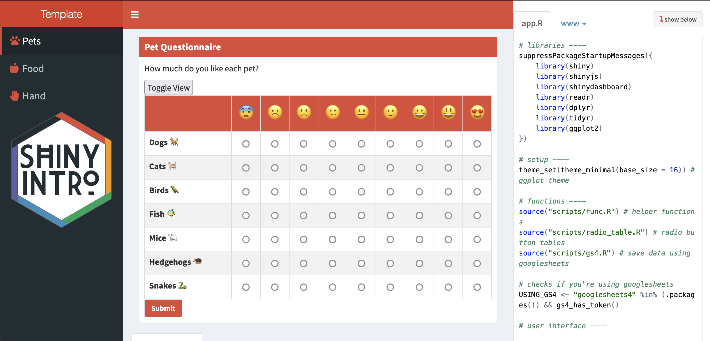

# Debugging and error handling {#debugging}

Bugs are a part of coding. A great coder isn't someone who writes bug-free code on their first try (this is an unachievable goal), but rather someone who knows how to efficiently catch bugs. This section presents a few simple ways to debug your Shiny app. 

## RStudio Console Messages

Sending messages to the `r glossary("console")` is a simple way to debug your code.

I like to keep track of what functions are being called by starting every function inside the server function with a message. The template includes a custom message logging function that helps you use this with both development and deployed apps: `r func("debug_msg")`. 

```{r, eval = TRUE}
# display debugging messages in R (if local) 
# and in the console log (if running in shiny)
debug_msg <- function(...) {
  is_local <- Sys.getenv('SHINY_PORT') == ""
  in_shiny <- !is.null(shiny::getDefaultReactiveDomain())
  txt <- toString(list(...))
  if (is_local) message(txt)
  if (in_shiny) shinyjs::runjs(sprintf("console.debug(\"%s\")", txt))
}
```

For example, the code below prints "questionnaire submitted" every time the action button `q_submit` is pressed. It prints to the javascript console and also to the RStudio console when you're developing.

```{r}
observeEvent(input$q_submit, {
  debug_msg("questionnaire submitted")
  # rest of code ...
})
```

## JavaScript Console

I use [FireFox Developer Edition](https://www.mozilla.org/en-US/firefox/developer/){target="_blank"} when I'm developing web apps, but Chrome also has developer tools. In FireFox, go to **`Tools > Browser Tools > Web Developer Tools`** (opt-cmd-I). In Chrome, go to **`View > Developer > Developer Tools`** (opt-cmd-I). You can dock the tools to the bottom, right , or left of the window, or as a separate window. 

```{r js-console, eval = TRUE, echo=FALSE, out.width="30%", fig.align='center', fig.show="hold", fig.cap="Javascript consoles in FireFox Developer Edition and Chrome."}
knitr::include_graphics(c("images/js_console_firefox.png",
                          "images/js_console_chrome.png"))
```

Shiny puts a lot of info you won't care about into the logs, so `r func("debug_msg")` writes messages to the debug console. You can filter just those messages by choosing only **`Debug`** in FireFox or **`Verbose`** in Chrome.

## Showcase Mode

You can view an app in showcase mode by setting "DisplayMode" to "Showcase" (instead of "Normal") in the `r path("DESCRIPTION")` file in the app directory. When you're in this mode, you can see your app code, css files, and javascript files. The functions in `r func("server")` will highlight in yellow each time they are run. However, this isn't much help if many of your functions are in external files or you are using modules. Also, if your script is very long, you won't be able to see the highlighting unless you've scrolled to the right section, so I find it more straightforward to use the message method described above.

```
Title: Questionnaire Template
Author: Lisa DeBruine
License: CC-BY-4.0
DisplayMode: Showcase
Type: Shiny
```

```{r showcase-mode, eval = TRUE, echo=FALSE, fig.cap="Showcase mode."}

```

## tryCatch

You've probably experienced the greyed out screen of a crashed app more than enough now. In development, the next step is to look at the console to see if you have a warning or error message. If you're lucky, you can figure out where in the code this is happening (this is easier if you start all your functions with a debug message) and fix it. 

However, sometimes there are errors that are difficult to prevent. For example, you can try to restrict inputs so the users only enter numeric values using `r func("numericInput")`, but many browsers will let you enter text values anyways (they cause a value of `NA`). To avoid crashing the whole app, you can wrap potentially error-triggering code in `r func("tryCatch")`. 

For example, the code below will cause an error because you can't add a number and a letter.

```{r, eval = TRUE, error = TRUE}
input <- list(n1 = 10, n2 = "A")

sum <- input$n1 + input$n2
```

The following code tries to run the code inside the curly brackets (`{}`), but if it creates an error, the error function will run. The object `e` is the error object, and you can print the message from it using `r func("debug_msg")` (this won't crash the app). 

```{r, eval = TRUE}
sum <- tryCatch({
  input$n1 + input$n2
}, error = function(e) {
  debug_msg(e$message)
  return(0)
})
```

The return value from the error message is the value assigned to `sum` if there is an error. Sometimes it won't make sense to have a default value, or the code you're checking doesn't have a return value. In that case, you can just put all the code inside the brackets and not return anything from the error function.

```{r, eval = TRUE}
tryCatch({
  sum <- input$n1 + input$n2
  output$sum <- renderText(sum)
}, error = function(e) {
  debug_msg(e$message)
})
```

## Input Checking

The user above might be frustrated if they've made a mistake that causes an error and don't know what it was. You can help prevent errors and make the experience of using your app nicer by doing input checking and sending your users useful messages.

### Modal Dialogs

One method is to check your input values, generate an appropriate error message if anything is wrong, and show the message in a `r func("modalDialog")`.

```{r}
observeEvent(input$submit, {
  # check inputs
  input_error <- dplyr::case_when(
    !is.numeric(input$n1) ~ "N1 needs to be a number",
    !is.numeric(input$n2) ~ "N2 needs to be a number",
    TRUE ~ ""
  )
  if (input_error != "") {
    showModal(modalDialog(
      title = "input_error",
      input_error,
      easyClose = TRUE
    ))
    return() # exit the function here
  }
  
  # no input errors
    sum <- input$n1 + input$n2
    add_text <- sprintf("%d + %d = %d", input$n1, input$n2, sum)
    output$n1_plus_n2 <- renderText(add_text)
})
```

### Validate

You can also use `r func("validate")` and `r func("need")` to test for required inputs to an output. However, this only works from inside a render function or a reactive function called inside a render function. I prefer to make my own pop-up messages like above, because they will work from any type of function.

```{r}
server <- function(input, output) {
  add_text <- reactive({
    input$add # triggers reactive
    n1 <- isolate(input$n1)
    n2 <- isolate(input$n2)
    validate(
      need(!is.na(n1), "The first value must a number"),
      need(!is.na(n2), "The second value must a number")
    )
    
    sprintf("%d + %d = %d", n1, n2, n1 + n2)
  })

  output$n1_plus_n2 <- renderText(add_text())
}
```


## Further Resources {#resources-debugging}

* [Debugging Shiny applications](https://shiny.rstudio.com/articles/debugging.html){target="_blank"}
* [reactlog](https://rstudio.github.io/reactlog/){target="_blank"}
* [Write error messages for your UI with validate](https://shiny.rstudio.com/articles/validation.html){target="_blank"}

## Exercises {#exercises-debugging}

### Required selections

Write an app that creates the plot below for any checked values of a `r func("checkboxGroupInput")` that lists all the orders in `msleep`.

```{r, eval = TRUE}
# this input is just an example for testing the code below
input <- list(orders = c("Carnivora", "Chiroptera", "Primates"))
# input <- list(orders = c()) # check this to see what happens with no selections

filtered_data <- dplyr::filter(msleep, order %in% input$orders)

ggplot(filtered_data, aes(x = sleep_total, fill = order)) +
  geom_histogram(binwidth = 1) +
  facet_wrap(~order)
```

Add error checking to the app to deal with what happens when `input$order` has no selections.

### Your app

In the app you're developing, find anywhere that a user could enter invalid information or cause an error and add a way to handle this.
