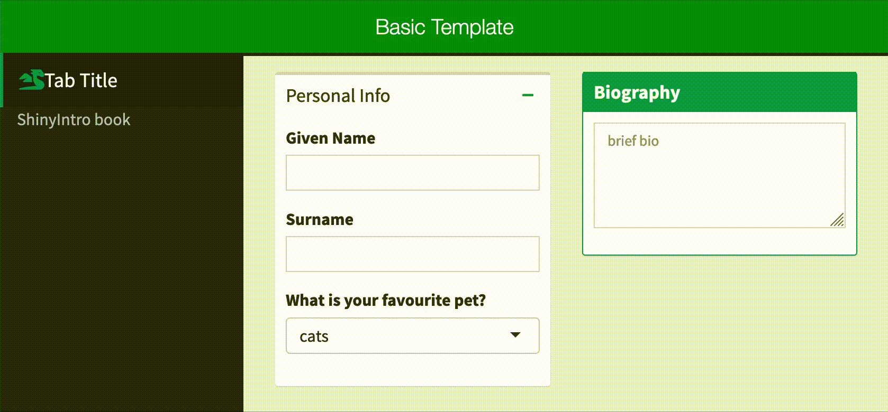
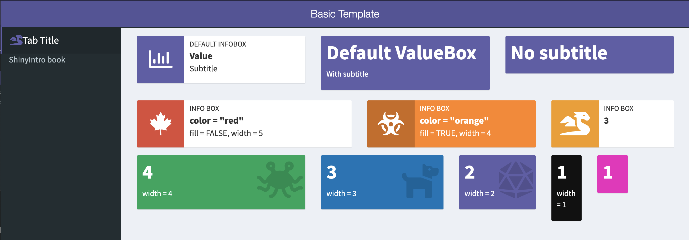
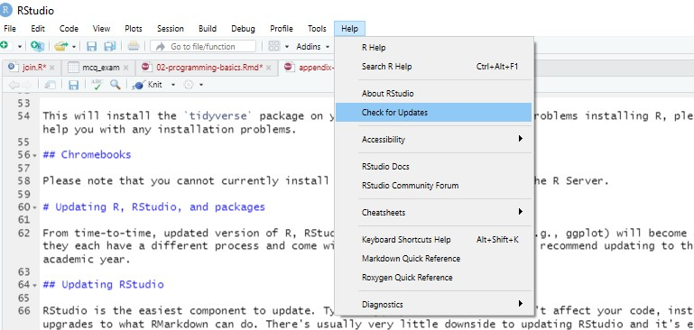
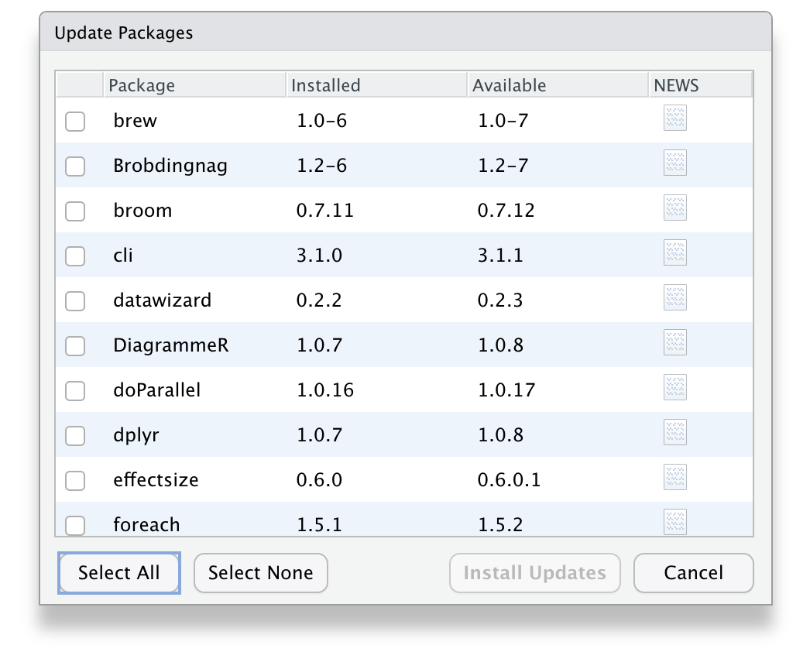

--- 
title: "Building Web Apps with R Shiny"
subtitle: "<a href='/shinyintro.pdf'>PDF</a> | <a href='/shinyintro.mobi'>MOBI</a>"
author: "Lisa DeBruine"
date: "`r Sys.Date()`"
site: bookdown::bookdown_site
documentclass: book
bibliography: [book.bib, packages.bib]
csl: include/apa.csl
classoption: oneside
geometry: margin=1in
link-citations: yes
description: "This class will teach you the basics of Shiny app programming, giving you skills that will form the basis of almost any app you want to build. By the end of the class, you will have created a custom app that collects and saves data, allows users to dynamically visualize the data, and produces downloadable reports."
url: https://debruine.github.io/shinyintro/
github-repo: debruine/shinyintro
cover-image: images/logos/shinyintro.png
apple-touch-icon: images/logos/touch-icon.png
apple-touch-icon-size: 152
favicon: images/logos/favicon.ico
always_allow_html: true
---
```{r include=FALSE, cache=FALSE}
suppressPackageStartupMessages({
  library(webexercises)
})

knitr::knit_hooks$set(webex.hide = function(before, options, envir) {
  if (before) {
    if (is.character(options$webex.hide)) {
      hide(options$webex.hide)
    } else {
      hide()
    }
  } else {
    unhide()
  }
})
# psyTeachR styles and functions
# do not edit!!!!!

suppressPackageStartupMessages({
  library(tidyverse)
  library(glossary)
})

# default knitr options
knitr::opts_chunk$set(
  echo       = TRUE,
  results    = "hold",
  out.width  = '100%',
  fig.width  = 8,
  fig.height = 5,
  fig.align  = 'center'
)

## set global theme options for figures
theme_set(theme_bw())

## set class for a chunk using class="className"
knitr::knit_hooks$set(class = function(before, options, envir) {
  if (before) {
    sprintf("<div class = '%s'>", options$class)
  } else {
    "</div>"
  }
})

## verbatim code chunks
knitr::knit_hooks$set(verbatim = function(before, options, envir) {
  if (before) {
    sprintf("<div class='verbatim'><pre class='sourceCode r'><code class='sourceCode R'>&#96;&#96;&#96;{%s}</code></pre>", options$verbatim)
  } else {
    "<pre class='sourceCode r'><code class='sourceCode R'>&#96;&#96;&#96;</code></pre></div>"
  }
})

## verbatim inline R in backticks
backtick <- function(code) {
  #warning("The backtick() function is deprecated. Use two backticks and a space to surround text with verbatim backticks, e.g. `` `in_backticks` ``")
  # removes inline math coding when you use >1 $ in a line
  code <- gsub("\\$", "\\\\$", code)
  paste0("<code>&#096;", code, "&#096;</code>")
}

## palette with psyTeachR logo colour
psyteachr_colours <- function(vals = 1:6) {
  ptrc <- c(
    "pink" = "#983E82",
    "orange" = "#E2A458",
    "yellow" = "#F5DC70",
    "green" = "#59935B",
    "blue" = "#467AAC",
    "purple" = "#61589C"
  )

  unname(ptrc[vals])
}
psyteachr_colors <- psyteachr_colours

# inline code highlighting and styles

hl <- function(code) {
  txt <- rlang::enexpr(code) %>% rlang::as_label()
  
  downlit::highlight(txt, classes = downlit::classes_pandoc()) %>%
    gsub("a href", "a target='_blank' href", .) %>%
    paste0("<code>", . , "</code>")
}

path <- function(txt) {
  sprintf("<code class='path'>%s</code>", txt)
}

pkg <- function(txt, url = NULL) {
  if (is.null(url)) {
    sprintf("<code class='package'>%s</code>", txt)
  } else {
    sprintf("<code class='package'><a href='%s' target='_blank'>%s</a></code>", url, txt)
  }
}
# book-specific code to include on every page
suppressPackageStartupMessages({
  library(shiny)
  library(shinydashboard)
  library(formatR)
})

pandoc_to <- knitr::opts_knit$get("rmarkdown.pandoc.to")
is_html <- pandoc_to == "html"
is_epub <- substr(pandoc_to, 1, 4) == "epub"
is_latex <- pandoc_to == "latex"

code_width <- switch(pandoc_to, html = 80, epub3 = 35, latex = 80)

knitr::opts_chunk$set(
  warning = FALSE,
  message = FALSE,
  tidy.opts=list(width.cutoff=code_width), 
  tidy=FALSE,
  eval = FALSE,
  fig.show   = "hold"
)

theme_set(theme_minimal())


tex_replace <- function(txt) {
  for (char in c("#", "_", " ", "$", "{", "}")) {
    txt <- gsub(char, paste0("\\", char), txt, fixed = TRUE)
  }
  txt
}

path <- function(txt) {
  if (is_latex) {
    sprintf("\\textit{\\texttt{%s}}", tex_replace(txt))
  } else {
    sprintf("<code class='path'>%s</code>", txt)
  }
}

pkg <- function(txt, url = NULL) {
  if (is_latex) {
    sprintf("\\textbf{\\texttt{%s}}", tex_replace(txt))
  } else if (is.null(url)) {
    sprintf("<code class='package'>%s</code>", txt)
  } else {
    sprintf("<code class='package'><a href='%s' target='_blank'>%s</a></code>", url, txt)
  }
}


func <- function(txt, args = "") {
  if (is_latex) {
    sprintf("\\texttt{%s}\\texttt{(%s)}", tex_replace(txt), tex_replace(args))
  } else {
    sprintf("<code><span class='fu'>%s</span>(%s)</code>", txt, args)
  }
}

arg <- function(txt) {
  dt(txt, "at")
}

dt <- function(val, class = NULL) {
  if (is.null(class)) {
    class <- switch(typeof(val), 
                    character = "st", 
                    integer = "fl", 
                    double = "fl", 
                    logical = "cn",
                    closure = "fu",
                    "")
  }
  txt <- toString(val)
  
  if (is_latex) {
    if (class == "st") txt <- sprintf("\"%s\"", txt)
    textok <- switch(
      class,
      st = "String",
      fu = "Function",
      at = "Attribute",
      fl = "DecVal",
      cn = "Constant",
      "Normal"
    )
    
    sprintf("\\%sTok{%s}", textok, tex_replace(txt))
  } else {
    if (class == "st") txt <- sprintf("&quot;%s&quot;", txt)
    txt <- gsub("<", "&lt;", txt, fixed = TRUE)
    sprintf("<code><span class='%s'>%s</span></code>", class, txt)
  }
}
```

```{r cite-packages, include = FALSE}
# automatically create a bib database for R packages
# add any packages you want to cite here
knitr::write_bib(c(
  .packages(), 'bookdown', 'tidyverse'
), 'packages.bib')
```

# Overview {-}

```{r, echo = FALSE, eval = TRUE, results='asis'}
if (is_html) {
  cat('<div class="small_right"></div>')
}
```

`r glossary("Shiny")` lets you make web applications that do anything you can code in R. For example, you can share your data analysis in a dynamic way with people who don't use R, collect and visualize data, or even make [data aRt](https://towardsdatascience.com/getting-started-with-generative-art-in-r-3bc50067d34b){target="_blank"}.

While there is a wealth of material available on the internet to help you get started with Shiny, it can be difficult to see how everything fits together. This class will take a predominantly live coding approach, rather than a lecture-only approach, so you can code along with the instructor and deal with the inevitable bugs and roadblocks together.

This class will teach you the basics of Shiny app programming, giving you skills that will form the basis of almost any app you want to build. By the end of the class, you will have created a custom app that collects and saves data, allows users to dynamically visualize the data, and produces downloadable reports.

## Installing shinyintro

To install the class package, which will provide you with a copy of all of the shiny apps we'll use for demos and the basic template, paste the following code into the console in RStudio. See [Appendix A](#installing-r) for help installing R and RStudio.

```{r}
# you may have to install devtools first with 
# install.packages("devtools")

devtools::install_github("debruine/shinyintro")
```

The class package lets you access the book or run the demo apps offline.

```{r}
shinyintro::book()
shinyintro::app("first_demo")
```

You can also clone the demo apps.

```{r}
shinyintro::clone("basic_template", "myapps/newapp")
```


## Example Apps

The following are some diverse examples of Shiny apps that the instructor has made.

* [Word Cloud](https://shiny.psy.gla.ac.uk/debruine/wordcloud/){target="_blank"} Create a word cloud from text and customize its appearance. Created during the live-coding event at [Hack Your Data Beautiful](https://psyteachr.github.io/hack-your-data/){target="_blank"}.
* [Faux](https://shiny.psy.gla.ac.uk/debruine/fauxapp/){target="_blank"} Simulate data with a specified factorial design.
* [Plot Demo](https://shiny.psy.gla.ac.uk/debruine/plotdemo/){target="_blank"} Simulate data from a 2×2 factorial design and visualize it with 6 different plot styles.
* [Simulating for LMEM](https://shiny.psy.gla.ac.uk/lmem_sim/){target="_blank"} companion to Understanding mixed effects models through data simulation (DeBruine & Barr, AMPPS 2021)
* [Scienceverse](http://shiny.ieis.tue.nl/scienceverse/){target="_blank"} is an ambitious (but in-progress) app for creating machine-readable descriptions of studies and human-readable summaries.

```{r word-cloud-app, echo=FALSE, fig.cap="Word Cloud App"}
if (is_html)
  knitr::include_app("https://shiny.psy.gla.ac.uk/debruine/wordcloud/",
  height = "600px")
```

<!--

## Code Horizons Course (27-30 July 2021)

Starting July 27, we are offering this seminar as a 4-day synchronous ^[We understand that scheduling is difficult during this unpredictable time. If you prefer, you may take all or part of the course asynchronously. The video recordings will be made available within 24 hours of each session and will be accessible for two weeks after the seminar, meaning that you will get all of the class content and discussions even if you cannot participate synchronously.], remote workshop for the first time. Each day will consist of a 3-hour live lecture held via the free video-conferencing software Zoom. You are encouraged to join the lecture live, but will have the opportunity to view the recorded session later if you are unable to attend at the scheduled time. Closed captioning is available for all live and recorded sessions.

Each lecture session will conclude with a hands-on exercise reviewing the content covered, to be completed on your own. An additional lab session will be held Tuesday and Thursday afternoons, where you can review the exercise results with the instructor and ask any questions.

### Schedule

#### Day 1 {-}

* [Your First Shiny App](#first-app)
* [ShinyDashboard](#shinydashboard)

#### Day 2 {-}

* [Different input types](#inputs)
* [Different output types](#outputs)
* [Reactive functions](#reactives)
* [Reading and saving data](#data)

#### Day 3 {-}

* [CSS, HTML, and Javascript](#web)
* [Structuring a complex app](#structure)
* [Debugging and error handling](#debugging)
* [Contingent Display](#contingency)

#### Day 4 {-}

* [Sharing Your Apps](#sharing)
* [Creating and downloading a customized report](#reports)
* [Shiny modules for repeated structures](#modules)

-->

### Computing

To participate in the hands-on exercises, you are strongly encouraged to use a computer with the most recent version of [R installed](https://www.r-project.org/){target="_blank"}. Participants are also encouraged to download and install [RStudio](https://www.rstudio.com/products/rstudio/download/){target="_blank"}, a front-end for R that makes it easier to work with. This software is free and available for Windows, Mac, and Linux platforms.

### What experience do I need?

You need to have basic familiarity with R, including data import, `r glossary("data wrangling", "data processing")`, visualization, and `r glossary("function", "functions")` and control structures (e.g., if/else). Instruction will be done using `r glossary("RStudio")`. Some familiarity with `r pkg("ggplot2")` and `r pkg("dplyr")` would be useful. You definitely do not need to be an expert coder, but the following code should not be challenging to understand.

```{r, eval = FALSE}

library(ggplot2)

pets <- read.csv("pets.csv")

dv <- sample(c("score", "weight"), 1)

if (dv == "score") {
  g <- ggplot(pets, aes(pet, score, fill = country))
} else if (dv == "weight") {
  g <- ggplot(pets, aes(pet, weight, fill = country))
}

g + geom_violin(alpha = 0.5)

```


If you want to brush up on your R (especially `r glossary("tidyverse")`), and also gain familiarity with the instructor's teaching style, the book [Applied Data Skills](https://psyteachr.github.io/ads/){target="_blank"} provides a good overview.


## Further Resources

There are a lot of great resources online to reinforce or continue your learning about Shiny. I advise going back to learning materials periodically because things that don't make sense the first (or second or third...) time around often click after you've had some experience.

* [Mastering Shiny](https://mastering-shiny.org/){target="_blank"}
* [RStudio Shiny Tutorials](https://shiny.rstudio.com/tutorial/){target="_blank"}
* [Awesome Shiny Extensions](https://github.com/nanxstats/awesome-shiny-extensions){target="_blank"}


<!--chapter:end:index.Rmd-->

```{r include=FALSE, cache=FALSE}
suppressPackageStartupMessages({
  library(webexercises)
})

knitr::knit_hooks$set(webex.hide = function(before, options, envir) {
  if (before) {
    if (is.character(options$webex.hide)) {
      hide(options$webex.hide)
    } else {
      hide()
    }
  } else {
    unhide()
  }
})
# psyTeachR styles and functions
# do not edit!!!!!

suppressPackageStartupMessages({
  library(tidyverse)
  library(glossary)
})

# default knitr options
knitr::opts_chunk$set(
  echo       = TRUE,
  results    = "hold",
  out.width  = '100%',
  fig.width  = 8,
  fig.height = 5,
  fig.align  = 'center'
)

## set global theme options for figures
theme_set(theme_bw())

## set class for a chunk using class="className"
knitr::knit_hooks$set(class = function(before, options, envir) {
  if (before) {
    sprintf("<div class = '%s'>", options$class)
  } else {
    "</div>"
  }
})

## verbatim code chunks
knitr::knit_hooks$set(verbatim = function(before, options, envir) {
  if (before) {
    sprintf("<div class='verbatim'><pre class='sourceCode r'><code class='sourceCode R'>&#96;&#96;&#96;{%s}</code></pre>", options$verbatim)
  } else {
    "<pre class='sourceCode r'><code class='sourceCode R'>&#96;&#96;&#96;</code></pre></div>"
  }
})

## verbatim inline R in backticks
backtick <- function(code) {
  #warning("The backtick() function is deprecated. Use two backticks and a space to surround text with verbatim backticks, e.g. `` `in_backticks` ``")
  # removes inline math coding when you use >1 $ in a line
  code <- gsub("\\$", "\\\\$", code)
  paste0("<code>&#096;", code, "&#096;</code>")
}

## palette with psyTeachR logo colour
psyteachr_colours <- function(vals = 1:6) {
  ptrc <- c(
    "pink" = "#983E82",
    "orange" = "#E2A458",
    "yellow" = "#F5DC70",
    "green" = "#59935B",
    "blue" = "#467AAC",
    "purple" = "#61589C"
  )

  unname(ptrc[vals])
}
psyteachr_colors <- psyteachr_colours

# inline code highlighting and styles

hl <- function(code) {
  txt <- rlang::enexpr(code) %>% rlang::as_label()
  
  downlit::highlight(txt, classes = downlit::classes_pandoc()) %>%
    gsub("a href", "a target='_blank' href", .) %>%
    paste0("<code>", . , "</code>")
}

path <- function(txt) {
  sprintf("<code class='path'>%s</code>", txt)
}

pkg <- function(txt, url = NULL) {
  if (is.null(url)) {
    sprintf("<code class='package'>%s</code>", txt)
  } else {
    sprintf("<code class='package'><a href='%s' target='_blank'>%s</a></code>", url, txt)
  }
}
# book-specific code to include on every page
suppressPackageStartupMessages({
  library(shiny)
  library(shinydashboard)
  library(formatR)
})

pandoc_to <- knitr::opts_knit$get("rmarkdown.pandoc.to")
is_html <- pandoc_to == "html"
is_epub <- substr(pandoc_to, 1, 4) == "epub"
is_latex <- pandoc_to == "latex"

code_width <- switch(pandoc_to, html = 80, epub3 = 35, latex = 80)

knitr::opts_chunk$set(
  warning = FALSE,
  message = FALSE,
  tidy.opts=list(width.cutoff=code_width), 
  tidy=FALSE,
  eval = FALSE,
  fig.show   = "hold"
)

theme_set(theme_minimal())


tex_replace <- function(txt) {
  for (char in c("#", "_", " ", "$", "{", "}")) {
    txt <- gsub(char, paste0("\\", char), txt, fixed = TRUE)
  }
  txt
}

path <- function(txt) {
  if (is_latex) {
    sprintf("\\textit{\\texttt{%s}}", tex_replace(txt))
  } else {
    sprintf("<code class='path'>%s</code>", txt)
  }
}

pkg <- function(txt, url = NULL) {
  if (is_latex) {
    sprintf("\\textbf{\\texttt{%s}}", tex_replace(txt))
  } else if (is.null(url)) {
    sprintf("<code class='package'>%s</code>", txt)
  } else {
    sprintf("<code class='package'><a href='%s' target='_blank'>%s</a></code>", url, txt)
  }
}


func <- function(txt, args = "") {
  if (is_latex) {
    sprintf("\\texttt{%s}\\texttt{(%s)}", tex_replace(txt), tex_replace(args))
  } else {
    sprintf("<code><span class='fu'>%s</span>(%s)</code>", txt, args)
  }
}

arg <- function(txt) {
  dt(txt, "at")
}

dt <- function(val, class = NULL) {
  if (is.null(class)) {
    class <- switch(typeof(val), 
                    character = "st", 
                    integer = "fl", 
                    double = "fl", 
                    logical = "cn",
                    closure = "fu",
                    "")
  }
  txt <- toString(val)
  
  if (is_latex) {
    if (class == "st") txt <- sprintf("\"%s\"", txt)
    textok <- switch(
      class,
      st = "String",
      fu = "Function",
      at = "Attribute",
      fl = "DecVal",
      cn = "Constant",
      "Normal"
    )
    
    sprintf("\\%sTok{%s}", textok, tex_replace(txt))
  } else {
    if (class == "st") txt <- sprintf("&quot;%s&quot;", txt)
    txt <- gsub("<", "&lt;", txt, fixed = TRUE)
    sprintf("<code><span class='%s'>%s</span></code>", class, txt)
  }
}
```
# Your First Shiny App {#first-app}

## The Demo App

To start, let's walk through the basics of setting up a `r glossary("shiny")` app, starting with the example built into `r glossary("RStudio")`. I won't explain yet how shiny apps are structured; the goal is to just get something up and running, and give you some familiarity with the layout of a fairly simple app.

### Set Up the Demo App

```{r first-demo, eval = TRUE, echo=FALSE, out.width="30%", fig.cap = "Creating a demo app."}
knitr::include_graphics(
  c("images/demo_app/01-create-project.png",
    "images/demo_app/02-project-type.png",
    "images/demo_app/03-project-directory.png"))
```

1.  Under the **`File`** menu, choose **`New Project...`**. You will see a popup window like the one above. Choose **`New Directory`**.

2.  Choose **`Shiny Web Application`** as the `r glossary("project")` type.

3.  I like to put all of my apps in the same `r glossary("directory")`, but it doesn't matter where you save it.

Your RStudio interface should look like this now. 

```{r first-rstudio-interface, eval = TRUE, echo=FALSE, fig.cap = "RStudio interface with the built-in demo app loaded."}
knitr::include_graphics("images/demo_app/04-rstudio-interface.png")
```

::: {.warning data-latex=""}
If you are not using RStudio or your source code doesn't look like this, replace it with the code below:

`r hide("View Code")`

```{r demo-rstudio}
#
# This is a Shiny web application. You can run the application by clicking
# the 'Run App' button above.
#
# Find out more about building applications with Shiny here:
#
#    http://shiny.rstudio.com/
#

library(shiny)

# Define UI for application that draws a histogram
ui <- fluidPage(
   
   # Application title
   titlePanel("Old Faithful Geyser Data"),
   
   # Sidebar with a slider input for number of bins 
   sidebarLayout(
      sidebarPanel(
         sliderInput("bins",
                     "Number of bins:",
                     min = 1,
                     max = 50,
                     value = 30)
      ),
      
      # Show a plot of the generated distribution
      mainPanel(
         plotOutput("distPlot")
      )
   )
)

# Define server logic required to draw a histogram
server <- function(input, output) {
   
   output$distPlot <- renderPlot({
      # generate bins based on input$bins from ui.R
      x    <- faithful[, 2] 
      bins <- seq(min(x), max(x), length.out = input$bins + 1)
      
      # draw the histogram with the specified number of bins
      hist(x, breaks = bins, col = 'darkgray', border = 'white')
   })
}

# Run the application 
shinyApp(ui = ui, server = server)

```

`r unhide()`
:::

Click on **`Run App`** in the top right corner of the `r glossary("panes", "source pane")`. The app will open up in a new window. Play with the slider and watch the histogram change.

```{r first-app-interface, eval = TRUE, echo=FALSE, fig.cap = 'Demo application interface'}
knitr::include_graphics('images/demo_app/05-app-interface.png')
```


::: {.info data-latex=""}
You can also open up the app in a web browser by clicking on `Open in Browser`.
:::

### Modify the Demo App

Now we're going to make a series of changes to the demo app until it's all your own.

::: {.info data-latex=""}
You can close the app by closing the window or browser tab it's running in and clicking the red stop sign in the console tab, or leave it running while you edit the code. If you have multiple screens, it can be useful to have the app open on one screen and the code on another.
:::

Find the application title. It is the first `r glossary("argument")` to the `r glossary("function")` `r func("titlePanel")`. Change the `r arg("title")` to `r dt("My First App")`. Make sure the title is inside quotes and the whole quoted `r glossary("string")` is inside the parentheses. Save the file (`cmd-S` or `File > Save`).

```{r first-change-title, eval = TRUE, echo=FALSE, fig.cap = 'App with changed title.'}
knitr::include_graphics('images/demo_app/06-change-title.png')
```

Click **`Run App`** (or **`Reload App`** if you haven't closed the app window) in the `r glossary("panes", "source pane")`. If you haven't saved your changes, it will prompt you to do so. Check that the app title has changed.

Now let's change the input. Find the function `r func("sliderInput")` (line 21). The first `r glossary("argument")` is the name you can use in the code to find the value of this input, so don't change it just yet. The second argument is the text that displays before the slider. Change this to something else and re-run the app.

```{r, app-sliderInput}
sliderInput("bins",
            "Number of bins:",
            min = 0,
            max = 50,
            value = 30)
```

::: {.try data-latex=""}
See if you can figure out what the next three arguments to `r func("sliderInput")` do. Change them to different `r glossary("integer", "integers")`, then re-run the app to see what's changed.
:::

The arguments to the function `r func("sidebarPanel")` are just a list of things you want to display in the sidebar. To add some explanatory text in a paragraph before `r func("sliderInput")`, just use the paragraph function `r func("p")`.

```{r, app-sidebar-p}
sidebarPanel(
   p("I am explaining this perfectly"),
   sliderInput("bins",
               "Choose the best bin number:",
               min = 10,
               max = 40,
               value = 25)
)
```

```{r first-app-sidebar-p, eval = TRUE, echo=FALSE, fig.cap = 'Sidebar with an added paragraph.'}
knitr::include_graphics('images/demo_app/07-app-sidebar-p.png')
```

::: {.info data-latex=""}
The sidebar shows up on the left if your window is wide enough, but moves to the top of the screen if it's too narrow.
:::

I don't like it there, so we can move this text out of the sidebar and to the top of the page, just under the title. Try this and re-run the app.

```{r, app-intro-text}
# Application title
titlePanel("My First App"),

p("I am explaining this perfectly"),

# Sidebar with a slider input for number of bins
sidebarLayout(...)
```

::: {.try data-latex=""}
See where you can move the text in the layout of the page and where causes errors.
:::

I'm also not keen on the grey plot. We can change the plot colour inside `hist()`

```{r plot-colors}
# draw the histogram with the specified number of bins
hist(x, breaks = bins, col = 'steelblue3', border = 'grey30')
```

There are a lot of ways to represent colour in R. The easiest three are:

1.  hexadecimal colours (e.g., `r dt("#0066CC")`)
2.  the `rgb` or `hsl` functions (e.g., `rgb(0, .4, .8)`)
3.  colour names (type `r func("colours")` in the console)

The color `r dt("steelblue3")` is pretty close to the shiny interface default colour, but feel free to choose whatever you like.

I prefer ggplots, so let's make the plot with `r func("geom_histogram")` instead of `r func("hist")` (which is a great function for really quick plots, but not very visually appealing). Since we need several functions from the `r pkg("ggplot2")` `r glossary("package")`, we'll need to load that package at the top of the script, just under where the  `r pkg("shiny")` package is loaded:

```{r load-library}
library(shiny)
library(ggplot2)
```

You can replace all of the code in `r func("renderPlot")` with the code below.

```{r, ggplot}
output$distPlot <- renderPlot({
  # create plot
  ggplot(faithful, aes(waiting)) +
    geom_histogram(bins = input$bins,
                   fill = "steelblue3",
                   colour = "grey30") +
    xlab("What are we even plotting here?") +
    theme_minimal()
})
```

::: {.info data-latex=""}
You can set `r arg("fill")` and `r arg("colour")` to whatever colours you like, and change `r func("theme_minimal")` to one of the other [built-in ggplot themes](https://ggplot2.tidyverse.org/reference/ggtheme.html#examples){target="_blank"}.
:::

::: {.try data-latex=""}
What *are* we even plotting here? Type `?faithful` into the console pane to see what the `waiting` column represents (`faithful` is a built-in demo dataset). Change the label on the x-axis to something more sensible.
:::

### Add New Things

The `faithful` dataset includes two columns: `eruptions` and `waiting`. We've been plotting the `waiting` variable, but what if you wanted to plot the `eruptions` variable instead?

::: {.try data-latex=""}
Try plotting the eruption time (`eruptions`) instead of the waiting time. You just have to change one word in `r func("ggplot")` and update the x-axis label.
:::

We can add another input `r glossary("widget")` to let the user switch between plotting eruption time and wait time. We'll learn more about the different input options in Section\ \@ref(inputs). We need to toggle between two options, so we can use either radio buttons or a select box. Radio buttons are probably best if you have only a few options and the user will want to see them all at the same time to decide.

Add the following code as the first argument to `r func("sidebarPanel")`, which just takes a list of different widgets. `r func("radioButtons")` is the widget we're using. We'll set four `r glossary("argument", "arguments")`:

* `r arg("inputId")`: a unique identifier that we will use later in the code to find the value of this widget
* `r arg("label")`: the text to display to the user
* `r arg("choices")`: a list of choices in the format `c("label1" = "value1", "label2" = "value2", ...)`
* `r arg("selected")`: the value of the default choice

For `r arg("choices")`, the label is what gets shown to the user and the value is what gets used by the code (these can be the same, but you often want the user label to be more descriptive).

```{r add-radiobuttons}
 radioButtons(inputId = "display_var",
              label = "Which variable to display",
              choices = c("Waiting time to next eruption" = "waiting",
                          "Eruption time" = "eruptions"),
              selected = "waiting"
 ),
```

Save this and re-run the app.

```{r first-radiobutton-widget, eval = TRUE, echo=FALSE, fig.cap = 'A radioButton widget above a sliderInput widget.'}
knitr::include_graphics('images/demo_app/08-radiobutton-widget.png')
```

You should have a radio button interface now. You can click on the options to switch the button, but it won't do anything to your plot yet. We need to edit the plot-generating code to make that happen.

First, we need to change the x-axis label depending on what we're graphing. We use an if/else statement to set the variable `xlabel` to one thing if `input$display_var` is equivalent to `r dt("eruptions")`, and to something else if it's equivalent to `r dt("waiting")`. Put this code at the very beginning of the code block for `r func("renderPlot")` (after the line `output$distPlot <- renderPlot({`).

```{r plot-switch1}
# set x-axis label depending on the value of display_var
if (input$display_var == "eruptions") {
  xlabel <- "Eruption Time (in minutes)"
} else if (input$display_var == "waiting") {
  xlabel <- "Waiting Time to Next Eruption (in minutes)"
}
```

::: {.warning data-latex=""}
The double-equal-signs `==` means "equivalent to and is how you check if two things are the same; if you only use one equal sign, you set the variable on the left to the value on the right.
:::

Then we have to edit `r func("ggplot")` to use the new label and to plot the correct column. The variable `input$display_var` gives you the user-input value of the widget called `"display_var"`.

```{r plot-switch2}
# create plot
ggplot(faithful, aes(.data[[input$display_var]])) +
  geom_histogram(bins = input$bins,
                 fill = "steelblue3",
                 colour = "grey30") +
  xlab(xlabel) +
  theme_minimal()
```

::: {.warning data-latex=""}
Notice that the code `r func("aes", "waiting")` from before has changed to `r func("aes", ".data[[input$display_var]]")`. Because `input$display_var` is a `r glossary("string")`, we have to select it from the `.data` placeholder (which refers to the `faithful` data table) using double brackets.
:::

Re-run your app and see if you can change the data and x-axis label with your new widget. 

```{r first-demo-app, eval=TRUE, echo=FALSE, fig.cap="First Demo App. You can also access this app with `shinyintro::app(\"first_demo\")`or view it in a separate tab with the [showcase interface](https://shiny.psy.gla.ac.uk/debruine/first_demo/){target=\"_blank\"}."}
if (is_html)
  knitr::include_app("https://shiny.psy.gla.ac.uk/debruine/first_demo/",
height = "520px")
```


## App Structure

Now that we've made and modified our first working app, it's time to learn a bit about how a shiny app is structured.

A shiny app is made of two main parts, a `r glossary("UI")`, which defines what the user interface looks like, and a `r glossary("server")` function, which defines how the interface behaves. The function `r func("shinyApp")` puts the two together to run the application in a web browser.

```{r app-structure}
# Setup ----
library(shiny)

# Define UI ----
ui <- fluidPage()

# Define server logic ----
server <- function(input, output, session) {}

# Run the application ----
shinyApp(ui = ui, server = server)
```

::: {.try data-latex=""}
Create a new app called "basic_demo" and replace all the text in app.R with the code above. You should be able to run the app and see just a blank page.
:::

### UI

The UI is created by one of the ui-building `****Page()` functions, such as `r func("fluidPage")`, `r func("fixedPage")`, `r func("fillPage")` or `r func("dashboardPage")` (which we'll learn more about in Section\ \@ref(shinydashboard)). The ui-building functions set up the parts of the webpage, which are created by more shiny functions that you list inside of the page function, separated by commas.

### Tags

For example, the code below displays:

1.  a title panel with the text "Basic Demo"
2.  a level-two header with the text "My favourite things"
3.  an unordered list containing several list items
4.  a paragraph with the text "This is a very basic demo."
5.  an image of the `r pkg("shinyintro")` logo with a width and height of 100 pixels

```{r fluidPage}
ui <- fluidPage(
  titlePanel("Basic Demo"),
  h2("My favourite things"),
  tags$ul(tags$li("Coding"),
          tags$li("Cycling"),
          tags$li("Cooking")),
  p("This is a very basic demo."),
  tags$img(
    src = "https://debruine.github.io/shinyintro/images/logos/shinyintro.png",
    width = "100px",
    height = "100px"
  )
)
```

Many of the functions used to create parts of the website are the same as `r glossary("tag", "HTML tags")`, which are ways to mark the beginning and end of different types of text. Most HTML tags are available in shiny by using one of the `r func("tags")` sub-functions, but some of the more common tags, like `r func("p")` or `r func("h1")`-`r func("h6")`also have a version where you can omit the `tags$` part. You can see a list of all of the tags available in Shiny at the [tag glossary](https://shiny.rstudio.com/articles/tag-glossary.html){target="_blank"}

::: {.try data-latex=""}
Add the code above to your basic_demo app and replace my favourite things with yours. Make the list an ordered list (instead of unordered) and change the image size.
:::

### Page Layout

You usually want your apps to have a more complex layout than just each element stacked below the previous one. The code below wraps the elements after the title panel inside `r func("flowLayout")`.

```{r}
ui <- fluidPage(titlePanel("Basic Demo"),
                flowLayout(
                  h2("My favourite things"),
                  tags$ul(tags$li("Coding"),
                          tags$li("Cycling"),
                          tags$li("Cooking")),
                  p("This is a very basic demo."),
                  tags$img(
                    src = "https://debruine.github.io/shinyintro/images/logos/shinyintro.png",
                    width = "100px",
                    height = "100px"
                  )
                ))
```

::: {.try data-latex=""}
Replace the ui code in your basic_demo app with the code above and run it in a web browser. What happens when you change the width of the web browser? Change `r func("flowLayout")` to `r func("verticalLayout")` or `r func("splitLayout")` and see what changes.
:::

You can use a `r func("sidebarLayout")` to arrange your elements into a `r func("sidebarPanel")` and a `r func("mainPanel")`. If the browser width is too narrow, the sidebar will display on top of the main panel.

```{r}
ui <- fluidPage(titlePanel("Basic Demo"),
                sidebarLayout(sidebarPanel(
                  h2("My favourite things"),
                  tags$ul(tags$li("Coding"),
                          tags$li("Cycling"),
                          tags$li("Cooking"))
                ),
                mainPanel(
                  p("This is a very basic demo."),
                  tags$img(
                    src = "https://debruine.github.io/shinyintro/images/logos/shinyintro.png",
                    width = "100px",
                    height = "100px"
                  )
                )))
```


## Dynamic Elements
So far, we've just put `r glossary("static")` elements into our UI. What makes Shiny apps work is `r glossary("dynamic")` elements like inputs, outputs, and action buttons. 

### Inputs {#inputs-intro}

Inputs are ways for the users of your app to communicate with the app, like drop-down menus or checkboxes. We'll go into the different types of inputs in Section\ \@ref(inputs).  Below we'll turn the list of favourite things into a group of checkboxes

```{r}
checkboxGroupInput(
  inputId = "fav_things",
  label = "What are your favourite things?",
  choices = c("Coding", "Cycling", "Cooking")
)
```

Most inputs are structured like this, with an `r arg("inputId")`, which needs to be a unique string not used as the ID for any other input or output in your app, a `r arg("label")` that contains the question, and a list of `r arg("choices")` or other parameters that determine what type of values the input will record.

::: {.info data-latex=""}
You might have noticed that the `r func("sliderInput")` in the demo app didn't use the argument names for the `r arg("inputId")` or the `r arg("label")`. All inputs need these first two arguments, so almost everyone omits their names.
:::

### Outputs {#outputs-intro}

Outputs are placeholders for things that `r func("server")` will create. There are different output functions for different types of outputs, like text, plots, and tables. We'll go into the different types of outputs in detail in Section\ \@ref(outputs). Below, we'll make a placeholder for some text that we'll display after counting the number of favourite things.

```{r}
textOutput(outputId = "n_fav_things")
```

Most outputs are structured like this, with just a unique `r arg("outputId")` (the argument name is also usually omitted).


### Action buttons

Action buttons are a special type of input that register button clicks. Below we'll make an action button that users can click once they've selected all of their favourite things.

```{r}
actionButton(inputId = "count_fav_things",
             label = "Count",
             icon = icon("calculator"))
```

Action buttons require a unique `r arg("inputId")` and a `r arg("label")` for the button text. You can also add an `r arg("icon")`. Choose a free icon from [fontawesome](https://fontawesome.com/icons?d=gallery&m=free){target="_blank"}.

Put the input, output, and action button into the ui and run it. You will see that the input checkboxes are selectable and the button is clickable, but nothing is displayed in the text output. We need some code in `r func("server")` to handle that.

```{r}
ui <- fluidPage(titlePanel("Basic Demo"),
                sidebarLayout(
                  sidebarPanel(
                    checkboxGroupInput(
                      inputId = "fav_things",
                      label = "What are your favourite things?",
                      choices = c("Coding", "Cycling", "Cooking")
                    ),
                    actionButton(
                      inputId = "count_fav_things",
                      label = "Count",
                      icon = icon("calculator")
                    )
                  ),
                  mainPanel(textOutput(outputId = "n_fav_things"))
                ))
```

## Reactive functions {#first-reactive}

Reactive functions are functions that only run when certain types of inputs change. Inside `r func("server")`, the `r glossary("object")` `input` is a named `r glossary("list")` of the values of all of the inputs. For example, if you want to know which items in the select input named `r dt("fav_things")` were selected, you would use `input$fav_things`.

Here, we just want to count how many items are checked. We want to do this whenever the button `r dt("count_fav_things")` is clicked, so we can use the reactive function `r func("observeEvent")` to do this. Every time the value of `input$count_fav_things` changes (which happens when it is clicked), it will run the code inside of the curly brackets `{}`. The code will only run when `input$count_fav_things` changes, not when any inputs inside the function change.

```{r}
server <- function(input, output) {
  # count favourite things
  observeEvent(input$count_fav_things, {
    n <- length(input$fav_things)
    count_text <- sprintf("You have %d favourite things", n)
  })
}
```

Now we want to display this text in the output `r dt("n_fav_things")`. We need to use a render function that is paired with our output function. Since "n_fav_things" was made with `r func("textOutput")`, we fill it with `r func("renderText")`. 

```{r}
server <- function(input, output) {
  # count favourite things
  observeEvent(input$count_fav_things, {
    n <- length(input$fav_things)
    count_text <- sprintf("You have %d favourite things", n)
    output$n_fav_things <- renderText(count_text)
  })
}
```

As always in coding, there are many ways to accomplish the same thing. These methods have different pros and cons that we'll learn more about in Section\ \@ref(reactives). Here is another (better) pattern that does that same as above.

```{r}
server <- function(input, output) {
  # update count_text on fav_things
  count_text <- reactive({
    input$count_fav_things # just here to trigger the reactive
    fav_things <-
      isolate(input$fav_things) # don't trigger on checks
    n <- length(fav_things)
    sprintf("You have %d favourite things", n)
  })
  
  # display count_text when it updates
  output$n_fav_things <- renderText(count_text())
}
```

This pattern uses `r func("reactive")` to create a new function called `r func("count_text")`, which updates the value it returns whenever any inputs inside the reactive function change. We use `r func("isolate")` to prevent `r func("count_text")` from changing when users click the checkboxes. 

Whenever the returned value of `r func("count_text")` changes, this triggers an update of the `r dt("n_fav_things")` output.

::: {.try data-latex=""}
Compare the app behaviour with the first pattern versus the second. How are they different? What happens if you remove `r func("isolate")` from around `input$fav_things`?
:::

## Further Resources {#resources-first-app}

* [Mastering Shiny: Chapters 1-3](https://mastering-shiny.org/){target="_blank"}
* [RStudio Shiny Tutorials: Videos 1-6](https://shiny.rstudio.com/tutorial/){target="_blank"}
* [Application layout guide](https://shiny.rstudio.com/articles/layout-guide.html){target="_blank"}


## Exercises {#exercises-first-app}

### Addition App - UI  {-}

Create the UI for following app. Use `r func("numericInput")` to create the inputs.

```{r add-demo-app, eval=TRUE, echo=FALSE, fig.cap="Add Demo App. You can also access this app with `shinyintro::app(\"add_demo\")`or view it in a separate tab with the [showcase interface](https://shiny.psy.gla.ac.uk/debruine/add_demo/){target=\"_blank\"}."}
if (is_html)
  knitr::include_app("https://shiny.psy.gla.ac.uk/debruine/add_demo/",
height = "400px")
```

`r hide()`

```{r}
ui <- fluidPage(titlePanel("Addition Demo"),
                sidebarLayout(
                  sidebarPanel(
                    numericInput("n1", "First number", 0),
                    numericInput("n2", "Second number", 0),
                    actionButton("add", "Add Numbers")
                  ),
                  mainPanel(textOutput(outputId = "n1_plus_n2"))
                ))
```

`r unhide()`

### observeEvent {-}

Use `r func("observeEvent")` to write a server function that displays "n1 + n2 = sum" when you click the action button.

`r hide()`

```{r}
server <- function(input, output) {
  # add numbers
  observeEvent(input$add, {
    sum <- input$n1 + input$n2
    add_text <- sprintf("%d + %d = %d", input$n1, input$n2, sum)
    output$n1_plus_n2 <- renderText(add_text)
  })
}
```

`r unhide()`

### reactive {-}

Use `r func("reactive")` to accomplish the same behaviour.

`r hide()`

```{r}
server <- function(input, output) {
  add_text <- reactive({
    input$add # triggers reactive
    n1 <- isolate(input$n1)
    n2 <- isolate(input$n2)
    sprintf("%d + %d = %d", n1, n2, n1 + n2)
  })
  
  output$n1_plus_n2 <- renderText(add_text())
}
```

`r unhide()`

<!--chapter:end:01_first_app.Rmd-->

```{r include=FALSE, cache=FALSE}
suppressPackageStartupMessages({
  library(webexercises)
})

knitr::knit_hooks$set(webex.hide = function(before, options, envir) {
  if (before) {
    if (is.character(options$webex.hide)) {
      hide(options$webex.hide)
    } else {
      hide()
    }
  } else {
    unhide()
  }
})
# psyTeachR styles and functions
# do not edit!!!!!

suppressPackageStartupMessages({
  library(tidyverse)
  library(glossary)
})

# default knitr options
knitr::opts_chunk$set(
  echo       = TRUE,
  results    = "hold",
  out.width  = '100%',
  fig.width  = 8,
  fig.height = 5,
  fig.align  = 'center'
)

## set global theme options for figures
theme_set(theme_bw())

## set class for a chunk using class="className"
knitr::knit_hooks$set(class = function(before, options, envir) {
  if (before) {
    sprintf("<div class = '%s'>", options$class)
  } else {
    "</div>"
  }
})

## verbatim code chunks
knitr::knit_hooks$set(verbatim = function(before, options, envir) {
  if (before) {
    sprintf("<div class='verbatim'><pre class='sourceCode r'><code class='sourceCode R'>&#96;&#96;&#96;{%s}</code></pre>", options$verbatim)
  } else {
    "<pre class='sourceCode r'><code class='sourceCode R'>&#96;&#96;&#96;</code></pre></div>"
  }
})

## verbatim inline R in backticks
backtick <- function(code) {
  #warning("The backtick() function is deprecated. Use two backticks and a space to surround text with verbatim backticks, e.g. `` `in_backticks` ``")
  # removes inline math coding when you use >1 $ in a line
  code <- gsub("\\$", "\\\\$", code)
  paste0("<code>&#096;", code, "&#096;</code>")
}

## palette with psyTeachR logo colour
psyteachr_colours <- function(vals = 1:6) {
  ptrc <- c(
    "pink" = "#983E82",
    "orange" = "#E2A458",
    "yellow" = "#F5DC70",
    "green" = "#59935B",
    "blue" = "#467AAC",
    "purple" = "#61589C"
  )

  unname(ptrc[vals])
}
psyteachr_colors <- psyteachr_colours

# inline code highlighting and styles

hl <- function(code) {
  txt <- rlang::enexpr(code) %>% rlang::as_label()
  
  downlit::highlight(txt, classes = downlit::classes_pandoc()) %>%
    gsub("a href", "a target='_blank' href", .) %>%
    paste0("<code>", . , "</code>")
}

path <- function(txt) {
  sprintf("<code class='path'>%s</code>", txt)
}

pkg <- function(txt, url = NULL) {
  if (is.null(url)) {
    sprintf("<code class='package'>%s</code>", txt)
  } else {
    sprintf("<code class='package'><a href='%s' target='_blank'>%s</a></code>", url, txt)
  }
}
# book-specific code to include on every page
suppressPackageStartupMessages({
  library(shiny)
  library(shinydashboard)
  library(formatR)
})

pandoc_to <- knitr::opts_knit$get("rmarkdown.pandoc.to")
is_html <- pandoc_to == "html"
is_epub <- substr(pandoc_to, 1, 4) == "epub"
is_latex <- pandoc_to == "latex"

code_width <- switch(pandoc_to, html = 80, epub3 = 35, latex = 80)

knitr::opts_chunk$set(
  warning = FALSE,
  message = FALSE,
  tidy.opts=list(width.cutoff=code_width), 
  tidy=FALSE,
  eval = FALSE,
  fig.show   = "hold"
)

theme_set(theme_minimal())


tex_replace <- function(txt) {
  for (char in c("#", "_", " ", "$", "{", "}")) {
    txt <- gsub(char, paste0("\\", char), txt, fixed = TRUE)
  }
  txt
}

path <- function(txt) {
  if (is_latex) {
    sprintf("\\textit{\\texttt{%s}}", tex_replace(txt))
  } else {
    sprintf("<code class='path'>%s</code>", txt)
  }
}

pkg <- function(txt, url = NULL) {
  if (is_latex) {
    sprintf("\\textbf{\\texttt{%s}}", tex_replace(txt))
  } else if (is.null(url)) {
    sprintf("<code class='package'>%s</code>", txt)
  } else {
    sprintf("<code class='package'><a href='%s' target='_blank'>%s</a></code>", url, txt)
  }
}


func <- function(txt, args = "") {
  if (is_latex) {
    sprintf("\\texttt{%s}\\texttt{(%s)}", tex_replace(txt), tex_replace(args))
  } else {
    sprintf("<code><span class='fu'>%s</span>(%s)</code>", txt, args)
  }
}

arg <- function(txt) {
  dt(txt, "at")
}

dt <- function(val, class = NULL) {
  if (is.null(class)) {
    class <- switch(typeof(val), 
                    character = "st", 
                    integer = "fl", 
                    double = "fl", 
                    logical = "cn",
                    closure = "fu",
                    "")
  }
  txt <- toString(val)
  
  if (is_latex) {
    if (class == "st") txt <- sprintf("\"%s\"", txt)
    textok <- switch(
      class,
      st = "String",
      fu = "Function",
      at = "Attribute",
      fl = "DecVal",
      cn = "Constant",
      "Normal"
    )
    
    sprintf("\\%sTok{%s}", textok, tex_replace(txt))
  } else {
    if (class == "st") txt <- sprintf("&quot;%s&quot;", txt)
    txt <- gsub("<", "&lt;", txt, fixed = TRUE)
    sprintf("<code><span class='%s'>%s</span></code>", class, txt)
  }
}
```
# ShinyDashboard {#shinydashboard}

[Shinydashboard](https://rstudio.github.io/shinydashboard/){target="_blank"} is an R `r glossary("package")` that provides functions to upgrade the appearance and function of your Shiny apps. 

## Basic template for shinydashboard projects

The `r pkg("shinyintro")` package provides a basic template for a shinydashboard `r glossary("project")`.

```{r basic-template-app, eval=TRUE, echo=FALSE, fig.cap="Basic Template.App You can also access this app with `shinyintro::app(\"basic_template\")`or view it in a [separate tab](https://shiny.psy.gla.ac.uk/debruine/basic_template/){target=\"_blank\"}."}
if (is_html)
  knitr::include_app("https://shiny.psy.gla.ac.uk/debruine/basic_template/",
height = "400px")
```

----

You can start a new app using the template with the code `shinyintro::clone("basic_template", "myapp")`. This will create a new directory called `r path("myapp")` in your `r glossary("working directory")` and open the `r path("app.R")` file in RStudio.

This directory contains:

* `r path("app.R")`: the file where you define the `r glossary("ui")` and `r glossary("server")`
* `r path("DESCRIPTION")`: A file that contains some structured info about the app
* `r path("README.md")`: A file that can contain any information you want
* `r path("scripts")`: a directory that can contain external R code that you can source into the `r path("app.R")` file
* `r path("www")`: a directory that contains helper files like images, `r glossary("CSS")`, and `r glossary("JavaScript")` 

## Dashboard Structure

Notice that the ui is created with `r func("dashboardPage")` now. This needs to be set up a little differently than `r func("fluidPage")`. The main parts of a dashboard page are the header, sidebar, and body.

You can also change the default `r arg("skin")` colour. Possible skin colours are: `r dt("red")`, `r dt("yellow")` (looks orange to me), `r dt("green")`, `r dt("blue")`, `r dt("purple")`, and `r dt("black")`.

```{r}
dashboardPage(skin = "purple",
              dashboardHeader(),
              dashboardSidebar(),
              dashboardBody())
```

### dashboardHeader

You can add a title to the header, and change the title width.

```{r}
dashboardHeader(title = "Basic Template",
                # puts sidebar toggle on right
                titleWidth = "calc(100% - 44px)")
```

You can also include message, notification, and task menus in the header. We won't be using those in this class, but you can learn more at [the shinydashboard site](https://rstudio.github.io/shinydashboard/structure.html#message-menus){target="_blank"}.

::: {.info data-latex=""}
If you don't want to use a header, include `dashboardHeader(disable = TRUE)` inside `r func("dashboardPage")`. 
:::

### dashboardSidebar

The sidebar usually contains a `r func("sidebarMenu")`, which needs a unique ID and a list of menu items. Each `r func("menuItem")` consists of the `r arg("title")`, a `r arg("tabName")` that will be used to refer to the tab later, and an `r arg("icon")`. You can find a list of the available free icons at [fontawesome](https://fontawesome.com/icons?d=gallery&m=free){target="_blank"}.

You can also add in any other elements to the sidebar. The code below adds a link using `r func("tags$a")` Text inside of the sidebar usually looks too close to the edges, so we use [css](#CSS) to style the link and add padding.

```{r}
dashboardSidebar(
  sidebarMenu(id = "tabs",
              menuItem(
                "Tab Title",
                tabName = "demo_tab",
                icon = icon("dragon")
              )),
  tags$a("ShinyIntro book",
         href = "https://debruine.github.io/shinyintro/",
         style = "padding: 1em;")
)
```

::: {.info data-latex=""}
If you don't want to use a sidebar, include `dashboardSidebar(disable = TRUE)` inside `r func("dashboardPage")`. 
:::

### dashboardBody

The main part of the app goes inside `r func("dashboardBody")` If you're going to use `r glossary("javascript")` functions (which the basic template does and we'll learn more about in Section\ \@ref(shinyjs)), you need to put `r func("useShinyjs")` first. Then you include the header, linking to any custom CSS or JavaScript files. 

The contents of the body go after that. The most common pattern is a multi-page tabbed pattern, which is set up with `r func("tabItems")`, which contains a `r func("tabItem")` for each tab. The `r arg("tabName")` has to match the name you used in the sidebar `r func("menuItem")`, so that tab shows when the user clicks on the corresponding menu item.

```{r}
dashboardBody(shinyjs::useShinyjs(),
              tags$head(
                # links to files in www/
                tags$link(rel = "stylesheet",
                          type = "text/css",
                          href = "custom.css"),
                tags$script(src = "custom.js")
              ),
              tabItems(tabItem(tabName = "demo_tab",
                               imageOutput("logo"))))
```

Since each tab is usually a quite complex list of elements, I like to define each tab outside `r func("dashboardPage")` and then just put a list of the tab objects inside `r func("tabItems")`. This way, it's easy to move the whole tab definition to an external file if it gets too complex (see Section\ \@ref(structure)).

## Body Structure

Tab items can be structured in several ways. At the simplest, you can just list each element after the `r arg("tabName")`.

```{r}
tabItem(
  tabName = "demo_tab",
  textInput("given", "Given Name"),
  textInput("surname", "Surname"),
  selectInput("pet", "What is your favourite pet?",
              c("cats", "dogs", "ferrets")),
  textAreaInput("bio", NULL,
                height = "100px",
                placeholder = "brief bio")
)
```

### Boxes

Most `r pkg("shinydashboard")` apps organise the parts inside boxes.

```{r}
tabItem(tabName = "demo_tab",
        box(
          textInput("given", "Given Name"),
          textInput("surname", "Surname"),
          selectInput("pet", "What is your favourite pet?",
                      c("cats", "dogs", "ferrets"))
        ),
        box(
          textAreaInput("bio", NULL,
                        height = "100px",
                        placeholder = "brief bio")
        ))
```

```{r sdb-layout2, eval=TRUE, echo=FALSE, fig.cap = 'Organizing elements inside boxes.'}
knitr::include_graphics('images/sdb_layout2.png')
```

You can add titles to the boxes, make them collapsible and/or give them solid headers. 

```{r}
tabItem(
    tabName = "demo_tab",
    box(title = "Personal Info",
        collapsible = TRUE, 
        textInput("given", "Given Name"),
        textInput("surname", "Surname"),
        selectInput("pet", "What is your favourite pet?", c("cats", "dogs", "ferrets"))
    ),
    box(title = "Biography",
        solidHeader = TRUE, 
        textAreaInput("bio", NULL, height = "100px", placeholder = "brief bio")
    )
)
```



In the normal shinydashboard style, solid headers only have a colour if the box also has the status argument set. In the basic template provided in this class, there is custom CSS to make solid headers the same colour as the theme skin, but you can also set the `r arg("status")`.

```{r}
tabItem(
    tabName = "demo_tab",
    box(title = "No Status", solidHeader = TRUE),
    box(title = "Primary",   solidHeader = TRUE, status = "primary"),
    box(title = "Success",   solidHeader = TRUE, status = "success"),
    box(title = "Info",      solidHeader = TRUE, status = "info"),
    box(title = "Warning",   solidHeader = TRUE, status = "warning"),
    box(title = "Danger",    solidHeader = TRUE, status = "danger")
)
```

```{r sdb-box-status, eval=TRUE, echo=FALSE, fig.cap = 'Shinydashboard Box Statuses.'}
knitr::include_graphics('images/sdb_box_status.png')
```

### Info and Value Boxes

You can use an `r func("infoBox")` or a `r func("valueBox")` to highlight a small amount of information. The default background is aqua, but the basic template changes this to the skin colour. However, you can customise this by setting the `r arg("color")` argument.  

```{r}
tabItem(
    tabName = "demo_tab",
    infoBox("Default InfoBox", "Value", "Subtitle"),
    valueBox("Default ValueBox", "With subtitle"),
    valueBox("No subtitle", "")
)
```

```{r sdb-value-info, eval=TRUE, echo=FALSE, fig.cap = 'Examples of value and info boxes you can make.'}

```

`r pkg("Shinydashboard")` uses a grid system that is `r dt(12)` units across. The default width of boxes is `r dt(6)`, and info and value boxes are `r dt(4)`.

::: {.try data-latex=""}
Try to write the code to create the second row of info boxes show above and the third row of value boxes.
:::

### Tab Boxes

Create a box with multiple tabs using `r func("tabBox")`, which contains `r func("tabPanel")`.

```{r}
tabItem(
    tabName = "demo_tab",
    tabBox(
        title = "Test Yourself 1",
        tabPanel("Question", "What function creates tabBox contents?"),
        tabPanel("Answer", "tabPanel()")
    ),
    tabBox(
        title = "Test Yourself 2",
        side = "right",
        selected = "Question",
        tabPanel("Answer", "selected"),
        tabPanel("Question", "What attribute changes the default tab?")
    )
)
```

```{r sdb-tab-box, eval=TRUE, echo=FALSE, fig.cap = 'Tab Boxes'}
knitr::include_graphics('images/sdb_tab_box.png')
```


### Row Layout

You can arrange the boxes inside a `r func("fluidRow")`. Set the box height in pixels. If the window gets too narrow, the boxes will move to stack instead of be in rows.

```{r}
tabItem(
    tabName = "demo_tab",
    fluidRow(
      box("A", title = "2x100", width = 2, height = 100),
      box("B", title = "1x100", width = 1, height = 100),
      box("C", title = "2x200", width = 2, height = 200),
      box("D", title = "3x300", width = 3, height = 300),
      box("E", title = "4x100", width = 4, height = 100),
      box("F", title = "5x100", width = 5, height = 100),
      box("G", title = "7x100", width = 7, height = 100)
    )
)
```

```{r sdb-row-layout, eval=TRUE, echo=FALSE, fig.cap = 'An example fluidRow layout of boxes with different widths and heights.'}
knitr::include_graphics('images/sdb_row_layout.png')
```

### Column Layout

Alternatively, you can arrange boxes or other elements inside a `r func("column")` with a specific `r arg("width")`. Elements inside this column have a width relative to the column width, so no matter what value you set the column `r arg("width")` to, an element inside with a `r arg("width")` of `r dt(6)` will be half the column width.

```{r}
tabItem(
    tabName = "demo_tab",
    column(width = 6,
        box("A", title = "12x100", width = 12, height = 100),
        box("B", title = "6x100", width = 6, height = 100),
        box("C", title = "6x200", width = 6, height = 200)
    ), 
    column(width = 4,
        box("D", title = "12x300", width = 12, height = 300),
        box("E", title = "12x100", width = 12, height = 100)
    ),
    column(width = 2,
        box("F", title = "12x100", width = 12, height = 100),
        box("G", title = "12x100", width = 12, height = 100)
    )
)
```

```{r sdb-column-layout, eval=TRUE, echo=FALSE, fig.cap = 'An example for column layout.'}
knitr::include_graphics('images/sdb_column_layout.png')
```

## Further Resources {#resources-shinydashboard}

* [ShinyDashboard](https://rstudio.github.io/shinydashboard/){target="_blank"}


## Your App {#your-app-sdb}

### Create an app from the basic template

* Create a demo app from the basic template and run it. 
* Close the app and run it again. 
* Look at the code to see how the theme colour and sidebar icon change. 
* Change the title and author in the `r path("DESCRIPTION")` file and set DisplayMode to "Showcase" instead of "Normal" to see what happens when you run it.

### Customize the header

* Change the `r arg("title")` to the title of the app you want to build.
* Choose a `r arg("skin")` color.
* Experiment with different values for the `r arg("titleWidth")` argument. Try `r dt("50%")` or `r dt("200px")` and see how the title behaves when you change the width of the browser window.

### Customize the sidebar

* Add tabs to the `r func("sidebarMenu")` for the pages of your custom app.
* Choose appropriate `r arg("icon")` for each tab.
* Remove the link to the ShinyIntro book and add some information about your app, like the author or a use license.

### Customize the body

* Create an empty `r func("tabItem")` for each tab you put in the `r func("sidebarMenu")` and add them to the `r func("dashboardBody")`.
* Start adding elements to each tab, such as a list of inputs with questions or a `r func("plotOutput")` to display a feedback plot.
* Experiment with different ways to display the elements by grouping them into boxes
* Experiment with different layouts for your boxes and elements.
* Make sure you check how the app looks on different sized screens, such as phone screens.


<!--chapter:end:02_shinydashboard.Rmd-->

```{r include=FALSE, cache=FALSE}
suppressPackageStartupMessages({
  library(webexercises)
})

knitr::knit_hooks$set(webex.hide = function(before, options, envir) {
  if (before) {
    if (is.character(options$webex.hide)) {
      hide(options$webex.hide)
    } else {
      hide()
    }
  } else {
    unhide()
  }
})
# psyTeachR styles and functions
# do not edit!!!!!

suppressPackageStartupMessages({
  library(tidyverse)
  library(glossary)
})

# default knitr options
knitr::opts_chunk$set(
  echo       = TRUE,
  results    = "hold",
  out.width  = '100%',
  fig.width  = 8,
  fig.height = 5,
  fig.align  = 'center'
)

## set global theme options for figures
theme_set(theme_bw())

## set class for a chunk using class="className"
knitr::knit_hooks$set(class = function(before, options, envir) {
  if (before) {
    sprintf("<div class = '%s'>", options$class)
  } else {
    "</div>"
  }
})

## verbatim code chunks
knitr::knit_hooks$set(verbatim = function(before, options, envir) {
  if (before) {
    sprintf("<div class='verbatim'><pre class='sourceCode r'><code class='sourceCode R'>&#96;&#96;&#96;{%s}</code></pre>", options$verbatim)
  } else {
    "<pre class='sourceCode r'><code class='sourceCode R'>&#96;&#96;&#96;</code></pre></div>"
  }
})

## verbatim inline R in backticks
backtick <- function(code) {
  #warning("The backtick() function is deprecated. Use two backticks and a space to surround text with verbatim backticks, e.g. `` `in_backticks` ``")
  # removes inline math coding when you use >1 $ in a line
  code <- gsub("\\$", "\\\\$", code)
  paste0("<code>&#096;", code, "&#096;</code>")
}

## palette with psyTeachR logo colour
psyteachr_colours <- function(vals = 1:6) {
  ptrc <- c(
    "pink" = "#983E82",
    "orange" = "#E2A458",
    "yellow" = "#F5DC70",
    "green" = "#59935B",
    "blue" = "#467AAC",
    "purple" = "#61589C"
  )

  unname(ptrc[vals])
}
psyteachr_colors <- psyteachr_colours

# inline code highlighting and styles

hl <- function(code) {
  txt <- rlang::enexpr(code) %>% rlang::as_label()
  
  downlit::highlight(txt, classes = downlit::classes_pandoc()) %>%
    gsub("a href", "a target='_blank' href", .) %>%
    paste0("<code>", . , "</code>")
}

path <- function(txt) {
  sprintf("<code class='path'>%s</code>", txt)
}

pkg <- function(txt, url = NULL) {
  if (is.null(url)) {
    sprintf("<code class='package'>%s</code>", txt)
  } else {
    sprintf("<code class='package'><a href='%s' target='_blank'>%s</a></code>", url, txt)
  }
}
# book-specific code to include on every page
suppressPackageStartupMessages({
  library(shiny)
  library(shinydashboard)
  library(formatR)
})

pandoc_to <- knitr::opts_knit$get("rmarkdown.pandoc.to")
is_html <- pandoc_to == "html"
is_epub <- substr(pandoc_to, 1, 4) == "epub"
is_latex <- pandoc_to == "latex"

code_width <- switch(pandoc_to, html = 80, epub3 = 35, latex = 80)

knitr::opts_chunk$set(
  warning = FALSE,
  message = FALSE,
  tidy.opts=list(width.cutoff=code_width), 
  tidy=FALSE,
  eval = FALSE,
  fig.show   = "hold"
)

theme_set(theme_minimal())


tex_replace <- function(txt) {
  for (char in c("#", "_", " ", "$", "{", "}")) {
    txt <- gsub(char, paste0("\\", char), txt, fixed = TRUE)
  }
  txt
}

path <- function(txt) {
  if (is_latex) {
    sprintf("\\textit{\\texttt{%s}}", tex_replace(txt))
  } else {
    sprintf("<code class='path'>%s</code>", txt)
  }
}

pkg <- function(txt, url = NULL) {
  if (is_latex) {
    sprintf("\\textbf{\\texttt{%s}}", tex_replace(txt))
  } else if (is.null(url)) {
    sprintf("<code class='package'>%s</code>", txt)
  } else {
    sprintf("<code class='package'><a href='%s' target='_blank'>%s</a></code>", url, txt)
  }
}


func <- function(txt, args = "") {
  if (is_latex) {
    sprintf("\\texttt{%s}\\texttt{(%s)}", tex_replace(txt), tex_replace(args))
  } else {
    sprintf("<code><span class='fu'>%s</span>(%s)</code>", txt, args)
  }
}

arg <- function(txt) {
  dt(txt, "at")
}

dt <- function(val, class = NULL) {
  if (is.null(class)) {
    class <- switch(typeof(val), 
                    character = "st", 
                    integer = "fl", 
                    double = "fl", 
                    logical = "cn",
                    closure = "fu",
                    "")
  }
  txt <- toString(val)
  
  if (is_latex) {
    if (class == "st") txt <- sprintf("\"%s\"", txt)
    textok <- switch(
      class,
      st = "String",
      fu = "Function",
      at = "Attribute",
      fl = "DecVal",
      cn = "Constant",
      "Normal"
    )
    
    sprintf("\\%sTok{%s}", textok, tex_replace(txt))
  } else {
    if (class == "st") txt <- sprintf("&quot;%s&quot;", txt)
    txt <- gsub("<", "&lt;", txt, fixed = TRUE)
    sprintf("<code><span class='%s'>%s</span></code>", class, txt)
  }
}
```
# Inputs {#inputs}

Inputs are ways that users can communicate information to the Shiny app. Explore some different input types in the embedded app below before you read about how to set up each type.

```{r input-demo-app, eval = TRUE, echo=FALSE, fig.cap="Input Demo App. You can also access this app with `shinyintro::app(\"input_demo\")` or view it in a separate tab with the [showcase interface](https://shiny.psy.gla.ac.uk/debruine/input_demo/){target=\"_blank\"}."}
if (is_html)
  knitr::include_app("https://shiny.psy.gla.ac.uk/debruine/input_demo/",
  height = "625px")
```

## Input functions

### textInput

`r func("textInput")` creates a one-line box for short text input. The first `r glossary("argument")`, `r arg("inputId")` (the argument name is usually omitted), needs to be a unique `r glossary("string")` that you cannot use for another input or output in this app.

```{r}
demo_text <- 
  textInput("demo_text", 
            label = "Name", 
            value = "", 
            width = "100%",
            placeholder = "Your Name")
```

::: {.try data-latex=""}
Experiment with the values of `r arg("label")`, `r arg("value")`, `r arg("width")`, and `r arg("placeholder")` to see what they do.
:::

### textAreaInput

`r func("textAreaInput")` creates a multi-line box for longer text input.

```{r}
demo_textarea <- 
  textAreaInput("demo_textarea", 
                label = "Biography", 
                value = "",
                width = "100%",
                rows = 5, 
                placeholder = "Tell us something interesting about you.")
```

What is the `r arg("inputId")` of the widget above?
`r mcq(c("textAreaInput", answer="demo_textarea", "Biography"))`

### selectInput

`r func("selectInput")` creates a drop-down menu. Set the first `r arg("choice")` to `""` to default to `NA`. If your choices are a named `r glossary("list")` or `r glossary("vector")`, the names are what is shown and the values are what is recorded. If the choices aren't named, the displayed and recorded values are the same.

```{r}
demo_select <- 
  selectInput("demo_select", 
              label = "Do you like Shiny?", 
              choices = list("", 
                             "Yes, I do" = "y", 
                             "No, I don't" = "n"),
              selected = NULL,
              width = "100%")
```

If you set `r arg("multiple")` to `r dt(TRUE)`, you can also make a select where users can choose multiple options.

```{r}
genders <- list( # no blank needed
  "Non-binary" = "nb",
  "Male" = "m",
  "Female" = "f",
  "Agender" = "a",
  "Gender Fluid" = "gf"
)

demo_select_multi <- 
  selectInput("demo_select2", 
              label = "Gender (select all that apply)", 
              choices = genders,
              selected = NULL,
              multiple = TRUE, 
              selectize = FALSE,
              size = 5)
```

### checkboxGroupInput

However, this interface almost always looks better with `r func("checkboxGroupInput")`. 

```{r}
demo_cbgi <-
  checkboxGroupInput("demo_cbgi",
                     label = "Gender (select all that apply)",
                     choices = genders)
```

How can you get the checkboxes to display horizontally instead of vertically?  
`r mcq(c("display = 'horizontal'", "class = 'horiz'", answer = "inline = TRUE", "class = 'shiny-input-container-inline'"))`


### checkboxInput

You can also make a single checkbox with `r func("checkboxInput")`. The `r arg("value")` is `r dt(TRUE)` when checked and `r dt(FALSE)` when not.

```{r}
demo_cb <- checkboxInput("demo_cb",
                         label = "I love R",
                         value = TRUE)
```

`r func("sliderInput")` allows you to choose numbers between a `r arg("min")` and `r arg("max")` value.

```{r}
demo_slider <- sliderInput("demo_slider",
                           label = "Age",
                           min = 0,
                           max = 100,
                           value = 0,
                           step = 1,
                           width = "100%")
```

::: {.try data-latex=""}
What happens if you change `r arg("value")` or `r arg("step")`? Try changing `r arg("value")` to `c(10, 20)`.
:::

### radioButtons

If you want users to only be able to choose one option and there are a small number of short options, `r func("radioButton")` is a good interface. 

```{r}
demo_radio <- radioButtons("demo_radio",
                           label = "Choose one",
                           choices = c("Cats", "Dogs"),
                           selected = character(0),
                           inline = TRUE)
```

::: {.warning data-latex=""}
Radio buttons default to selecting the first item unless you set `r arg("selected")` to a choice value or `character(0)` to start with no selection.
:::

### dateInput

I find the date interface a little clunky, but that might just be because I have to click the back button on the year interface 44 time to find my birthdate. However, it also allows you to type in a date following the format that you can set.

```{r}
demo_date <- dateInput("demo_date",
                       label = "What is your birth date?",
                       min = "1900-01-01",
                       max = Sys.Date(),
                       format = "yyyy-mm-dd",
                       startview = "year")
```

::: {.info data-latex=""}
IMHO, the default of `r dt("yyyy-mm-dd")` is the best because it sorts into chronological order. Don't let me catch you storing dates like `r dt("m/d/yyyy")`. 
:::

What would you set `r arg("format")` to in order to display dates like "Sunday July 4, 2021"?  
`r mcq(c("D M d, Y", answer = "DD MM d, yyyy", "DAY MONTH day, YEAR", "D MM dd, yyyy"))`


### fileInput

Users can upload one or more files with `r func("fileInput")`. The argument `r arg("accept")` lets you limit this to certain file types, but some browsers can bypass this requirement, so it's not fool-proof.

```{r}
demo_file <- fileInput("demo_file",
                       label = "Upload a data table",
                       multiple = FALSE,
                       accept = c(".csv", ".tsv"),
                       buttonLabel = "Upload")
```

What would you set `r arg("accept")` to to accept any image file?  
`r mcq(c(answer = "image/*",".jpg", "jpg", "images", ".img"))`


## Setting inputs programatically

Sometimes you need to change the value of an input with code, such as when resetting a questionnaire or in response to an answer on another item. The following code resets all of the inputs above.

```{r}
updateTextInput(session, "demo_text", value = "")
updateTextAreaInput(session, "demo_textarea", value = "")
updateSelectInput(session, "demo_select", selected = "")
updateCheckboxGroupInput(session, "demo_cbgi", selected = character(0))
updateCheckboxInput(session, "demo_cb", value = TRUE)
updateRadioButtons(session, "demo_radio", selected = character(0))
updateSliderInput(session, "demo_slider", value = 0)
updateDateInput(session, "demo_date", value = NULL)
```

::: {.warning data-latex=""}
Note that select inputs, checkbox groups, and radio buttons use the argument `r arg("selected")` and not `r func("value")`. If you want to set all the values in a checkbox group or radio button group to unchecked, set `selected = character(0)`.
:::

## Further Resources {#resources-inputs}

* [Mastering Shiny Section 2.2](https://mastering-shiny.org/basic-ui.html#inputs){target="_blank"}
* [RStudio Shiny Tutorials](https://vimeo.com/rstudioinc/review/131218530/212d8a5a7a/#t=10m41s){target="_blank"}

## Exercises {#exercises-inputs}

### Pets {-}

Create an interface that gets people to rate the following pets on a 9-point scale. You can use any option labels or input type you like.

* Dogs 🐕  
* Cats 🐈  
* Birds 🦜  
* Fish 🐠  
* Mice 🐁  
* Hedgehogs 🦔  
* Snakes 🐍

## Your App {#your-app-inputs}

In the app you're developing, add a tab for a questionnaire that you're interested in and set up the appropriate inputs.

Add a "reset" button to your questionnaire tab and write the `r func("server")` code to reset all of its inputs.

<!--chapter:end:03_inputs.Rmd-->

```{r include=FALSE, cache=FALSE}
suppressPackageStartupMessages({
  library(webexercises)
})

knitr::knit_hooks$set(webex.hide = function(before, options, envir) {
  if (before) {
    if (is.character(options$webex.hide)) {
      hide(options$webex.hide)
    } else {
      hide()
    }
  } else {
    unhide()
  }
})
# psyTeachR styles and functions
# do not edit!!!!!

suppressPackageStartupMessages({
  library(tidyverse)
  library(glossary)
})

# default knitr options
knitr::opts_chunk$set(
  echo       = TRUE,
  results    = "hold",
  out.width  = '100%',
  fig.width  = 8,
  fig.height = 5,
  fig.align  = 'center'
)

## set global theme options for figures
theme_set(theme_bw())

## set class for a chunk using class="className"
knitr::knit_hooks$set(class = function(before, options, envir) {
  if (before) {
    sprintf("<div class = '%s'>", options$class)
  } else {
    "</div>"
  }
})

## verbatim code chunks
knitr::knit_hooks$set(verbatim = function(before, options, envir) {
  if (before) {
    sprintf("<div class='verbatim'><pre class='sourceCode r'><code class='sourceCode R'>&#96;&#96;&#96;{%s}</code></pre>", options$verbatim)
  } else {
    "<pre class='sourceCode r'><code class='sourceCode R'>&#96;&#96;&#96;</code></pre></div>"
  }
})

## verbatim inline R in backticks
backtick <- function(code) {
  #warning("The backtick() function is deprecated. Use two backticks and a space to surround text with verbatim backticks, e.g. `` `in_backticks` ``")
  # removes inline math coding when you use >1 $ in a line
  code <- gsub("\\$", "\\\\$", code)
  paste0("<code>&#096;", code, "&#096;</code>")
}

## palette with psyTeachR logo colour
psyteachr_colours <- function(vals = 1:6) {
  ptrc <- c(
    "pink" = "#983E82",
    "orange" = "#E2A458",
    "yellow" = "#F5DC70",
    "green" = "#59935B",
    "blue" = "#467AAC",
    "purple" = "#61589C"
  )

  unname(ptrc[vals])
}
psyteachr_colors <- psyteachr_colours

# inline code highlighting and styles

hl <- function(code) {
  txt <- rlang::enexpr(code) %>% rlang::as_label()
  
  downlit::highlight(txt, classes = downlit::classes_pandoc()) %>%
    gsub("a href", "a target='_blank' href", .) %>%
    paste0("<code>", . , "</code>")
}

path <- function(txt) {
  sprintf("<code class='path'>%s</code>", txt)
}

pkg <- function(txt, url = NULL) {
  if (is.null(url)) {
    sprintf("<code class='package'>%s</code>", txt)
  } else {
    sprintf("<code class='package'><a href='%s' target='_blank'>%s</a></code>", url, txt)
  }
}
# book-specific code to include on every page
suppressPackageStartupMessages({
  library(shiny)
  library(shinydashboard)
  library(formatR)
})

pandoc_to <- knitr::opts_knit$get("rmarkdown.pandoc.to")
is_html <- pandoc_to == "html"
is_epub <- substr(pandoc_to, 1, 4) == "epub"
is_latex <- pandoc_to == "latex"

code_width <- switch(pandoc_to, html = 80, epub3 = 35, latex = 80)

knitr::opts_chunk$set(
  warning = FALSE,
  message = FALSE,
  tidy.opts=list(width.cutoff=code_width), 
  tidy=FALSE,
  eval = FALSE,
  fig.show   = "hold"
)

theme_set(theme_minimal())


tex_replace <- function(txt) {
  for (char in c("#", "_", " ", "$", "{", "}")) {
    txt <- gsub(char, paste0("\\", char), txt, fixed = TRUE)
  }
  txt
}

path <- function(txt) {
  if (is_latex) {
    sprintf("\\textit{\\texttt{%s}}", tex_replace(txt))
  } else {
    sprintf("<code class='path'>%s</code>", txt)
  }
}

pkg <- function(txt, url = NULL) {
  if (is_latex) {
    sprintf("\\textbf{\\texttt{%s}}", tex_replace(txt))
  } else if (is.null(url)) {
    sprintf("<code class='package'>%s</code>", txt)
  } else {
    sprintf("<code class='package'><a href='%s' target='_blank'>%s</a></code>", url, txt)
  }
}


func <- function(txt, args = "") {
  if (is_latex) {
    sprintf("\\texttt{%s}\\texttt{(%s)}", tex_replace(txt), tex_replace(args))
  } else {
    sprintf("<code><span class='fu'>%s</span>(%s)</code>", txt, args)
  }
}

arg <- function(txt) {
  dt(txt, "at")
}

dt <- function(val, class = NULL) {
  if (is.null(class)) {
    class <- switch(typeof(val), 
                    character = "st", 
                    integer = "fl", 
                    double = "fl", 
                    logical = "cn",
                    closure = "fu",
                    "")
  }
  txt <- toString(val)
  
  if (is_latex) {
    if (class == "st") txt <- sprintf("\"%s\"", txt)
    textok <- switch(
      class,
      st = "String",
      fu = "Function",
      at = "Attribute",
      fl = "DecVal",
      cn = "Constant",
      "Normal"
    )
    
    sprintf("\\%sTok{%s}", textok, tex_replace(txt))
  } else {
    if (class == "st") txt <- sprintf("&quot;%s&quot;", txt)
    txt <- gsub("<", "&lt;", txt, fixed = TRUE)
    sprintf("<code><span class='%s'>%s</span></code>", class, txt)
  }
}
```
# Outputs {#outputs}

Output are ways that the Shiny app can dynamically display information to the user. In the user interface (`r glossary("UI")`), you create outputs with IDs that you reference in an associated rendering function inside the `r glossary("server")` function.

Explore some different output types in the embedded app below before you read about how to set up each type.

```{r output-demo-app, eval=TRUE, echo=FALSE, fig.cap="Output Demo App. You can also access this app with `shinyintro::app(\"output_demo\")`or view it in a separate tab with the [showcase interface](https://shiny.psy.gla.ac.uk/debruine/output_demo/){target=\"_blank\"}."}
if (is_html)
  knitr::include_app("https://shiny.psy.gla.ac.uk/debruine/output_demo/", height = "670px")
```


## Text

`r func("textOutput")` defaults to text inside a generic `<span>` or `<div>`, but you can use a different `r glossary("element-html", "element")` with the `r arg("container")` argument.

```{r}
# in the UI function
textOutput("demo_text", container = tags$h3)
```

`r func("renderText")` replaces the text of the linked element with its returned string.

```{r}
# in the server function
output$demo_text <- renderText({
    sprintf("Plot of %s", input$y)
})
```

If you use `r func("verbatimTextOutput")` in the UI (no change to the render function), it will show the output in a fixed-width font. This can be good for code or text you want the user to copy.

```{r}
# in the UI function
verbatimTextOutput("demo_verbatim")

# in the server function
output$demo_verbatim <- renderText({
  code <-
    "ggplot(iris, aes(x = Species, y = %s, color = Species)) +
    geom_violin(show.legend = FALSE) +
    stat_summary(show.legend = FALSE)"
  
  sprintf(code, input$y)
})
```


## Plots

`r func("plotOutput")` displays plots made with the `r glossary("base R")` plotting functions (e.g., `r func("plot")`, `r func("hist")`) or `r pkg("ggplot2")` functions.

```{r}
# in the UI function
plotOutput("demo_plot", width = "500px", height="300px")
```

What is the default value for `r arg("width")`?  
`r mcq(c(answer = "100%", "400px", "400", "5in", "7in"))`  
What is the default value for `r arg("height")`?  
`r mcq(c("100%", answer = "400px", "400", "5in", "7in"))`


```{r}
# in the server function
output$demo_plot <- renderPlot({
  ggplot(iris, aes(x = Species, y = .data[[input$y]], color = Species)) +
    geom_violin(show.legend = FALSE) +
    stat_summary(show.legend = FALSE) +
    ylab(input$y)
})
```

::: {.warning data-latex=""}
If you want to create dynamic plots that change with input, note how you need to use `y = .data[[input$y]]` inside `r func("aes")`, instead of just `y = input$y`.
:::

## Images

`r func("imageOutput")` takes the same arguments as `r func("plotOutput")`. You can leave `r arg("width")` and `r arg("height")` as their defaults if you are going to set those values in the render function.

```{r}
# in the UI function
imageOutput("demo_image")
```

`r func("renderImage")` needs to return a named list with at least an `r arg("src")` with the image path. You can also set the `r arg("width")` and `r arg("height")` (numeric values are in pixels), `r arg("class")` and `r arg("alt")` (the alt-text for screen readers).

```{r}
# in the server function
output$demo_image <- renderImage({
    list(src = "images/flower.jpg",
         width = 100,
         height = 100,
         alt = "A flower")
}, deleteFile = FALSE)
```

::: {.warning data-latex=""}
The `r arg("deleteFile")` argument is currently optional, but triggers periodic warnings that it won't be optional in the future. You should set it to `r dt(TRUE)` if you're making a temporary file (this stops unneeded plots using memory) and `r dt(FALSE)` if you're referencing a file you previously saved.
:::

## Tables

Display a table using `r func("tableOutput")`.

```{r}
# in the UI function
tableOutput("demo_table")
```

This is paired with `r func("renderTable")`, which makes a table out of any data frame it returns.

```{r}
# in the server function
output$demo_table <- renderTable({
  iris %>%
    group_by(Species) %>%
    summarise(mean = mean(.data[[input$y]]),
              sd = sd(.data[[input$y]]))
})
```

::: {.warning data-latex=""}
Note how you need to use `.data[[input$y]]` inside `r func("dplyr::summarise")`, instead of just `input$y` to dynamically choose which variable to summarise.
:::

### Data Tables

If you have a long table to show, or one that you want users to be able to sort or search, use `r func("DT::dataTableOutput")` (or its synonym `r func("DTOutput")`). 

The basic `r pkg("shiny")` package has `r func("dataTableOutput")` and `r func("renderDataTable")` functions, but they can be buggy. The versions in the `r pkg("DT")` package are better and have [many additional functions](https://rstudio.github.io/DT/){target="_blank"}, so I use those. 

```{r}
# in the UI function
DT::dataTableOutput("demo_datatable",
                    width = "50%",
                    height = "auto")
```

The paired render function is `r func("renderDataTable")` (or its synonym `r func("renderDT")`). You can customise data tables in many ways, but we'll stick with a basic example here that limits the number of rows shown at once to `r dt(10)`.

```{r}
# in the server function
output$demo_datatable <- DT::renderDataTable({
    iris
}, options = list(pageLength = 10))
```

::: {.info data-latex=""}
You can use the `r pkg("DT")` synonyms to make sure you're not accidentally using the `r pkg("shiny")` versions, which don't have the same options.
:::

## Dynamic HTML

If you want to dynamically create parts of the UI, you can use `r func("uiOutput")`. 

```{r}
# in the UI function
uiOutput("demo_ui")
```

You can create the UI using `r func("renderUI")` to return HTML created using the input functions we learned about in Section\ \@ref(inputs), the [tag functions](#tags), or HTML that you write yourself (as an argument to `r func("HTML")`).

```{r}
# in the server function
output$demo_ui <- renderUI({
  cols <- names(iris)[1:4]
  selectInput("y", "Column to plot", cols, "Sepal.Length")
})
```

::: {.info data-latex=""}
The function `r func("htmlOutput")` is a synonym for `r func("uiOutput")`, so you might see that in some code examples, but I use `r func("uiOutput")` to make the connection with `r func("renderUI")` clearer, since there is no `r func("renderHTML")`.
:::

## Further Resources {#reosurces-outputs}

* [Mastering Shiny Section 2.3](https://mastering-shiny.org/basic-ui.html#outputs){target="_blank"}
* [RStudio Shiny Tutorials](https://vimeo.com/rstudioinc/review/131218530/212d8a5a7a/#t=10m41s){target="_blank"}
* [DT (data tables)](https://rstudio.github.io/DT/){target="_blank"}

## Exercises {#exercises-outputs}

### Modify the demo {-}

Clone the "output_demo" app and modify it to use a different dataset.

### Pets {-}

Add outputs and appropriate render functions to show a plot and the data from the pets questionnaire you made for the exercise in Section\ \@ref(inputs).

## Your App {#your-app-outputs}

In the app you're developing, add relevant outputs, such as for plots or tables, and the appropriate render function for each output. You can leave the contents blank for now or add in some code to create output.

<!--chapter:end:04_outputs.Rmd-->

```{r include=FALSE, cache=FALSE}
suppressPackageStartupMessages({
  library(webexercises)
})

knitr::knit_hooks$set(webex.hide = function(before, options, envir) {
  if (before) {
    if (is.character(options$webex.hide)) {
      hide(options$webex.hide)
    } else {
      hide()
    }
  } else {
    unhide()
  }
})
# psyTeachR styles and functions
# do not edit!!!!!

suppressPackageStartupMessages({
  library(tidyverse)
  library(glossary)
})

# default knitr options
knitr::opts_chunk$set(
  echo       = TRUE,
  results    = "hold",
  out.width  = '100%',
  fig.width  = 8,
  fig.height = 5,
  fig.align  = 'center'
)

## set global theme options for figures
theme_set(theme_bw())

## set class for a chunk using class="className"
knitr::knit_hooks$set(class = function(before, options, envir) {
  if (before) {
    sprintf("<div class = '%s'>", options$class)
  } else {
    "</div>"
  }
})

## verbatim code chunks
knitr::knit_hooks$set(verbatim = function(before, options, envir) {
  if (before) {
    sprintf("<div class='verbatim'><pre class='sourceCode r'><code class='sourceCode R'>&#96;&#96;&#96;{%s}</code></pre>", options$verbatim)
  } else {
    "<pre class='sourceCode r'><code class='sourceCode R'>&#96;&#96;&#96;</code></pre></div>"
  }
})

## verbatim inline R in backticks
backtick <- function(code) {
  #warning("The backtick() function is deprecated. Use two backticks and a space to surround text with verbatim backticks, e.g. `` `in_backticks` ``")
  # removes inline math coding when you use >1 $ in a line
  code <- gsub("\\$", "\\\\$", code)
  paste0("<code>&#096;", code, "&#096;</code>")
}

## palette with psyTeachR logo colour
psyteachr_colours <- function(vals = 1:6) {
  ptrc <- c(
    "pink" = "#983E82",
    "orange" = "#E2A458",
    "yellow" = "#F5DC70",
    "green" = "#59935B",
    "blue" = "#467AAC",
    "purple" = "#61589C"
  )

  unname(ptrc[vals])
}
psyteachr_colors <- psyteachr_colours

# inline code highlighting and styles

hl <- function(code) {
  txt <- rlang::enexpr(code) %>% rlang::as_label()
  
  downlit::highlight(txt, classes = downlit::classes_pandoc()) %>%
    gsub("a href", "a target='_blank' href", .) %>%
    paste0("<code>", . , "</code>")
}

path <- function(txt) {
  sprintf("<code class='path'>%s</code>", txt)
}

pkg <- function(txt, url = NULL) {
  if (is.null(url)) {
    sprintf("<code class='package'>%s</code>", txt)
  } else {
    sprintf("<code class='package'><a href='%s' target='_blank'>%s</a></code>", url, txt)
  }
}
# book-specific code to include on every page
suppressPackageStartupMessages({
  library(shiny)
  library(shinydashboard)
  library(formatR)
})

pandoc_to <- knitr::opts_knit$get("rmarkdown.pandoc.to")
is_html <- pandoc_to == "html"
is_epub <- substr(pandoc_to, 1, 4) == "epub"
is_latex <- pandoc_to == "latex"

code_width <- switch(pandoc_to, html = 80, epub3 = 35, latex = 80)

knitr::opts_chunk$set(
  warning = FALSE,
  message = FALSE,
  tidy.opts=list(width.cutoff=code_width), 
  tidy=FALSE,
  eval = FALSE,
  fig.show   = "hold"
)

theme_set(theme_minimal())


tex_replace <- function(txt) {
  for (char in c("#", "_", " ", "$", "{", "}")) {
    txt <- gsub(char, paste0("\\", char), txt, fixed = TRUE)
  }
  txt
}

path <- function(txt) {
  if (is_latex) {
    sprintf("\\textit{\\texttt{%s}}", tex_replace(txt))
  } else {
    sprintf("<code class='path'>%s</code>", txt)
  }
}

pkg <- function(txt, url = NULL) {
  if (is_latex) {
    sprintf("\\textbf{\\texttt{%s}}", tex_replace(txt))
  } else if (is.null(url)) {
    sprintf("<code class='package'>%s</code>", txt)
  } else {
    sprintf("<code class='package'><a href='%s' target='_blank'>%s</a></code>", url, txt)
  }
}


func <- function(txt, args = "") {
  if (is_latex) {
    sprintf("\\texttt{%s}\\texttt{(%s)}", tex_replace(txt), tex_replace(args))
  } else {
    sprintf("<code><span class='fu'>%s</span>(%s)</code>", txt, args)
  }
}

arg <- function(txt) {
  dt(txt, "at")
}

dt <- function(val, class = NULL) {
  if (is.null(class)) {
    class <- switch(typeof(val), 
                    character = "st", 
                    integer = "fl", 
                    double = "fl", 
                    logical = "cn",
                    closure = "fu",
                    "")
  }
  txt <- toString(val)
  
  if (is_latex) {
    if (class == "st") txt <- sprintf("\"%s\"", txt)
    textok <- switch(
      class,
      st = "String",
      fu = "Function",
      at = "Attribute",
      fl = "DecVal",
      cn = "Constant",
      "Normal"
    )
    
    sprintf("\\%sTok{%s}", textok, tex_replace(txt))
  } else {
    if (class == "st") txt <- sprintf("&quot;%s&quot;", txt)
    txt <- gsub("<", "&lt;", txt, fixed = TRUE)
    sprintf("<code><span class='%s'>%s</span></code>", class, txt)
  }
}
```
# Reactive functions {#reactives}

There are a lot of great tutorials that explain the principles behind reactive functions, but that never made any sense to me when I first started out, so I'm just going to give you examples that you can extrapolate principles from.

Reactivity is how Shiny determines which code in `r func("server")` gets to run when. Some types of `r glossary("object", "objects")`, such as the `input` object or objects made by `r func("reactiveValues")`, can trigger some types of functions to run whenever they change. 

For our example, we will use the `reactive_demo` app. It shows three select inputs that allow the user to choose values from the cut, color, and clarity columns of the `diamonds` dataset from `r pkg("ggplot2")`, then draws a plot of the relationship between carat and price for the selected subset.

```{r reactive-demo-app, eval=TRUE, echo=FALSE, fig.cap="Reactive Demo App. You can also access this app with `shinyintro::app(\"reactive_demo\")`or view it in a separate tab with the [showcase interface](https://shiny.psy.gla.ac.uk/debruine/reactive_demo/){target=\"_blank\"}."}
if (is_html)
  knitr::include_app("https://shiny.psy.gla.ac.uk/debruine/reactive_demo/",
height = "560px")
```

Here is the relevant code for the UI. There are four inputs: cut, color, clarity, and update. There are two outputs: title and plot.

```{r}
box(
  title = "Diamonds",
  solidHeader = TRUE,
  selectInput("cut", "Cut", levels(diamonds$cut)),
  selectInput("color", "Color", levels(diamonds$color)),
  selectInput("clarity", "Clarity", levels(diamonds$clarity)),
  actionButton("update", "Update Plot")
),
box(
  title = "Plot",
  solidHeader = TRUE,
  textOutput("title"),
  plotOutput("plot")
)
```


Whenever an input changes, it will trigger some types of functions to run.

## Render functions

Functions that render an output, like `r func("renderText")` or `r func("renderPlot")` will run whenever an input in their code changes. You can trigger a render function just by putting a reactive alone on a line, even if you aren't using it in the rest of the code.

```{r}
server <- function(input, output, session) {
  output$plot <- renderPlot({
    data <- filter(diamonds,
                   cut == input$cut,
                   color == input$color,
                   clarity == input$clarity)
    
    ggplot(data, aes(carat, price)) +
      geom_point(color = "#605CA8", alpha = 0.5) +
      geom_smooth(method = lm, color = "#605CA8")
  })
  
  output$title <- renderText({
    input$update # just here to trigger the function
    
    sprintf("Cut: %s, Color: %s, Clarity: %s",
                     input$cut,
                     input$color,
                     input$clarity)
  })
} 
```

In the example above, which inputs will trigger `r func("renderPlot")` to run and produce a new plot?  
`r mcq(c("cut", "color", "clarity", "update", answer = "cut, color & clarity", "all of the above"))`

Which inputs will trigger `r func("renderText")` to run and produce a new title?  
`r mcq(c("cut", "color", "clarity", "update", "cut, color & clarity", answer = "all of the above"))`

## reactive()

If you move the `data` filtering outside of `r func("renderPlot")`, you'll get an error message like "Can't access reactive value 'cut' outside of reactive consumer." This means that the `input` values can only be read inside certain functions, like `r func("reactive")`, `r func("observeEvent")`, or a render function.

However, we can put the data filtering inside `r func("reactive")`. This means that whenever an input inside that function changes, the code will run and update the value of `r func("data")`. This can be useful if you need to recalculate the data table each time the inputs change, and then use it in more than one function.

```{r}
server <- function(input, output, session) {
  data <- reactive({
    filter(diamonds,
           cut == input$cut,
           color == input$color,
           clarity == input$clarity)
  })
  
  title <- reactive({
    sprintf("Cut: %s, Color: %s, Clarity: %s, N: %d",
                     input$cut,
                     input$color,
                     input$clarity)
  })
  
  output$plot <- renderPlot({
    ggplot(data(), aes(carat, price)) +
      geom_point(color = "#605CA8", alpha = 0.5) +
      geom_smooth(method = lm, color = "#605CA8")
  })
  
  output$text <- renderText(title())
} 
```

In the example above, which inputs will trigger `r func("renderPlot")` to run and produce a new plot?  
`r mcq(c("cut", "color", "clarity", "update", answer = "cut, color & clarity", "all of the above"))`

Which inputs will trigger `r func("renderText")` to run and produce a new title?  
`r mcq(c("cut", "color", "clarity", "update", answer = "cut, color & clarity", "all of the above"))`

::: {.warning data-latex=""}
My most common error is trying to use `data` or `title` as an object instead of as a function. Notice how the first argument to ggplot is no longer `data`, but `r func("data")` and you set the value of data with `data(newdata)`, not `data <- newdata`. For now, just remember this as a quirk of shiny.
:::

## observeEvent()

What if you only want to update things when the update button is clicked, and not whenever the user changes an option?

We learned about `r func("observeEvent")` in Section\ \@ref(first-reactive). This function runs the code whenever the value of the first argument changes. If there are reactive values inside the function, they won't trigger the code to run when they change.

```{r}
server <- function(input, output, session) {
  observeEvent(input$update, {
    data <- filter(diamonds,
                   cut == input$cut,
                   color == input$color,
                   clarity == input$clarity)
    
    title <- sprintf("Cut: %s, Color: %s, Clarity: %s",
                     input$cut,
                     input$color,
                     input$clarity)
    
    output$plot <- renderPlot({
      ggplot(data, aes(carat, price)) +
        geom_point(color = "#605CA8", alpha = 0.5) +
        geom_smooth(method = lm, color = "#605CA8")
    })
    
    output$title <- renderText(title)
  })
} 
```

In the example above, which inputs will trigger `r func("renderPlot")` to run and produce a new plot?

`r mcq(c("cut", "color", "clarity", answer = "update", "cut, color & clarity", "all of the above"))`

In the example above, which inputs will trigger `r func("renderText")` to run and produce a new title?

`r mcq(c("cut", "color", "clarity", answer = "update", "cut, color & clarity", "all of the above"))`

::: {.warning data-latex=""}
You should avoid creating reactive functions inside other functions like I did above. That is because those functions *will* be triggered by changes to any reactive inputs inside them. It doesn't make a difference in this example because the render functions don't have any reactive values in them, but this can cause huge problems in more complex apps.
:::

## reactiveVal()

You can avoid the problem above of defining a render function inside a reactive function by creating a reactive value using `r func("reactiveVal")`. This allows you to update the value of `r func("data")` not just using the code inside the `r func("observeEvent")` function that created it, but in any function. This is useful when you have multiple functions that need to update that value.

Here, we use `r func("observeEvent")` to trigger the data filtering code only when the update button is pressed. This new data set is assigned to `r func("data")` using the code `data(newdata)`. 

Because `r func("data")` returns a reactive value, it will trigger `r func("renderPlot")` whenever it changes.

```{r}
server <- function(input, output, session) {
    data <- reactiveVal(diamonds)
    title <- reactiveVal()
    
    observeEvent(input$update, {
        newdata <- filter(diamonds,
                   cut == input$cut,
                   color == input$color,
                   clarity == input$clarity)
    
        newtitle <- sprintf("Cut: %s, Color: %s, Clarity: %s",
                         input$cut,
                         input$color,
                         input$clarity)
            
        data(newdata) # updates data()
        title(newtitle) # updates title()
    })
    
    output$plot <- renderPlot({
        ggplot(data(), aes(carat, price)) +
            geom_point(color = "#605CA8", alpha = 0.5) +
            geom_smooth(method = lm, color = "#605CA8")
    })
    
    output$title <- renderText(title())
} 
```

In the example above, which inputs will trigger `r func("renderPlot")` to run and produce a new plot?  
`r mcq(c("cut", "color", "clarity", answer = "update", "cut, color & clarity", "all of the above"))`

Which inputs will trigger `r func("renderText")` to run and produce a new title?  
`r mcq(c("cut", "color", "clarity", answer = "update", "cut, color & clarity", "all of the above"))`

::: {.info data-latex=""}
We used `data <- reactiveVal(diamonds)` in order for `r func("data")` to have a value that didn't cause an error when `r func("renderPlot")` runs for the first time. 
:::


## reactiveValue()

You need to set up a new `r func("reactiveVal")` for each value in an app that you want to make reactive. I prefer to use `r func("reactiveValues")` because it can be used for any new reactive value you need and works just like `input`, except you can assign new values to it.

You can just set your new object to `r func("reactiveValues")` or you can initialise it with starting values like below. The object `v` is a named list, just like `input`, and when its values change, it triggers reactive functions exactly like `input` does. 

```{r}
server <- function(input, output, session) {
    v <- reactiveValues(
        data = diamonds,
        title = "All Data"
    )
    
    observeEvent(input$update, {
        v$data <- filter(diamonds,
                       cut == input$cut,
                       color == input$color,
                       clarity == input$clarity)
        
        v$title <- sprintf("Cut: %s, Color: %s, Clarity: %s",
                         input$cut,
                         input$color,
                         input$clarity)
    })
    
    output$plot <- renderPlot({
        ggplot(v$data, aes(carat, price)) +
            geom_point(color = "#605CA8", alpha = 0.5) +
            geom_smooth(method = lm, color = "#605CA8")
    })
    
    output$title <- renderText(v$title)
} 
```

In the example above, which inputs will trigger `r func("renderPlot")` to run and produce a new plot?  
`r mcq(c("cut", "color", "clarity", answer = "update", "cut, color & clarity", "all of the above"))`

Which inputs will trigger `r func("renderText")` to run and produce a new title?  
`r mcq(c("cut", "color", "clarity", answer = "update", "cut, color & clarity", "all of the above"))`

::: {.warning data-latex=""}
Note that you refer to reactive values set up this way as `v$data` and `v$title`, not `r func("data")` and `r func("title")`, as set them `v$data <- newdata`, not `v$data(newdata)`.
:::

## eventReactive() 

While `r func("reactive")` is triggered whenever any input values inside it change, `r func("eventReactive")` is only triggered when the value of the first argument changes, like `r func("observeEvent")`, but returns a reactive function like `r func("reactive")`.

```{r}
server <- function(input, output, session) {
  data <- eventReactive(input$update, {
    filter(diamonds,
           cut == input$cut,
           color == input$color,
           clarity == input$clarity)
  })
  
  title <- eventReactive(input$update, {
    sprintf("Cut: %s, Color: %s, Clarity: %s",
                     input$cut,
                     input$color,
                     input$clarity)
  })
  
  output$plot <- renderPlot({
    ggplot(data(), aes(carat, price)) +
      geom_point(color = "#605CA8", alpha = 0.5) +
      geom_smooth(method = lm, color = "#605CA8")
  })
  
  output$text <- renderText(title())
}
```

In the example above, which inputs will trigger `r func("renderPlot")` to run and produce a new plot?

`r mcq(c("cut", "color", "clarity", answer = "update", "cut, color & clarity", "all of the above"))`

Which inputs will trigger `r func("renderText")` to run and produce a new title?

`r mcq(c("cut", "color", "clarity", answer = "update", "cut, color & clarity", "all of the above"))`

## isolate()

If you want to use an input or reactive value inside a reactive function, but don't want to trigger that function, you can `r func("isolate")` it. You can also use `r func("isolate")` to get a reactive value outside a reactive function.

```{r}
server <- function(input, output, session) {
  data <- reactive({
    filter(
      diamonds,
      cut == isolate(input$cut),
      color == isolate(input$color),
      clarity == input$clarity
    )
  })
  
  title <- reactive({
    sprintf(
      "Cut: %s, Color: %s, Clarity: %s",
      input$cut,
      isolate(input$color),
      isolate(input$clarity)
    )
  })
  
  # what is the title at initialisation?
  debug_msg(isolate(title()))
  
  output$plot <- renderPlot({
    ggplot(data(), aes(carat, price)) +
      geom_point(color = "#605CA8", alpha = 0.5) +
      geom_smooth(method = lm, color = "#605CA8")
  })
  
  output$title <- renderText(title())
} 
```

In the example above, which inputs will trigger `r func("renderPlot")` to run and produce a new plot?  
`r mcq(c("cut", "color", answer = "clarity", "update", "cut, color & clarity", "all of the above"))`

Which inputs will trigger `r func("renderText")` to run and produce a new title?  
`r mcq(c(answer = "cut", "color", "clarity", "update", "cut, color & clarity", "all of the above"))`


## Further Resources {#resources-reactive}

* [Mastering Shiny - Basic Reactivity](https://mastering-shiny.org/basic-reactivity.html){target="_blank"}
* [Reactivity - An overview](https://shiny.rstudio.com/articles/reactivity-overview.html){target="_blank"}
* [ Use reactive expressions ](https://shiny.rstudio.com/tutorial/written-tutorial/lesson6/){target="_blank"}
* [Mastering Shiny - Mastering Reactivity](https://mastering-shiny.org/reactivity-intro.html){target="_blank"}


## Exercises {#exercises-reactive}

For the following exercises, clone "reactive_demo" and replace the boxes in the ui with the code below. Delete all the code in `r func("server")`. Make sure this runs before you go ahead.

```{r}
box(width = 4,
    selectInput("stat", "Statistic", c("mean", "sd")),
    selectInput("group", "Group By", c("vore", "order", "conservation")),
    actionButton("update", "Update Table")),
box(width = 8,
    solidHeader = TRUE,
    title = textOutput("caption"),
    tableOutput("table"))
```

You will grouping and summarising the `msleep` data table from `r pkg("ggplot2")` by calculating the mean or standard deviation for all (or some) of the numeric columns grouped by the categorical columns `vore`, `order`, or `conservation`. If you're not sure how to create such a summary table with `r pkg("dplyr")`, look at the following code for a concrete example.

`r hide("Hint")`
```{r, eval = TRUE}
msleep %>%
  group_by(vore) %>%
  summarise_if(is.numeric, "mean", na.rm = TRUE)
```
`r unhide()`

### render {-}

Use render functions to update the output table and caption whenever group or stat change.

`r hide()`
```{r}
server <- function(input, output, session) {
  output$table <- renderTable({
    msleep %>%
      group_by(.data[[input$group]]) %>%
      summarise_if(is.numeric, input$stat, na.rm = TRUE)
  })
  
  output$caption <- renderText({
    sprintf("%ss by %s", toupper(input$stat), input$group)
  })
} 
```
`r unhide()`


### reactive {-}

Use `r func("reactive")` to update the output table and caption whenever group or stat change. Ignore the update button.

`r hide()`
```{r}
server <- function(input, output, session) {
  data <- reactive({
    msleep %>%
      group_by(.data[[input$group]]) %>%
      summarise_if(is.numeric, input$stat, na.rm = TRUE)
  })
  output$table <- renderTable(data())
  
  caption <- reactive({
    sprintf("%ss by %s", toupper(input$stat), input$group)
  })
  output$caption <- renderText(caption())
} 
```
`r unhide()`


### observeEvent {-}

Use `r func("observeEvent")` to update the output table with the appropriate summary table and to update the caption with an appropriate caption only when the update button is clicked.

`r hide()`
```{r}
server <- function(input, output, session) {
  observeEvent(input$update, {
    data <- msleep %>%
      group_by(.data[[input$group]]) %>%
      summarise_if(is.numeric, input$stat, na.rm = TRUE)
    output$table <- renderTable(data)
    
    caption <-
      sprintf("%ss by %s", toupper(input$stat), input$group)
    output$caption <- renderText(caption)
  })
} 
```
`r unhide()`


### reactiveVal {-}

Use `r func("reactiveVal")` to update the output table and caption only when the update button is clicked.

`r hide()`
```{r}
server <- function(input, output, session) {
  data <- reactiveVal()
  caption <- reactiveVal()
  
  observeEvent(input$update, {
    newdata <- msleep %>%
      group_by(.data[[input$group]]) %>%
      summarise_if(is.numeric, input$stat, na.rm = TRUE)
    data(newdata)
    
    # this is an alternative way to set reactiveVal
    # by piping the value into the function
    sprintf("%ss by %s", toupper(input$stat), input$group) %>%
      caption()
  })
  
  output$table <- renderTable(data())
  output$caption <- renderText(caption())
} 
```
`r unhide()`


### reactiveValues {-}

Use `r func("reactiveValues")` to update the output table and caption only when the update button is clicked.

`r hide()`
```{r}
server <- function(input, output, session) {
  v <- reactiveValues()
  
  observeEvent(input$update, {
    v$data <- msleep %>%
      group_by(.data[[input$group]]) %>%
      summarise_if(is.numeric, input$stat, na.rm = TRUE)
    
    v$caption <-
      sprintf("%ss by %s", toupper(input$stat), input$group)
  })
  
  output$table <- renderTable(v$data)
  output$caption <- renderText(v$caption)
} 
```
`r unhide()`

### eventReactive {-}

Use `r func("eventReactive")` to update the output table and caption only when the update button is clicked.

`r hide()`
```{r}
server <- function(input, output, session) {
  data <- eventReactive(input$update, {
    msleep %>%
      group_by(.data[[input$group]]) %>%
      summarise_if(is.numeric, input$stat, na.rm = TRUE)
  })
  output$table <- renderTable(data())
  
  caption <- eventReactive(input$update, {
    sprintf("%ss by %s", toupper(input$stat), input$group)
  })
  output$caption <- renderText(caption())
} 
```
`r unhide()`


## Your App {#your-app-reactive}

Add reactive functions to your custom app. Think about which patterns are best for your app. For example, if you need to update a data table when inputs change, and then use it in more than one output, it's best to use `r func("reactive")` to create a function for the data and callit in the render functions for each output, rather than creating the data table in each render function.


<!--chapter:end:05_reactive.Rmd-->

```{r include=FALSE, cache=FALSE}
suppressPackageStartupMessages({
  library(webexercises)
})

knitr::knit_hooks$set(webex.hide = function(before, options, envir) {
  if (before) {
    if (is.character(options$webex.hide)) {
      hide(options$webex.hide)
    } else {
      hide()
    }
  } else {
    unhide()
  }
})
# psyTeachR styles and functions
# do not edit!!!!!

suppressPackageStartupMessages({
  library(tidyverse)
  library(glossary)
})

# default knitr options
knitr::opts_chunk$set(
  echo       = TRUE,
  results    = "hold",
  out.width  = '100%',
  fig.width  = 8,
  fig.height = 5,
  fig.align  = 'center'
)

## set global theme options for figures
theme_set(theme_bw())

## set class for a chunk using class="className"
knitr::knit_hooks$set(class = function(before, options, envir) {
  if (before) {
    sprintf("<div class = '%s'>", options$class)
  } else {
    "</div>"
  }
})

## verbatim code chunks
knitr::knit_hooks$set(verbatim = function(before, options, envir) {
  if (before) {
    sprintf("<div class='verbatim'><pre class='sourceCode r'><code class='sourceCode R'>&#96;&#96;&#96;{%s}</code></pre>", options$verbatim)
  } else {
    "<pre class='sourceCode r'><code class='sourceCode R'>&#96;&#96;&#96;</code></pre></div>"
  }
})

## verbatim inline R in backticks
backtick <- function(code) {
  #warning("The backtick() function is deprecated. Use two backticks and a space to surround text with verbatim backticks, e.g. `` `in_backticks` ``")
  # removes inline math coding when you use >1 $ in a line
  code <- gsub("\\$", "\\\\$", code)
  paste0("<code>&#096;", code, "&#096;</code>")
}

## palette with psyTeachR logo colour
psyteachr_colours <- function(vals = 1:6) {
  ptrc <- c(
    "pink" = "#983E82",
    "orange" = "#E2A458",
    "yellow" = "#F5DC70",
    "green" = "#59935B",
    "blue" = "#467AAC",
    "purple" = "#61589C"
  )

  unname(ptrc[vals])
}
psyteachr_colors <- psyteachr_colours

# inline code highlighting and styles

hl <- function(code) {
  txt <- rlang::enexpr(code) %>% rlang::as_label()
  
  downlit::highlight(txt, classes = downlit::classes_pandoc()) %>%
    gsub("a href", "a target='_blank' href", .) %>%
    paste0("<code>", . , "</code>")
}

path <- function(txt) {
  sprintf("<code class='path'>%s</code>", txt)
}

pkg <- function(txt, url = NULL) {
  if (is.null(url)) {
    sprintf("<code class='package'>%s</code>", txt)
  } else {
    sprintf("<code class='package'><a href='%s' target='_blank'>%s</a></code>", url, txt)
  }
}
# book-specific code to include on every page
suppressPackageStartupMessages({
  library(shiny)
  library(shinydashboard)
  library(formatR)
})

pandoc_to <- knitr::opts_knit$get("rmarkdown.pandoc.to")
is_html <- pandoc_to == "html"
is_epub <- substr(pandoc_to, 1, 4) == "epub"
is_latex <- pandoc_to == "latex"

code_width <- switch(pandoc_to, html = 80, epub3 = 35, latex = 80)

knitr::opts_chunk$set(
  warning = FALSE,
  message = FALSE,
  tidy.opts=list(width.cutoff=code_width), 
  tidy=FALSE,
  eval = FALSE,
  fig.show   = "hold"
)

theme_set(theme_minimal())


tex_replace <- function(txt) {
  for (char in c("#", "_", " ", "$", "{", "}")) {
    txt <- gsub(char, paste0("\\", char), txt, fixed = TRUE)
  }
  txt
}

path <- function(txt) {
  if (is_latex) {
    sprintf("\\textit{\\texttt{%s}}", tex_replace(txt))
  } else {
    sprintf("<code class='path'>%s</code>", txt)
  }
}

pkg <- function(txt, url = NULL) {
  if (is_latex) {
    sprintf("\\textbf{\\texttt{%s}}", tex_replace(txt))
  } else if (is.null(url)) {
    sprintf("<code class='package'>%s</code>", txt)
  } else {
    sprintf("<code class='package'><a href='%s' target='_blank'>%s</a></code>", url, txt)
  }
}


func <- function(txt, args = "") {
  if (is_latex) {
    sprintf("\\texttt{%s}\\texttt{(%s)}", tex_replace(txt), tex_replace(args))
  } else {
    sprintf("<code><span class='fu'>%s</span>(%s)</code>", txt, args)
  }
}

arg <- function(txt) {
  dt(txt, "at")
}

dt <- function(val, class = NULL) {
  if (is.null(class)) {
    class <- switch(typeof(val), 
                    character = "st", 
                    integer = "fl", 
                    double = "fl", 
                    logical = "cn",
                    closure = "fu",
                    "")
  }
  txt <- toString(val)
  
  if (is_latex) {
    if (class == "st") txt <- sprintf("\"%s\"", txt)
    textok <- switch(
      class,
      st = "String",
      fu = "Function",
      at = "Attribute",
      fl = "DecVal",
      cn = "Constant",
      "Normal"
    )
    
    sprintf("\\%sTok{%s}", textok, tex_replace(txt))
  } else {
    if (class == "st") txt <- sprintf("&quot;%s&quot;", txt)
    txt <- gsub("<", "&lt;", txt, fixed = TRUE)
    sprintf("<code><span class='%s'>%s</span></code>", class, txt)
  }
}
```
# Reading and saving data {#data}

```{r radiotables-app, eval=TRUE, echo=FALSE, fig.cap="RadioTables Demo App. You can also access this app with `shinyintro::app(\"radiotables\")`or view it in a separate tab with the [showcase interface](https://shiny.psy.gla.ac.uk/debruine/radiotables/){target=\"_blank\"}."}
knitr::include_app("https://shiny.psy.gla.ac.uk/debruine/radiotables/",
height = "800px")
```

## Local Data

You can read and write data from a Shiny app the same way you do from any R script. We will focus on reading data, since writing data locally can cause problems and is better done with [Google Sheets](#google_sheets).

The `r glossary("working directory")` for a Shiny app is the directory that app.R is in. I recommend keeping your data in a directory called `r path("data")` to keep things tidy.

```{r}
# read local data
my_data <- readxl::read_xls("data/my_data.xls")

# read data on the web
countries <- readr::read_csv("https://datahub.io/core/country-list/r/data.csv")
languages <- jsonlite::read_json("https://datahub.io/core/language-codes/r/language-codes.json")
```


## Google Sheets {#google_sheets}

One of the best ways to start collecting data with a Shiny app is with Google Sheets. This allows you to collect data to the same place from multiple servers, which might happen if you're running the app locally on more than one computer or through a service like [shinyapps.io](https://shinyapps.io){target="_blank"}. The R package `r pkg("googlesheets4")` makes it easy to work with Google Sheets from R.

```{r, eval = TRUE, include = FALSE}
# make sure demo is set up right
library(googlesheets4)
googledrive::drive_auth(cache = ".secrets", email = "debruine@gmail.com")
gs4_auth(cache = ".secrets", email = "debruine@gmail.com")
data <- data.frame(number = 1:3, letter = LETTERS[1:3])
sheet_id <- "https://docs.google.com/spreadsheets/d/1tQCYQrI4xITlPyxb9dQ-JpMDYeADovIeiZZRNHkctGA/"
write_sheet(data, sheet_id, "Sheet1")

gs4_find("demo2") %>% googledrive::drive_trash()
```


If you just want to read data from a public Google Sheet, you don't need any authorisation. Just start your code with `r func("gs4_deauth")` after you load `r pkg("googlesheets4")` (otherwise you'll be prompted to log in). Then you can read data like this:

```{r, eval = TRUE}
library(googlesheets4)
gs4_deauth()
sheet_id <- "https://docs.google.com/spreadsheets/d/1tQCYQrI4xITlPyxb9dQ-JpMDYeADovIeiZZRNHkctGA/"
read_sheet(sheet_id)
```

However, even if a Google Sheet is publicly editable, you can't add data to it without authorising your account. If you try, you'll get the error below.

```{r, eval = TRUE, error = TRUE}
data <- data.frame(number = 4, letter = "D")
sheet_append(sheet_id, data)
```

You can authorise interactively using the following code (and your own email), which will prompt you to authorise "Tidyverse API Packages" the first time you do this.

```{r}
gs4_auth(email = "debruine@gmail.com")
```

However, this won't work if you want your Shiny apps to be able to access your Google Sheets.

### Authorisation for Apps

First, you need to get a token and store it in a cache folder in your app directory. We're going to call that directory `r path(".secrets")`. Run the following code in your console (NOT in an Rmd file). This will open up a web browser window and prompt you to choose your Google account and authorise "Tidyverse API Packages".

```{r}
setwd(app_directory)
gs4_auth(email = "debruine@gmail.com", cache = ".secrets")

# optionally, authorise google drive to search your drive
# googledrive::drive_auth(email = "debruine@gmail.com", cache = ".secrets")
```

```{r gs4-auth, eval = TRUE, echo=FALSE, out.width="30%", fig.align='center', fig.show="hold", fig.cap="Prompts to choose an account, grant permissions, and confirm."}
knitr::include_graphics(c("images/gs4_choose_account.png",
                          "images/gs4_auth.png",
                          "images/gs4_confirm_auth.png"))
```

When you have finished, you will see a page that says something like, "Authentication complete. Please close this page and return to R." In the file pane in RStudio, you should now see a directory called `r path(".secrets")` in the app directory.

If you are using GitHub, you don't want to save your secret info to a public repository, so run the following code to ignore any directories called `r path(".secrets")` (so they will only exist on your computer and not on GitHub).

```{r}
usethis::use_git_ignore(".secrets")
usethis::use_git_ignore("*/.secrets")
```

Now, you can include the following code at the top of your `r path("app.R")` script to authorise the app to read from and write to your files.

```{r, eval = TRUE}
gs4_auth(cache = ".secrets", email = "debruine@gmail.com")
```

### Accessing an existing sheet

If you have an existing [Google Sheet](https://docs.google.com/spreadsheets/u/0/){target="_blank"}, you can access it by URL.

```{r, eval = TRUE}
sheet_id <- "https://docs.google.com/spreadsheets/d/1tQCYQrI4xITlPyxb9dQ-JpMDYeADovIeiZZRNHkctGA/"
data <- data.frame(number = 4, letter = "D")
sheet_append(sheet_id, data)
read_sheet(sheet_id)
```

### Make a new sheet

You can set up a new Google Sheet with code. You only need to do this once for a sheet that you will use with a Shiny app, and you will need to save the sheet ID. If you don't specify the tab name(s), the sheet will be created with one tab called "Sheet1". I recommend making only one sheet per app and saving each table in a separate tab.


```{r, eval = TRUE}
id <- gs4_create("demo2", sheets = c("demographics", "questionnaire"))
id
```

```{r, eval = TRUE, include = FALSE}
SHEET_ID <- as.character(id)
```


Include the ID at the top of your app like this:

<pre><code>SHEET_ID <- "`r SHEET_ID`"</code></pre>

### Add data

You can add an empty data structure to your sheet by specifying the `r glossary("data type", "data types")` of each column like this:

```{r, eval = TRUE}
data <- data.frame(
  name = character(0),
  birthyear = integer(0),
  R_user = logical(0),
  score = double(0)
)

write_sheet(data, SHEET_ID, "demographics")
read_sheet(SHEET_ID, "demographics") %>% names()
```

Or you can populate the table with starting data.

```{r, eval = TRUE}
data <- data.frame(
  name = "Lisa",
  birthyear = 1976L,
  R_user = TRUE,
  score = 10.2
)

write_sheet(data, SHEET_ID, "demographics")
read_sheet(SHEET_ID, "demographics")
```

::: {.info data-latex=""}
Notice that `birthyear` is a `r glossary("double")`, not an `r glossary("integer")`. Google Sheets only have one numeric type, so both doubles and integers are coerced to doubles.
:::

### Appending data

Then you can append new rows of data to the sheet.

```{r, eval = TRUE}
data <- data.frame(
  name = "Robbie",
  birthyear = 2007,
  R_user = FALSE,
  score = 12.1
)

sheet_append(SHEET_ID, data, "demographics")
read_sheet(SHEET_ID, "demographics")
```

If you try to append data of a different `r glossary("data type")`, some weird things can happen. `r glossary("Logical")` values added to a `r glossary("numeric")` column are cast as `r dt(0)` (`r dt(1)`) and `r dt(1)` (`r dt(TRUE)`), while numeric values added to a logical column change the column to numeric. If you mix `r glossary("character")` and numeric values in a column, the resulting column is a column of one-item lists so that each list can have the appropriate data type. (Data frames in R cannot mix data types in the same column.)

```{r, eval = TRUE}
data <- data.frame(
  name = 1,
  birthyear = FALSE,
  R_user = 0,
  score = "No"
)

sheet_append(SHEET_ID, data, "demographics")
read_sheet(SHEET_ID, "demographics")
```

::: {.dangerous data-latex=""}
You must append data that has the same number and order of columns as the Google Sheet. If you send columns out of order, they will be recorded in the order you sent them, not in the order of the column names. If you send extra columns, the append will fail.
:::

The demo app "radiotables" has a safer version of `r func("sheet_append")` that you can use when you're developing on your machine. It's defined in `r path("scripts/gs4.R")`. This version gracefully handles data with new columns, missing columns, columns in a different order, and columns with a different data type. However, it reads the whole data sheet before deciding whether to append or overwrite the data, which can slow down your app, so is best used only during development when you're changing things a lot. If it's not running locally, it uses the original `r func("googlesheets4::sheet_append")` function instead.

### Saving data {#gs4_save}

If you mix data types in a column, the data frame returned by `r func("read_sheet")` has list columns for any mixed columns. Dates can also get written in different ways that look the same when you print to the console, but are a mix of characters and doubles, so you have to convert them to strings like this before you can save as CSV.

```{r}
string_data <- lapply(data, sapply, toString) %>% as.data.frame()
readr::write_csv(string_data, "data.csv")
```

The demo app "radiotables" has a custom function `r func("gs4_write_csv")` defined in `r path("scripts/gs4.R")` that does the above for you.

## Exercises {#exercises-data}

### Read others' data {-}

Read in data from the public google sheet at <https://docs.google.com/spreadsheets/d/1QjpRZPNOOL0pfRO6IVT5WiafnyNdahsch1A03iHdv7s/>. Find the sheet ID and figure out which sheet has data on US states (assign this to the object `states`) and which has data on Eutherian mammals (assign this to `mammals`).

`r hide()`
```{r}
library(googlesheets4)

gs4_deauth()

sheet_url <- "https://docs.google.com/spreadsheets/d/1QjpRZPNOOL0pfRO6IVT5WiafnyNdahsch1A03iHdv7s/"
sheet_id <- as_sheets_id(sheet_url)

states <- read_sheet(sheet_id, 1)
mammals <- read_sheet(sheet_id, 2)

```
`r unhide()`


### Read your own data {-}

Create a google sheet online and read its contents in R. You will need to either make it public first (click on the green Share icon in the upper right) or authorise googlesheets to access your account.

`r hide()`
```{r}
gs4_auth()
my_sheet_url <- ""
mydata <- read_sheet(my_sheet_url)
```
`r unhide()`

### Write data {-}

Append some data to your google sheet.

## Your App {#your-app-data}

In the app you're developing, determine what data need to be saved and set up a google sheet (or local data if you're having trouble with google). Add the authorisation code to your app (see `r path("scripts/gs4.R")` in the radiotables demo). Write the server function to save data from your app when an action button is pressed.

<!--chapter:end:06_data.Rmd-->

```{r include=FALSE, cache=FALSE}
suppressPackageStartupMessages({
  library(webexercises)
})

knitr::knit_hooks$set(webex.hide = function(before, options, envir) {
  if (before) {
    if (is.character(options$webex.hide)) {
      hide(options$webex.hide)
    } else {
      hide()
    }
  } else {
    unhide()
  }
})
# psyTeachR styles and functions
# do not edit!!!!!

suppressPackageStartupMessages({
  library(tidyverse)
  library(glossary)
})

# default knitr options
knitr::opts_chunk$set(
  echo       = TRUE,
  results    = "hold",
  out.width  = '100%',
  fig.width  = 8,
  fig.height = 5,
  fig.align  = 'center'
)

## set global theme options for figures
theme_set(theme_bw())

## set class for a chunk using class="className"
knitr::knit_hooks$set(class = function(before, options, envir) {
  if (before) {
    sprintf("<div class = '%s'>", options$class)
  } else {
    "</div>"
  }
})

## verbatim code chunks
knitr::knit_hooks$set(verbatim = function(before, options, envir) {
  if (before) {
    sprintf("<div class='verbatim'><pre class='sourceCode r'><code class='sourceCode R'>&#96;&#96;&#96;{%s}</code></pre>", options$verbatim)
  } else {
    "<pre class='sourceCode r'><code class='sourceCode R'>&#96;&#96;&#96;</code></pre></div>"
  }
})

## verbatim inline R in backticks
backtick <- function(code) {
  #warning("The backtick() function is deprecated. Use two backticks and a space to surround text with verbatim backticks, e.g. `` `in_backticks` ``")
  # removes inline math coding when you use >1 $ in a line
  code <- gsub("\\$", "\\\\$", code)
  paste0("<code>&#096;", code, "&#096;</code>")
}

## palette with psyTeachR logo colour
psyteachr_colours <- function(vals = 1:6) {
  ptrc <- c(
    "pink" = "#983E82",
    "orange" = "#E2A458",
    "yellow" = "#F5DC70",
    "green" = "#59935B",
    "blue" = "#467AAC",
    "purple" = "#61589C"
  )

  unname(ptrc[vals])
}
psyteachr_colors <- psyteachr_colours

# inline code highlighting and styles

hl <- function(code) {
  txt <- rlang::enexpr(code) %>% rlang::as_label()
  
  downlit::highlight(txt, classes = downlit::classes_pandoc()) %>%
    gsub("a href", "a target='_blank' href", .) %>%
    paste0("<code>", . , "</code>")
}

path <- function(txt) {
  sprintf("<code class='path'>%s</code>", txt)
}

pkg <- function(txt, url = NULL) {
  if (is.null(url)) {
    sprintf("<code class='package'>%s</code>", txt)
  } else {
    sprintf("<code class='package'><a href='%s' target='_blank'>%s</a></code>", url, txt)
  }
}
# book-specific code to include on every page
suppressPackageStartupMessages({
  library(shiny)
  library(shinydashboard)
  library(formatR)
})

pandoc_to <- knitr::opts_knit$get("rmarkdown.pandoc.to")
is_html <- pandoc_to == "html"
is_epub <- substr(pandoc_to, 1, 4) == "epub"
is_latex <- pandoc_to == "latex"

code_width <- switch(pandoc_to, html = 80, epub3 = 35, latex = 80)

knitr::opts_chunk$set(
  warning = FALSE,
  message = FALSE,
  tidy.opts=list(width.cutoff=code_width), 
  tidy=FALSE,
  eval = FALSE,
  fig.show   = "hold"
)

theme_set(theme_minimal())


tex_replace <- function(txt) {
  for (char in c("#", "_", " ", "$", "{", "}")) {
    txt <- gsub(char, paste0("\\", char), txt, fixed = TRUE)
  }
  txt
}

path <- function(txt) {
  if (is_latex) {
    sprintf("\\textit{\\texttt{%s}}", tex_replace(txt))
  } else {
    sprintf("<code class='path'>%s</code>", txt)
  }
}

pkg <- function(txt, url = NULL) {
  if (is_latex) {
    sprintf("\\textbf{\\texttt{%s}}", tex_replace(txt))
  } else if (is.null(url)) {
    sprintf("<code class='package'>%s</code>", txt)
  } else {
    sprintf("<code class='package'><a href='%s' target='_blank'>%s</a></code>", url, txt)
  }
}


func <- function(txt, args = "") {
  if (is_latex) {
    sprintf("\\texttt{%s}\\texttt{(%s)}", tex_replace(txt), tex_replace(args))
  } else {
    sprintf("<code><span class='fu'>%s</span>(%s)</code>", txt, args)
  }
}

arg <- function(txt) {
  dt(txt, "at")
}

dt <- function(val, class = NULL) {
  if (is.null(class)) {
    class <- switch(typeof(val), 
                    character = "st", 
                    integer = "fl", 
                    double = "fl", 
                    logical = "cn",
                    closure = "fu",
                    "")
  }
  txt <- toString(val)
  
  if (is_latex) {
    if (class == "st") txt <- sprintf("\"%s\"", txt)
    textok <- switch(
      class,
      st = "String",
      fu = "Function",
      at = "Attribute",
      fl = "DecVal",
      cn = "Constant",
      "Normal"
    )
    
    sprintf("\\%sTok{%s}", textok, tex_replace(txt))
  } else {
    if (class == "st") txt <- sprintf("&quot;%s&quot;", txt)
    txt <- gsub("<", "&lt;", txt, fixed = TRUE)
    sprintf("<code><span class='%s'>%s</span></code>", class, txt)
  }
}
```
# HTML, CSS, and JavaScript {#web}

You don't need to know anything about HTML, CSS and JavaScript to make basic Shiny apps, but a little knowledge can really help you customise your apps. This chapter will cover some of the basics so you have enough vocabulary to get started.

## HTML

`r glossary("HTML")` stands for Hyper-Text Markup Language, a system for semantically tagging structure and information on web pages. The term "semantically" is important here; HTML should tell you **what** something is, not **how** to display it (that's handled by [CSS](#CSS)). This separation helps your apps be accessible to people who use screen readers.

### HTML Tags

We learned about the `r func("tags")` function in [Chapter 1](#tags) and how it is linked to `r glossary("tag", "HTML tags")`. For example, the R code `tags$h2("Methods")` creates the HTML `<h2>Methods</h2>`. It surrounds the text content with a starting tag (`r dt("<h2>", "kw")`) and an ending tag (`r dt("</h2>", "kw")`). 

Tags create `r glossary("element-html", "elements")`, which can be thought of kind of like boxes. An element can contain one or more elements. Elements can have `r glossary("attribute-html", "attributes")` that provide more information such as the element's `r dt("id", "er")` or `r dt("class", "er")`, which can be used by CSS or JavaScript to refer to the element or a group of elements.

For example, the following code creates an unordered list (`r dt("<ul>", "kw")`) with the `r dt("class", "er")` `r dt("animals")`. It contains three list item elements (`r dt("<li>", "kw")`), each with its own `r dt("id", "er")` and `r dt("class", "er")`. 

``` html
<ul class="animals">
    <li class="mammal" id="aardvark" >Aardvarks</li>
    <li class="insect" id="bee">Bees</li>
    <li class="mammal" id="capybara">Capybaras</li>
</ul>
```

You seldom *have to* write HTML directly in Shiny, but if you have experience with HTML, it can sometimes be easier to create something in HTML than with the relevant Shiny functions. For example, the code above in Shiny would be:

```{r}
tags$ul(
  class = "animals",
  tags$li("Aardvark", class = "mammal", id = "aardvark"),
  tags$li("Bee", class = "insect", id = "bee"),
  tags$li("Capybara", class = "mammal", id = "capybara")
)
```

Alternatively, you can use `r func("HTML")` to include raw HTML in a ui function.

```{r}
HTML('<ul class="animals">
    <li class="mammal" id="aardvark" >Aardvarks</li>
    <li class="insect" id="bee">Bees</li>
    <li class="mammal" id="capybara">Capybaras</li>
</ul>')
```

### Viewing HTML

But the main reason for you to learn a little about HTML is that it can help you to customise the appearance of your Shiny apps using [CSS](#CSS) and their behaviour using [JavaScript](#JavaScript).

Often, you'll need to find out how to refer to a specific element or group of elements that were created by a `r pkg("shiny")` ui function. For example, it isn't obvious how you'd refer to the sidebar tab for `r dt("demo_tab")` in the following code:

```{r}
sidebarMenu(
    id = "tabs",
    menuItem("Tab Title", tabName = "demo_tab", icon = icon("dragon"))
)
```

If you open the resulting app in a web browser, right click on the page, and choose **`View Page Source`**, you'll (eventually) find that the code above created the HTML below.

``` html
<ul class="sidebar-menu">
  <li>
    <a href="#shiny-tab-demo_tab" data-toggle="tab" data-value="demo_tab">
      <i class="fa fa-dragon" role="presentation" aria-label="dragon icon"></i>
      <span>Tab Title</span>
    </a>
  </li>
  <div id="tabs" class="sidebarMenuSelectedTabItem" data-value="null"></div>
</ul>
```

Now you know that the dragon icon is made by an italics tag (`r dt("<i>", "kw")`) that's inside an anchor (`r dt("<a>", "kw")`) with the `r dt("id", "er")` `r dt("#shiny-tab-demo_tab", "pp")`. Therefore, you can change the colour of this icon using the following CSS:

``` css
#shiny-tab-demo_tab i { color: red; }
```

It can be tricky to find what code you're looking for, but developer tools can help. I use [FireFox Developer Edition](https://www.mozilla.org/en-US/firefox/developer/){target="_blank"} when I'm developing web apps, but Chrome also has developer tools. In FireFox, go to **`Tools > Browser Tools > Web Developer Tools`** (opt-cmd-I). In Chrome, go to **`View > Developer > Developer Tools`** (opt-cmd-I). You can dock the tools to the bottom, right , or left of the window, or as a separate window. 

Open the Inspector (FireFox) or Elements (Chrome) tab of the tools and click on the icon that looks like an arrow pointing into a box. When you hover over parts of the web page, now you will see boxes outlining each element. You can click on an element to highlight its HTML in the tools.

```{r inspector, eval = TRUE, echo=FALSE, fig.cap = "Viewing the HTML with the inspector."}
knitr::include_graphics("images/inspector.png")
```


## CSS {#CSS}

`r glossary("CSS")` stands for Cascading Style Sheets and is a way to control the visual presentation of HTML on web pages. You can use CSS to change the default appearance of anything on a web page. 

### CSS Basics

CSS is structured as follows:

``` css
selector { property: value; }
```

Selectors are how you refer to the parts of the HTML you want to style. There are dozens of [selectors](https://www.w3schools.com/cssref/css_selectors.asp){target="_blank"} and they can get very complex. We'll focus on some basic examples below.

Properties are aspects of the visual style that you want to change, such as `r dt("color", "kw")` (text color), `r dt("background-color", "kw")`, or `r dt("border", "kw")`. Values have specific formats for each property, such as `r dt("1px")` or `r dt("0.5em")` to describe lengths, or `red` or `#FF0000` to describe colours. 

::: {.info data-latex=""}
There are hundreds of [properties](https://www.w3schools.com/cssref/default.asp){target="_blank"} and you can't memorise them all. I usually Google something like "css font type" or "css underline text" and choose the first link from [ww3schools](https://www.w3schools.com){target="_blank"}.
:::

For example, if you have HTML that looks like this:

``` html
<ul class="animals">
    <li class="mammal" id="aardvark" >Aardvarks</li>
    <li class="insect" id="bee">Bees</li>
    <li class="mammal" id="capybara">Capybaras</li>
</ul>
```

You can refer to different parts of the list in many ways:

| CSS | Meaning |
|:----|:--------|
| `.mammal { border: 1px solid green; }` | any element with the `r arg("class")` `r dt("mammal")` will get a 1-pixel green border |
| `ul.animals { border: 1px solid green; }` | any unordered list with the `r arg("class")` `r dt("animals")` will get a 1-pixel green border |
| `.animals li { color: blue; }` | any list item element inside an element with the `r arg("class")` `r dt("animals")` will have blue text |
| `#bee { font-style: italic; }` | the element with the `r arg("id")` `r dt("bee")` will be in italics |
| `.animals li + li { background-color: grey; }` | inside an element with the `r arg("class")` `r dt("animals")`, any list item that follows another list item will have a grey background |

### Styling a single element

You can add styles to most elements that you make with shiny ui functions by adding an argument called `r arg("style")`. You don't need to give them a `r dt("class", "kw")` or `r dt("id", "kw")` this way, but this is inefficient if you're styling many related elements in the same way.

```{r}
tags$ul(
  style = "width: 10em;",
  tags$li("Aardvark"),
  tags$li("Bee", style = "background-color: yellow;"),
  tags$li("Capybara")
)
```


### Inline CSS

You can add CSS to an app inside the header using the style tag. The code below makes the element with the `r arg("class")` `r dt("animal")` `r dt("10em")` in `r dt("width", "kw")` (*em* is a unit of size that is proportional to text size). It also makes the element with the `r arg("id")` `r dt("bee")` italic and gives it a black `r arg("background-color")` with yellow text `r arg("color")`. If the element is a list item, it makes the marker a bee emoji.

```{r}
mystyle <- '
  .animal { width: 10em; }
  #bee {
    font-style: italic; 
    color: yellow;
    background-color: black;
  }
  li#bee::marker { content: "🐝 "; }
'

ui <- fluidPage(tags$head(tags$style(mystyle)),
                tags$ul(
                  class = "animals",
                  tags$li("Aardvark", class = "mammal", id = "aardvark"),
                  tags$li("Bee", class = "insect", id = "bee"),
                  tags$li("Capybara", class = "mammal", id = "capybara")
                ))
```

<style>
  .animal { width: 10em; }
  #bee {
    font-style: italic; 
    color: yellow;
    background-color: black;
  }
  li#bee::marker { content: "🐝 "; }
</style>

<ul class="animals">
    <li class="mammal" id="aardvark" >Aardvarks</li>
    <li class="insect" id="bee">Bees</li>
    <li class="mammal" id="capybara">Capybaras</li>
</ul>

### External CSS

For anything longer than a few lines, you can see how this can get tedious. You can put all of your CSS in an external file and reference that in the header instead using `r func("tags$link")`. The CSS file needs to be inside the `r path("www")` directory to let Shiny know that it's meant to be included like this. The template we're using in this class comes with a CSS file called `r path("www/custom.css")`.

```{r}
tags$head(
  tags$link(rel = "stylesheet", type = "text/css", href = "custom.css")
)
```

::: {.warning data-latex=""}
Sometimes when you change external files, they don't seem to update when you test the app. This can be because of `r glossary("cache-web", "caching")`. You can usually solve this by reloading the app in your web browser, reloading in the web browser with the shift key pressed, stopping the app from running in RStudio with the stop sign icon and starting it up again, and, finally, restarting R.
:::

## JavaScript {#JavaScript}

`r glossary("JavaScript")` is a coding language that is very useful for adding dynamic behaviour to web pages. For simple apps, you don't need to understand any JavaScript, but a little bit can be really helpful for adding advanced behaviour.

### shinyjs

The R package `r pkg("shinyjs")` provides several ways to work with JavaScript in a Shiny app. In order to set it up so that your server function can use `r pkg("shinyjs")` function, you need to add `r func("shinyjs::useShinyjs")` somewhere in your ui function.

Here is a list of the `r pkg("shinyjs")` functions that I find most useful (`r arg("id")` refers to an element with the specified ID):

* `r func("hide", "id")`: hide the element
* `r func("show", "id")`: show the element
* `r func("toggle", "id")`: change the visibility of the element (hide it if it's visible, and show it if it's not)
* `r func("alert", "text")`: create an alert popup; this is useful for debugging
* `r func("addClass", "id, class")`: adds a CSS class to the element
* `r func("removeClass", "id, class")`: removes a CSS class from the element
* `r func("click", "id")`: simulates a click on the action button
* `r func("disable", "id")`: disable an input
* `r func("enable", "id")`: enables an input
* `r func("reset", "id")`: resets an input (much easier than the update* functions)

### External JS

To do anything more complicated, it's best to put your JavaScript in an external file in the `r path("www")` directory. You can include a link to this script in the header. The template we're using in this class comes with a JavaScript file called `r path("www/custom.js")`.

```{r}
tags$head(
  tags$script(src = "custom.js")
)
```

Shiny apps use [jQuery](https://jquery.com/){target="_blank"}, a framework for making JavaScript easier to write. It lets you refer to elements using their CSS selectors.

Here is some example code from the `r path("www/custom.js")` file in the basic template.

``` js
$(document).on("shiny:connected", function() {
  // send window width to shiny
  shiny_size = function() {
    Shiny.setInputValue("window_width", window.innerWidth);
    Shiny.setInputValue("window_height", window.innerHeight);
  }
  
  window.onresize = shiny_size;
  shiny_size(); // trigger once at start
})
```

JavaScript is similar to R in some ways, and maddeningly different in others. One big difference is that lines of code **_have to_** end with a semi-colon.

In the code above, the function `$(document).on("shiny:connected", function() { ... })` is jQuery shorthand for making sure that the code inside doesn't run until the whole webpage has been downloaded and the extra javascript for shiny is available. Otherwise, you might try to run some code that references an element that hasn't been created yet (HTML pages don't always download all in one go) or uses a Shiny javascript function that isn't available yet.

The we create a new function called `r func("shiny_size")`, which creates two new Shiny input variables, `r dt("window_width")` and `r dt("window_height")`, and sets then to the values of the window dimensions (in pixels). The line `window.onresize = shiny_size;` sets this function to run every time the window is resized and the function is run once at the start to initialise those values.

The javaScript function `Shiny.setInputValue(input_id, value)` is a way for you to communicate things that happen on the web page to the Shiny app by changing or creating inputs. You can use this inside `r func("server")` to, for example, change a plot style if `input$window_width < 600`.

## Further Resources {#resources-web}

* [W3 Schools HTML Tutorial](https://www.w3schools.com/html/){target="_blank"}
* [Using Custom CSS in your App](https://shiny.rstudio.com/articles/css.html){target="_blank"}
* [CSS Selectors Reference](https://www.w3schools.com/cssref/css_selectors.asp){target="_blank"}
* [Packaging JavaScript Code for Shiny](https://shiny.rstudio.com/articles/packaging-javascript.html){target="_blank"}
* [Communicating with Shiny via JavaScript](https://shiny.rstudio.com/articles/communicating-with-js.html){target="_blank"}
* [W3 Schools jQuery Tutorial](https://www.w3schools.com/jquERy/default.asp){target="_blank"}
* [Codeacademy interactive tutorials](https://www.codecademy.com/en/tracks/htmlcss){target="_blank"}

## Exercises {#exercises-web}

Clone the basic template for these exercises.

### Add HTML {-}

Add the following HTML before the image in `demo_tab` using ``r func("HTML")`:

``` html
<p class="help">For more help, you can go to <a href="https://shiny.rstudio.com/articles/html-tags.html">Customize your UI with HTML</a>.</p>
```

`r hide("Hint")`
Since the HTML has double quotes in it, you either need to escape them or surround the string in single quotes instead.
`r unhide()`

`r hide()`
```{r}
demo_tab <- tabItem(
  tabName = "demo_tab",
  HTML(
    '<p class="help">For more help, you can go to <a href="https://shiny.rstudio.com/articles/html-tags.html">Customize your UI with HTML</a>.</p>'
  ),
  imageOutput("logo")
)
```
`r unhide()`

### Class HTML {-}

Add an unordered list under the paragraph that contains the following text and links:

* [Tags Glossary](https://shiny.rstudio.com/articles/tag-glossary.html)
* [HTML Tutorial](https://www.w3schools.com/html/)

`r hide()`
```{r}
demo_tab <- tabItem(
  tabName = "demo_tab",
  HTML(
    '<p class="help">For more help, you can go to <a href="https://shiny.rstudio.com/articles/html-tags.html">Customize your UI with HTML</a>.</p>'
  ),
  tags$ul(tags$li(
    tags$a(href = "https://shiny.rstudio.com/articles/tag-glossary.html", "Tags Glossary")
  ),
  tags$li(
    tags$a(href = "https://www.w3schools.com/html/", "HTML Tutorial")
  )),
  imageOutput("logo")
)
```
`r unhide()`

### Style links {-}

Change the style of all the links to make them `hotpink`. Use the inline CSS method. As a bonus, change the colour of links when you hover over them, too.

`r hide()`
```{r}
tags$head(
  tags$style("a { color: hotpink; }
              a:hover { color: red; }")
)
```
`r unhide()`

### Style a single link directly {-}

Change the style of just the first link in the list to make it `green`. 

`r hide()`
```{r}
tags$ul(
        tags$li(tags$a(href = "https://shiny.rstudio.com/articles/tag-glossary.html", "Tags Glossary"), style="color: green;"),
        tags$li(tags$a(href = "https://www.w3schools.com/html/", "HTML Tutorial"))
    )
```
`r unhide()`

### External CSS {-}

Change the style of just the links inside paragraphs with the `r arg("class")` `r dt("help")` to have an underline. Use external CSS.

`r hide()`
Add the following to `r path("www/custom.css")`:

``` css
.help a { text-decoration: underline; }
```
`r unhide()`

## Your App {#your-app-web}

Add some new styles to `r path("www/custom.css")` in your custom app. See if you can figure out how to change any aspects of the default interface that bug you.


<!--chapter:end:07_css_html_js.Rmd-->

```{r include=FALSE, cache=FALSE}
suppressPackageStartupMessages({
  library(webexercises)
})

knitr::knit_hooks$set(webex.hide = function(before, options, envir) {
  if (before) {
    if (is.character(options$webex.hide)) {
      hide(options$webex.hide)
    } else {
      hide()
    }
  } else {
    unhide()
  }
})
# psyTeachR styles and functions
# do not edit!!!!!

suppressPackageStartupMessages({
  library(tidyverse)
  library(glossary)
})

# default knitr options
knitr::opts_chunk$set(
  echo       = TRUE,
  results    = "hold",
  out.width  = '100%',
  fig.width  = 8,
  fig.height = 5,
  fig.align  = 'center'
)

## set global theme options for figures
theme_set(theme_bw())

## set class for a chunk using class="className"
knitr::knit_hooks$set(class = function(before, options, envir) {
  if (before) {
    sprintf("<div class = '%s'>", options$class)
  } else {
    "</div>"
  }
})

## verbatim code chunks
knitr::knit_hooks$set(verbatim = function(before, options, envir) {
  if (before) {
    sprintf("<div class='verbatim'><pre class='sourceCode r'><code class='sourceCode R'>&#96;&#96;&#96;{%s}</code></pre>", options$verbatim)
  } else {
    "<pre class='sourceCode r'><code class='sourceCode R'>&#96;&#96;&#96;</code></pre></div>"
  }
})

## verbatim inline R in backticks
backtick <- function(code) {
  #warning("The backtick() function is deprecated. Use two backticks and a space to surround text with verbatim backticks, e.g. `` `in_backticks` ``")
  # removes inline math coding when you use >1 $ in a line
  code <- gsub("\\$", "\\\\$", code)
  paste0("<code>&#096;", code, "&#096;</code>")
}

## palette with psyTeachR logo colour
psyteachr_colours <- function(vals = 1:6) {
  ptrc <- c(
    "pink" = "#983E82",
    "orange" = "#E2A458",
    "yellow" = "#F5DC70",
    "green" = "#59935B",
    "blue" = "#467AAC",
    "purple" = "#61589C"
  )

  unname(ptrc[vals])
}
psyteachr_colors <- psyteachr_colours

# inline code highlighting and styles

hl <- function(code) {
  txt <- rlang::enexpr(code) %>% rlang::as_label()
  
  downlit::highlight(txt, classes = downlit::classes_pandoc()) %>%
    gsub("a href", "a target='_blank' href", .) %>%
    paste0("<code>", . , "</code>")
}

path <- function(txt) {
  sprintf("<code class='path'>%s</code>", txt)
}

pkg <- function(txt, url = NULL) {
  if (is.null(url)) {
    sprintf("<code class='package'>%s</code>", txt)
  } else {
    sprintf("<code class='package'><a href='%s' target='_blank'>%s</a></code>", url, txt)
  }
}
# book-specific code to include on every page
suppressPackageStartupMessages({
  library(shiny)
  library(shinydashboard)
  library(formatR)
})

pandoc_to <- knitr::opts_knit$get("rmarkdown.pandoc.to")
is_html <- pandoc_to == "html"
is_epub <- substr(pandoc_to, 1, 4) == "epub"
is_latex <- pandoc_to == "latex"

code_width <- switch(pandoc_to, html = 80, epub3 = 35, latex = 80)

knitr::opts_chunk$set(
  warning = FALSE,
  message = FALSE,
  tidy.opts=list(width.cutoff=code_width), 
  tidy=FALSE,
  eval = FALSE,
  fig.show   = "hold"
)

theme_set(theme_minimal())


tex_replace <- function(txt) {
  for (char in c("#", "_", " ", "$", "{", "}")) {
    txt <- gsub(char, paste0("\\", char), txt, fixed = TRUE)
  }
  txt
}

path <- function(txt) {
  if (is_latex) {
    sprintf("\\textit{\\texttt{%s}}", tex_replace(txt))
  } else {
    sprintf("<code class='path'>%s</code>", txt)
  }
}

pkg <- function(txt, url = NULL) {
  if (is_latex) {
    sprintf("\\textbf{\\texttt{%s}}", tex_replace(txt))
  } else if (is.null(url)) {
    sprintf("<code class='package'>%s</code>", txt)
  } else {
    sprintf("<code class='package'><a href='%s' target='_blank'>%s</a></code>", url, txt)
  }
}


func <- function(txt, args = "") {
  if (is_latex) {
    sprintf("\\texttt{%s}\\texttt{(%s)}", tex_replace(txt), tex_replace(args))
  } else {
    sprintf("<code><span class='fu'>%s</span>(%s)</code>", txt, args)
  }
}

arg <- function(txt) {
  dt(txt, "at")
}

dt <- function(val, class = NULL) {
  if (is.null(class)) {
    class <- switch(typeof(val), 
                    character = "st", 
                    integer = "fl", 
                    double = "fl", 
                    logical = "cn",
                    closure = "fu",
                    "")
  }
  txt <- toString(val)
  
  if (is_latex) {
    if (class == "st") txt <- sprintf("\"%s\"", txt)
    textok <- switch(
      class,
      st = "String",
      fu = "Function",
      at = "Attribute",
      fl = "DecVal",
      cn = "Constant",
      "Normal"
    )
    
    sprintf("\\%sTok{%s}", textok, tex_replace(txt))
  } else {
    if (class == "st") txt <- sprintf("&quot;%s&quot;", txt)
    txt <- gsub("<", "&lt;", txt, fixed = TRUE)
    sprintf("<code><span class='%s'>%s</span></code>", class, txt)
  }
}
```
# Structuring a complex app {#structure}

So far, we've been mostly structuring our app entirely in the `r path("app.R")` file, apart from some of the web helper files for `r glossary("CSS")` and `r glossary("JavaScript")`. However, once your apps start getting relatively complex, you might find it easier to move some of the code into external `r path(".R")` files and using `source()` to include them. There are a few things to watch out for when you do this.

## External Server Functions

You can define `r glossary("function", "functions")` you want to use in your app at the top of the `r path("app.R")` file, but that can make that file difficult to parse pretty quickly. The basic template includes external functions with the line:

```{r}
source("scripts/func.R") # helper functions
```

This file contains definitions for the functions `r func("debug_msg")` and `r func("debug_sprintf")`. You can add your own custom functions to this file or to another file that you source in separately.

::: {.warning data-latex=""}
All `r path(".R")` files inside a directory called `r path("R")` will run before the app starts up, even if you don't source them into the app. You can use this to set up any functions your app needs without having to use `r func("source")`, but I prefer to explicitly include external files, so I keep external functions in a directory called `scripts`.
:::

### Sourcing Locally

It can be tricky to use shiny functions to external files. For example, you can't just move the contents of `r func("server")` to an external file called `r path("scripts/logo.R")` and source the file in like this:

```{r}
server <- function(input, output, session) {
    source("scripts/logo.R")
} 
```

You'll get an error like: "Error in output$logo <- renderImage({ : object 'output' not found". This is because the input and output objects only work like you'd expect when they are inside `r func("server")` 

However, you can source in external code inside `r func("server")` by setting the `local` `r glossary("argument")` to TRUE. 

```{r}
server <- function(input, output, session) {
    source("scripts/logo.R", local = TRUE)
} 
```

You might find it useful to break up parts of the server logic for a very big app into separate files like this, but it's more common to keep any code that uses reactive functions inside `r func("server")` in the `r path("app.R")` file, and move large sections of code inside those functions to externally defined functions.

For example, you could define the function `r func("logo_image")` in the external file `r path("scripts/logo.R")` like this:

```{r}
logo_image() <- function() {
  list(src = "www/img/shinyintro.png",
       width = "300px",
       height = "300px",
       alt = "ShinyIntro hex logo")
}
```


The following in the `r path("app.R")` file keeps the reactive function `r func("renderImage")` inside `r func("server")`, but lets you reduce the number of lines of code. 

```{r}
source("scripts/logo.R")

server <- function(input, output, session) {
    source("scripts/logo.R", local = TRUE)
    output$logo <- renderImage(logo_image(), deleteFile = FALSE)
} 
```

### Inputs and Outputs

The objects `input` and `output` aren't available by default to externally defined functions. Let's add an action button to the ui for our app, `actionButton("change", "Change Image")`, and change the `r func("logo_image")` function so that it returns the ShinyIntro logo on odd-numbered clicks of the change button, and the psyTeachR logo on even-numbered clicks.

```{r}
logo_image <- function() {
  odd_clicks <- input$change%%2 == 1
  src <- ifelse(odd_clicks, 
                "www/img/shinyintro.png", 
                "www/img/psyteachr.png")
  
  list(src = src,
       width = "300px",
       height = "300px",
       alt = "ShinyIntro hex logo")
}
```

If you try to run this, you'll get an error message like, "Error in logo_image: object 'input' not found". This is because the external function doesn't have access to reactive objects like `input`, `output`, `session`, or any `r func("reactiveValues")`.

The best solution is to pass any variables to the function that you need. In some circumstances, you can pass the whole `input` object, but that's seldom necessary.

Here, we change `r func("logo_image")` to take a single argument called `r arg("change")` and replace `input$change` with this argument.

```{r}
logo_image <- function(change) {
  odd_clicks <- change%%2 == 1
  src <- ifelse(odd_clicks, 
                "www/img/shinyintro.png", 
                "www/img/psyteachr.png")
  
  list(src = src,
       width = "300px",
       height = "300px",
       alt = "ShinyIntro hex logo")
}
```

Then we just have to pass the value of `input$change` to `r func("logo_image")` inside `r func("renderImage")`, where the `input` object is available.

```{r}
server <- function(input, output, session) {
    output$logo <- renderImage({
        logo_image(input$change)
    }, deleteFile = FALSE)
} 
```

Don't worry too much if this isn't making a lot of sense yet. The main thing I want you to take away from this section is that when you try to move some server code to external files, you might get errors (I frequently do). I hope that will remind you of this lesson and you'll have a better idea about where to start looking for the solution.

## External UI Files

Defining a complex UI can be very challenging. The basic template uses a pattern that I find helpful with apps that have multiple tab items. I assign each tab to an object and then include the tabs of the app in `r func("dashboardBody")`  like this:

```{r}
tabItems(
    intro_tab,
    questionnaire_tab,
    feedback_tab,
    info_tab
)
```

For a simple app, you can define the tabs in `r path("app.R")` just before you define the `ui`. You can do the same for any components of the `ui`, such as `r func("dashboardHeader")` or `r func("dashboardSidebar")`. When the sections start getting complex, you can move them into external files and source them in.

### UI Lists

{style="float: right; width: 100%; max-width: 420px;"}

When parts of the UI repeat or can be created programmatically instead of manually, you can use `r func("apply")` or `r func("map")` functions to create a list of UI components. It can be a little tricky to figure out how to add a list of components into the UI, but this can be accomplished with `r func("do.call")`.

Here's an example of how you would programatically create select inputs for each categorical column of the `starwars` dataset from `r pkg("dplyr")` and add them to a `r func("box")`.

```{r}
# get the categorical columns
col_is_char <- sapply(starwars, is.character)
categorical_cols <- names(starwars)[col_is_char]

# set up the selectInputs
select_inputs <- lapply(categorical_cols, function(col) {
  unique_vals <- unique(starwars[[col]])
  
  selectInput(inputId = col, label = col, choices = unique_vals)
})

# add container arguments to select_inputs 
select_inputs$title = "Select the Categories"
select_inputs$solidHeader = TRUE
select_inputs$width = 4

# add to container
select_box <- do.call(box, select_inputs)
```


## Exercises {#exercises-structure}

### UI {-}

Clone the reactive_demo, move the boxes in the ui to an external file, and source them in.

### Server {-}

Make a custom function in `r path("scripts/func.R")` that creates the plot. Use that in `r func("server")`.

## Your App {#your-app-structure}

In the app you're developing, see if there are any long functions inside reactive functions in `r func("server")` that can be moved to `r path("scripts/func.R")` or another external file. Move each tab into an external file and source it into `r path("app.R")`.

<!--chapter:end:08_structure.Rmd-->

```{r include=FALSE, cache=FALSE}
suppressPackageStartupMessages({
  library(webexercises)
})

knitr::knit_hooks$set(webex.hide = function(before, options, envir) {
  if (before) {
    if (is.character(options$webex.hide)) {
      hide(options$webex.hide)
    } else {
      hide()
    }
  } else {
    unhide()
  }
})
# psyTeachR styles and functions
# do not edit!!!!!

suppressPackageStartupMessages({
  library(tidyverse)
  library(glossary)
})

# default knitr options
knitr::opts_chunk$set(
  echo       = TRUE,
  results    = "hold",
  out.width  = '100%',
  fig.width  = 8,
  fig.height = 5,
  fig.align  = 'center'
)

## set global theme options for figures
theme_set(theme_bw())

## set class for a chunk using class="className"
knitr::knit_hooks$set(class = function(before, options, envir) {
  if (before) {
    sprintf("<div class = '%s'>", options$class)
  } else {
    "</div>"
  }
})

## verbatim code chunks
knitr::knit_hooks$set(verbatim = function(before, options, envir) {
  if (before) {
    sprintf("<div class='verbatim'><pre class='sourceCode r'><code class='sourceCode R'>&#96;&#96;&#96;{%s}</code></pre>", options$verbatim)
  } else {
    "<pre class='sourceCode r'><code class='sourceCode R'>&#96;&#96;&#96;</code></pre></div>"
  }
})

## verbatim inline R in backticks
backtick <- function(code) {
  #warning("The backtick() function is deprecated. Use two backticks and a space to surround text with verbatim backticks, e.g. `` `in_backticks` ``")
  # removes inline math coding when you use >1 $ in a line
  code <- gsub("\\$", "\\\\$", code)
  paste0("<code>&#096;", code, "&#096;</code>")
}

## palette with psyTeachR logo colour
psyteachr_colours <- function(vals = 1:6) {
  ptrc <- c(
    "pink" = "#983E82",
    "orange" = "#E2A458",
    "yellow" = "#F5DC70",
    "green" = "#59935B",
    "blue" = "#467AAC",
    "purple" = "#61589C"
  )

  unname(ptrc[vals])
}
psyteachr_colors <- psyteachr_colours

# inline code highlighting and styles

hl <- function(code) {
  txt <- rlang::enexpr(code) %>% rlang::as_label()
  
  downlit::highlight(txt, classes = downlit::classes_pandoc()) %>%
    gsub("a href", "a target='_blank' href", .) %>%
    paste0("<code>", . , "</code>")
}

path <- function(txt) {
  sprintf("<code class='path'>%s</code>", txt)
}

pkg <- function(txt, url = NULL) {
  if (is.null(url)) {
    sprintf("<code class='package'>%s</code>", txt)
  } else {
    sprintf("<code class='package'><a href='%s' target='_blank'>%s</a></code>", url, txt)
  }
}
# book-specific code to include on every page
suppressPackageStartupMessages({
  library(shiny)
  library(shinydashboard)
  library(formatR)
})

pandoc_to <- knitr::opts_knit$get("rmarkdown.pandoc.to")
is_html <- pandoc_to == "html"
is_epub <- substr(pandoc_to, 1, 4) == "epub"
is_latex <- pandoc_to == "latex"

code_width <- switch(pandoc_to, html = 80, epub3 = 35, latex = 80)

knitr::opts_chunk$set(
  warning = FALSE,
  message = FALSE,
  tidy.opts=list(width.cutoff=code_width), 
  tidy=FALSE,
  eval = FALSE,
  fig.show   = "hold"
)

theme_set(theme_minimal())


tex_replace <- function(txt) {
  for (char in c("#", "_", " ", "$", "{", "}")) {
    txt <- gsub(char, paste0("\\", char), txt, fixed = TRUE)
  }
  txt
}

path <- function(txt) {
  if (is_latex) {
    sprintf("\\textit{\\texttt{%s}}", tex_replace(txt))
  } else {
    sprintf("<code class='path'>%s</code>", txt)
  }
}

pkg <- function(txt, url = NULL) {
  if (is_latex) {
    sprintf("\\textbf{\\texttt{%s}}", tex_replace(txt))
  } else if (is.null(url)) {
    sprintf("<code class='package'>%s</code>", txt)
  } else {
    sprintf("<code class='package'><a href='%s' target='_blank'>%s</a></code>", url, txt)
  }
}


func <- function(txt, args = "") {
  if (is_latex) {
    sprintf("\\texttt{%s}\\texttt{(%s)}", tex_replace(txt), tex_replace(args))
  } else {
    sprintf("<code><span class='fu'>%s</span>(%s)</code>", txt, args)
  }
}

arg <- function(txt) {
  dt(txt, "at")
}

dt <- function(val, class = NULL) {
  if (is.null(class)) {
    class <- switch(typeof(val), 
                    character = "st", 
                    integer = "fl", 
                    double = "fl", 
                    logical = "cn",
                    closure = "fu",
                    "")
  }
  txt <- toString(val)
  
  if (is_latex) {
    if (class == "st") txt <- sprintf("\"%s\"", txt)
    textok <- switch(
      class,
      st = "String",
      fu = "Function",
      at = "Attribute",
      fl = "DecVal",
      cn = "Constant",
      "Normal"
    )
    
    sprintf("\\%sTok{%s}", textok, tex_replace(txt))
  } else {
    if (class == "st") txt <- sprintf("&quot;%s&quot;", txt)
    txt <- gsub("<", "&lt;", txt, fixed = TRUE)
    sprintf("<code><span class='%s'>%s</span></code>", class, txt)
  }
}
```
# Debugging and error handling {#debugging}

Bugs are a part of coding. A great coder isn't someone who writes bug-free code on their first try (this is an unachievable goal), but rather someone who knows how to efficiently catch bugs. This section presents a few simple ways to debug your Shiny app. 

## RStudio Console Messages

Sending messages to the `r glossary("console")` is a simple way to debug your code.

I like to keep track of what functions are being called by starting every function inside the server function with a message. The template includes a custom message logging function that helps you use this with both development and deployed apps: `r func("debug_msg")`. 

```{r, eval = TRUE}
# display debugging messages in R (if local) 
# and in the console log (if running in shiny)
debug_msg <- function(...) {
  is_local <- Sys.getenv('SHINY_PORT') == ""
  in_shiny <- !is.null(shiny::getDefaultReactiveDomain())
  txt <- toString(list(...))
  if (is_local) message(txt)
  if (in_shiny) shinyjs::runjs(sprintf("console.debug(\"%s\")", txt))
}
```

For example, the code below prints "questionnaire submitted" every time the action button `q_submit` is pressed. It prints to the javascript console and also to the RStudio console when you're developing.

```{r}
observeEvent(input$q_submit, {
  debug_msg("questionnaire submitted")
  # rest of code ...
})
```

## JavaScript Console

I use [FireFox Developer Edition](https://www.mozilla.org/en-US/firefox/developer/){target="_blank"} when I'm developing web apps, but Chrome also has developer tools. In FireFox, go to **`Tools > Browser Tools > Web Developer Tools`** (opt-cmd-I). In Chrome, go to **`View > Developer > Developer Tools`** (opt-cmd-I). You can dock the tools to the bottom, right , or left of the window, or as a separate window. 

```{r js-console, eval = TRUE, echo=FALSE, out.width="30%", fig.align='center', fig.show="hold", fig.cap="Javascript consoles in FireFox Developer Edition and Chrome."}
knitr::include_graphics(c("images/js_console_firefox.png",
                          "images/js_console_chrome.png"))
```

Shiny puts a lot of info you won't care about into the logs, so `r func("debug_msg")` writes messages to the debug console. You can filter just those messages by choosing only **`Debug`** in FireFox or **`Verbose`** in Chrome.

## Showcase Mode

You can view an app in showcase mode by setting "DisplayMode" to "Showcase" (instead of "Normal") in the `r path("DESCRIPTION")` file in the app directory. When you're in this mode, you can see your app code, css files, and javascript files. The functions in `r func("server")` will highlight in yellow each time they are run. However, this isn't much help if many of your functions are in external files or you are using modules. Also, if your script is very long, you won't be able to see the highlighting unless you've scrolled to the right section, so I find it more straightforward to use the message method described above.

```
Title: Questionnaire Template
Author: Lisa DeBruine
License: CC-BY-4.0
DisplayMode: Showcase
Type: Shiny
```

```{r showcase-mode, eval = TRUE, echo=FALSE, fig.cap="Showcase mode."}
knitr::include_graphics("images/showcase_mode.png")
```

## tryCatch

You've probably experienced the greyed out screen of a crashed app more than enough now. In development, the next step is to look at the console to see if you have a warning or error message. If you're lucky, you can figure out where in the code this is happening (this is easier if you start all your functions with a debug message) and fix it. 

However, sometimes there are errors that are difficult to prevent. For example, you can try to restrict inputs so the users only enter numeric values using `r func("numericInput")`, but many browsers will let you enter text values anyways (they cause a value of `NA`). To avoid crashing the whole app, you can wrap potentially error-triggering code in `r func("tryCatch")`. 

For example, the code below will cause an error because you can't add a number and a letter.

```{r, eval = TRUE, error = TRUE}
input <- list(n1 = 10, n2 = "A")

sum <- input$n1 + input$n2
```

The following code tries to run the code inside the curly brackets (`{}`), but if it creates an error, the error function will run. The object `e` is the error object, and you can print the message from it using `r func("debug_msg")` (this won't crash the app). 

```{r, eval = TRUE}
sum <- tryCatch({
  input$n1 + input$n2
}, error = function(e) {
  debug_msg(e$message)
  return(0)
})
```

The return value from the error message is the value assigned to `sum` if there is an error. Sometimes it won't make sense to have a default value, or the code you're checking doesn't have a return value. In that case, you can just put all the code inside the brackets and not return anything from the error function.

```{r, eval = TRUE}
tryCatch({
  sum <- input$n1 + input$n2
  output$sum <- renderText(sum)
}, error = function(e) {
  debug_msg(e$message)
})
```

## Input Checking

The user above might be frustrated if they've made a mistake that causes an error and don't know what it was. You can help prevent errors and make the experience of using your app nicer by doing input checking and sending your users useful messages.

### Modal Dialogs

One method is to check your input values, generate an appropriate error message if anything is wrong, and show the message in a `r func("modalDialog")`.

```{r}
observeEvent(input$submit, {
  # check inputs
  input_error <- dplyr::case_when(
    !is.numeric(input$n1) ~ "N1 needs to be a number",
    !is.numeric(input$n2) ~ "N2 needs to be a number",
    TRUE ~ ""
  )
  if (input_error != "") {
    showModal(modalDialog(
      title = "input_error",
      input_error,
      easyClose = TRUE
    ))
    return() # exit the function here
  }
  
  # no input errors
    sum <- input$n1 + input$n2
    add_text <- sprintf("%d + %d = %d", input$n1, input$n2, sum)
    output$n1_plus_n2 <- renderText(add_text)
})
```

### Validate

You can also use `r func("validate")` and `r func("need")` to test for required inputs to an output. However, this only works from inside a render function or a reactive function called inside a render function. I prefer to make my own pop-up messages like above, because they will work from any type of function.

```{r}
server <- function(input, output) {
  add_text <- reactive({
    input$add # triggers reactive
    n1 <- isolate(input$n1)
    n2 <- isolate(input$n2)
    validate(
      need(!is.na(n1), "The first value must a number"),
      need(!is.na(n2), "The second value must a number")
    )
    
    sprintf("%d + %d = %d", n1, n2, n1 + n2)
  })

  output$n1_plus_n2 <- renderText(add_text())
}
```


## Further Resources {#resources-debugging}

* [Debugging Shiny applications](https://shiny.rstudio.com/articles/debugging.html){target="_blank"}
* [reactlog](https://rstudio.github.io/reactlog/){target="_blank"}
* [Write error messages for your UI with validate](https://shiny.rstudio.com/articles/validation.html){target="_blank"}

## Exercises {#exercises-debugging}

### Required selections {-}

Write an app that creates the plot below for any checked values of a `r func("checkboxGroupInput")` that lists all the orders in `msleep`.

```{r, eval = TRUE}
# this input is just an example for testing the code below
input <- list(orders = c("Carnivora", "Chiroptera", "Primates"))
# input <- list(orders = c()) # check this to see what happens with no selections

filtered_data <- dplyr::filter(msleep, order %in% input$orders)

ggplot(filtered_data, aes(x = sleep_total, fill = order)) +
  geom_histogram(binwidth = 1) +
  facet_wrap(~order)
```

Add error checking to the app to deal with what happens when `input$order` has no selections.

## Your App {#your-app-debugging}

In the app you're developing, add `r func("debug_msg")` messages to the start of any reactive functions. Run your app and look at the Rstudio  console and JavaScript console outputs.

Find anywhere that a user could enter invalid information or cause an error and add a way to handle this.

<!--chapter:end:09_debugging.Rmd-->

```{r include=FALSE, cache=FALSE}
suppressPackageStartupMessages({
  library(webexercises)
})

knitr::knit_hooks$set(webex.hide = function(before, options, envir) {
  if (before) {
    if (is.character(options$webex.hide)) {
      hide(options$webex.hide)
    } else {
      hide()
    }
  } else {
    unhide()
  }
})
# psyTeachR styles and functions
# do not edit!!!!!

suppressPackageStartupMessages({
  library(tidyverse)
  library(glossary)
})

# default knitr options
knitr::opts_chunk$set(
  echo       = TRUE,
  results    = "hold",
  out.width  = '100%',
  fig.width  = 8,
  fig.height = 5,
  fig.align  = 'center'
)

## set global theme options for figures
theme_set(theme_bw())

## set class for a chunk using class="className"
knitr::knit_hooks$set(class = function(before, options, envir) {
  if (before) {
    sprintf("<div class = '%s'>", options$class)
  } else {
    "</div>"
  }
})

## verbatim code chunks
knitr::knit_hooks$set(verbatim = function(before, options, envir) {
  if (before) {
    sprintf("<div class='verbatim'><pre class='sourceCode r'><code class='sourceCode R'>&#96;&#96;&#96;{%s}</code></pre>", options$verbatim)
  } else {
    "<pre class='sourceCode r'><code class='sourceCode R'>&#96;&#96;&#96;</code></pre></div>"
  }
})

## verbatim inline R in backticks
backtick <- function(code) {
  #warning("The backtick() function is deprecated. Use two backticks and a space to surround text with verbatim backticks, e.g. `` `in_backticks` ``")
  # removes inline math coding when you use >1 $ in a line
  code <- gsub("\\$", "\\\\$", code)
  paste0("<code>&#096;", code, "&#096;</code>")
}

## palette with psyTeachR logo colour
psyteachr_colours <- function(vals = 1:6) {
  ptrc <- c(
    "pink" = "#983E82",
    "orange" = "#E2A458",
    "yellow" = "#F5DC70",
    "green" = "#59935B",
    "blue" = "#467AAC",
    "purple" = "#61589C"
  )

  unname(ptrc[vals])
}
psyteachr_colors <- psyteachr_colours

# inline code highlighting and styles

hl <- function(code) {
  txt <- rlang::enexpr(code) %>% rlang::as_label()
  
  downlit::highlight(txt, classes = downlit::classes_pandoc()) %>%
    gsub("a href", "a target='_blank' href", .) %>%
    paste0("<code>", . , "</code>")
}

path <- function(txt) {
  sprintf("<code class='path'>%s</code>", txt)
}

pkg <- function(txt, url = NULL) {
  if (is.null(url)) {
    sprintf("<code class='package'>%s</code>", txt)
  } else {
    sprintf("<code class='package'><a href='%s' target='_blank'>%s</a></code>", url, txt)
  }
}
# book-specific code to include on every page
suppressPackageStartupMessages({
  library(shiny)
  library(shinydashboard)
  library(formatR)
})

pandoc_to <- knitr::opts_knit$get("rmarkdown.pandoc.to")
is_html <- pandoc_to == "html"
is_epub <- substr(pandoc_to, 1, 4) == "epub"
is_latex <- pandoc_to == "latex"

code_width <- switch(pandoc_to, html = 80, epub3 = 35, latex = 80)

knitr::opts_chunk$set(
  warning = FALSE,
  message = FALSE,
  tidy.opts=list(width.cutoff=code_width), 
  tidy=FALSE,
  eval = FALSE,
  fig.show   = "hold"
)

theme_set(theme_minimal())


tex_replace <- function(txt) {
  for (char in c("#", "_", " ", "$", "{", "}")) {
    txt <- gsub(char, paste0("\\", char), txt, fixed = TRUE)
  }
  txt
}

path <- function(txt) {
  if (is_latex) {
    sprintf("\\textit{\\texttt{%s}}", tex_replace(txt))
  } else {
    sprintf("<code class='path'>%s</code>", txt)
  }
}

pkg <- function(txt, url = NULL) {
  if (is_latex) {
    sprintf("\\textbf{\\texttt{%s}}", tex_replace(txt))
  } else if (is.null(url)) {
    sprintf("<code class='package'>%s</code>", txt)
  } else {
    sprintf("<code class='package'><a href='%s' target='_blank'>%s</a></code>", url, txt)
  }
}


func <- function(txt, args = "") {
  if (is_latex) {
    sprintf("\\texttt{%s}\\texttt{(%s)}", tex_replace(txt), tex_replace(args))
  } else {
    sprintf("<code><span class='fu'>%s</span>(%s)</code>", txt, args)
  }
}

arg <- function(txt) {
  dt(txt, "at")
}

dt <- function(val, class = NULL) {
  if (is.null(class)) {
    class <- switch(typeof(val), 
                    character = "st", 
                    integer = "fl", 
                    double = "fl", 
                    logical = "cn",
                    closure = "fu",
                    "")
  }
  txt <- toString(val)
  
  if (is_latex) {
    if (class == "st") txt <- sprintf("\"%s\"", txt)
    textok <- switch(
      class,
      st = "String",
      fu = "Function",
      at = "Attribute",
      fl = "DecVal",
      cn = "Constant",
      "Normal"
    )
    
    sprintf("\\%sTok{%s}", textok, tex_replace(txt))
  } else {
    if (class == "st") txt <- sprintf("&quot;%s&quot;", txt)
    txt <- gsub("<", "&lt;", txt, fixed = TRUE)
    sprintf("<code><span class='%s'>%s</span></code>", class, txt)
  }
}
```
# Contingent Display {#contingency}

```{r contingency-demo-app, eval=TRUE, echo=FALSE, fig.cap="Contingency Demo App. You can also access this app with `shinyintro::app(\"contingency_demo\")`or view it in a separate tab with the [showcase interface](https://shiny.psy.gla.ac.uk/debruine/contingency_demo/){target=\"_blank\"}."}
if (is_html)
  knitr::include_app("https://shiny.psy.gla.ac.uk/debruine/contingency_demo/",
height = "600px")
```

## Hide and Show

I frequently want to make some aspect of a shiny app contingent on the state of another aspect, such as only showing a text input of the value of a select input is "other". You can use the `r func("hide")` and `r func("show")` functions from `r pkg("shinyjs")` to accomplish this easily.

When you set up the UI, wrap any elements that should be hidden at the start in `r func("hidden")`.

```{r}
# in the ui
box(title = "Questions",
    solidHeader = TRUE,
    selectInput("first_pet", "What was your first pet?", 
                c("", "dog", "cat", "ferret", "other")),
    hidden(textInput("first_pet_other", NULL, 
                     placeholder = "Specify the other pet"))
)
```

Then set up the hide and show logic in `r func("server")`. 

```{r}
# in the server
observeEvent(input$first_pet, {
    if (input$first_pet == "other") {
        show("first_pet_other")
    } else {
        hide("first_pet_other")
    }
})
```

### Groups

Sometimes you need to hide and show a group of elements, depending on something else. You can wrap the grouped elements in a div tag with an id and hide and show that id.

For example, it doesn't make sense to show the questions above to someone who has never had a pet. Add a `r func("selectInput")` before the previous two questions, and then wrap those questions in `r func("tags$div")` with an id of `r dt("first_pet_grp")`

```{r}
# replace in ui
box(
  title = "Questions",
  solidHeader = TRUE,
  selectInput("had_pet", "Have you ever had a pet?", c("", "Yes", "No")),
  hidden(tags$div(
    id = "first_pet_grp",
    selectInput("first_pet", "What was your first pet?",
                c("", "dog", "cat", "ferret", "other")),
    textInput("first_pet_other", NULL,
              placeholder = "Specify the other pet")
  ))
)
```

Then add the following code to the server function to hide or show `first_pet_grp` depending on the value of `had_pet`. The server code above will take care of whether or not `first_pet_other` is visible.

```{r}
# add to server
observeEvent(input$had_pet, {
  if (input$had_pet == "Yes") {
    show("first_pet_grp")
  } else {
    hide("first_pet_grp")
  }
})
```

::: {.try data-latex=""}
Try to figure out what could go wrong if you didn't wrap "first_pet" and "first_pet_other" in a group, and instead just hid or showed "first_pet" and "first_pet_other" depending on the value of `has_pet`?
:::

### Toggle

Sometimes you need to change the visibility of an element when something happens, rather than specifically hide or show it. You can use `r func("toggle")` to hide an element if it's visible and show it if it's hidden.

Add an `r func("actionButton")` to the sidebar menu (not inside the box) and give the box an `r arg("id")` of `r dt("pet_box")`. Any element that you might want to refer to in the code needs an `r arg("id")`.

```{r}
# add to ui
actionButton("toggle_pet_box", "Toggle Pet Questions")
```

Now, whenever you click the "toggle_pet_box" button, the contents of "pet_box" will toggle their visibility.

```{r}
# add to server
observeEvent(input$toggle_pet_box, {
  toggle("pet_box")
})
```

::: {.try data-latex=""}
What would go wrong if you put the button inside the box?
:::

## Changing Styles

You can use `r func("addClass")`, `r func("removeClass")`, and `r func("toggleClass")` to change element classes. You usually want to do this with classes you've defined yourself. 

Add the following style to the `r path("www/custom.css")` file.

```{r}
.notice-me {
  color: red;
  text-decoration: underline;
  font-weight: 800;
}
```

And add this box to the ui:

```{r}
box(title = "Notice", solidHeader = TRUE,
    p(id = "notice_text", "Please pay attention to this text."),
    actionButton("add_notice", "Notice Me"),
    actionButton("remove_notice", "Ignore Me"),
    actionButton("toggle_notice", "Toggle Me")
)
```

This code adds the class `r dt("notice-me")` to the paragraph element `r dt("notice_text")` whenever the "add_notice" button is pressed.

```{r}
observeEvent(input$add_notice, {
  addClass("notice_text", "notice-me")
})
```

::: {.try data-latex=""}
Guess how you would use `r func("removeClass")`, and `r func("toggleClass")` with the buttons set up above.
:::


### Changing non-shiny elements

Unfortunately, not all elements on the web page have an ID that can be altered by `r func("addClass")` or `r func("removeClass")`. For example, the skin of a shinydashboard app is determined by the css class of the body element. However, we can use `r func("runjs")` to run any arbitrary [JavaScript](#JavaScript) code. 

Add the following action button into the `r func("sidebarMenu")`.

```{r}
actionButton("random_skin", "Random Skin")
```

The `r glossary("jQuery")` code below changes the skin of your app on a button press by removing all possible skin-color classes and adding a random one.

```{r}
observeEvent(input$random_skin, {
  skins <- c("red", "yellow", "green", "blue", "purple", "black")
  skin_color <- sample(skins, 1)
  
  js <- sprintf("$('body').removeClass('%s').addClass('skin-%s');",
                paste(paste0("skin-", skins), collapse = " "),
                skin_color)
  
  shinyjs::runjs(js)
})
```

::: {.info data-latex=""}
Changing the skin color with a button press isn't something you'll easily find documented in online materials. I figured it out through looking at how the underlying html changed when I changed the skin color in the app code. Hacks like this require lots of trial and error, but get easier the more you understand about html, css and JavaScript.
:::

## Changing input options

The relevant options in a `r func("selectInput")` or `r func("radioButton")` may change depending on the values of other inputs. Sometimes you can accommodate this by creating multiple versions of a input and hiding or showing. Other times you may wish to update the input directly.

Add the following box to the ui.

```{r}
box(title = "Data", solidHeader = TRUE, width = 12,
  selectInput("dataset", "Choose a dataset", c("mtcars", "sleep")),
  checkboxGroupInput("columns", "Select the columns to show", inline = TRUE),
  tableOutput("data_table")
)
```

First, set up the code to display the correct data in the table.

```{r}
mydata <- reactive({
  get(input$dataset, "package:datasets")
})

output$data_table <- renderTable(mydata())
```


Now we need to set the options for `r dt("columns")` depending on which "dataset" is selected.

```{r}
observe({
  col_names <- names(data())
  debug_msg(col_names)
  updateCheckboxGroupInput(inputId = "columns",
                           choices = col_names,
                           selected = col_names)
})
```

Finally, we can add some code to select only the checked columns to display.

```{r}
observe({
  full_data <- get(input$dataset, "package:datasets")
  col_names <- names(full_data)
  updateCheckboxGroupInput(
    inputId = "columns",
    choices = col_names,
    selected = col_names,
    inline = TRUE
  )
})
```

::: {.try data-latex=""}
Why do we have to get the dataset again instead of using the data from `r func("mydata")`?
:::

Finally, alter the reactive function to only show the selected columns.

```{r}
mydata <- reactive({
  d <- get(input$dataset, "package:datasets")
  d[input$columns]
})
```

::: {.try data-latex=""}
What happens when you unselect all the columns? How can you fix this?
:::

## Further Resources {#resources-contingency}

* [Mastering Shiny: Packages: Dynamic UI](https://mastering-shiny.org/action-dynamic.html){target="_blank"}

## Exercises {#exercises-contingency}

### Filtered data  {-}

Create an app where you use inputs to filter a dataset and display a table of the filtered dataset. For example, with the `msleep` dataset, you could have inputs that select `vore`, `order` and `conservation`. Since some values will exclude categories (e.g., there are no omnivores in the order Cetacea), update the available categories in each input when values are selected. Make sure you have a way to reset the values.

## Your App {#your-app-contingency}

Check for places in your app that could use contingency.


<!--chapter:end:10_contingency.Rmd-->

```{r include=FALSE, cache=FALSE}
suppressPackageStartupMessages({
  library(webexercises)
})

knitr::knit_hooks$set(webex.hide = function(before, options, envir) {
  if (before) {
    if (is.character(options$webex.hide)) {
      hide(options$webex.hide)
    } else {
      hide()
    }
  } else {
    unhide()
  }
})
# psyTeachR styles and functions
# do not edit!!!!!

suppressPackageStartupMessages({
  library(tidyverse)
  library(glossary)
})

# default knitr options
knitr::opts_chunk$set(
  echo       = TRUE,
  results    = "hold",
  out.width  = '100%',
  fig.width  = 8,
  fig.height = 5,
  fig.align  = 'center'
)

## set global theme options for figures
theme_set(theme_bw())

## set class for a chunk using class="className"
knitr::knit_hooks$set(class = function(before, options, envir) {
  if (before) {
    sprintf("<div class = '%s'>", options$class)
  } else {
    "</div>"
  }
})

## verbatim code chunks
knitr::knit_hooks$set(verbatim = function(before, options, envir) {
  if (before) {
    sprintf("<div class='verbatim'><pre class='sourceCode r'><code class='sourceCode R'>&#96;&#96;&#96;{%s}</code></pre>", options$verbatim)
  } else {
    "<pre class='sourceCode r'><code class='sourceCode R'>&#96;&#96;&#96;</code></pre></div>"
  }
})

## verbatim inline R in backticks
backtick <- function(code) {
  #warning("The backtick() function is deprecated. Use two backticks and a space to surround text with verbatim backticks, e.g. `` `in_backticks` ``")
  # removes inline math coding when you use >1 $ in a line
  code <- gsub("\\$", "\\\\$", code)
  paste0("<code>&#096;", code, "&#096;</code>")
}

## palette with psyTeachR logo colour
psyteachr_colours <- function(vals = 1:6) {
  ptrc <- c(
    "pink" = "#983E82",
    "orange" = "#E2A458",
    "yellow" = "#F5DC70",
    "green" = "#59935B",
    "blue" = "#467AAC",
    "purple" = "#61589C"
  )

  unname(ptrc[vals])
}
psyteachr_colors <- psyteachr_colours

# inline code highlighting and styles

hl <- function(code) {
  txt <- rlang::enexpr(code) %>% rlang::as_label()
  
  downlit::highlight(txt, classes = downlit::classes_pandoc()) %>%
    gsub("a href", "a target='_blank' href", .) %>%
    paste0("<code>", . , "</code>")
}

path <- function(txt) {
  sprintf("<code class='path'>%s</code>", txt)
}

pkg <- function(txt, url = NULL) {
  if (is.null(url)) {
    sprintf("<code class='package'>%s</code>", txt)
  } else {
    sprintf("<code class='package'><a href='%s' target='_blank'>%s</a></code>", url, txt)
  }
}
# book-specific code to include on every page
suppressPackageStartupMessages({
  library(shiny)
  library(shinydashboard)
  library(formatR)
})

pandoc_to <- knitr::opts_knit$get("rmarkdown.pandoc.to")
is_html <- pandoc_to == "html"
is_epub <- substr(pandoc_to, 1, 4) == "epub"
is_latex <- pandoc_to == "latex"

code_width <- switch(pandoc_to, html = 80, epub3 = 35, latex = 80)

knitr::opts_chunk$set(
  warning = FALSE,
  message = FALSE,
  tidy.opts=list(width.cutoff=code_width), 
  tidy=FALSE,
  eval = FALSE,
  fig.show   = "hold"
)

theme_set(theme_minimal())


tex_replace <- function(txt) {
  for (char in c("#", "_", " ", "$", "{", "}")) {
    txt <- gsub(char, paste0("\\", char), txt, fixed = TRUE)
  }
  txt
}

path <- function(txt) {
  if (is_latex) {
    sprintf("\\textit{\\texttt{%s}}", tex_replace(txt))
  } else {
    sprintf("<code class='path'>%s</code>", txt)
  }
}

pkg <- function(txt, url = NULL) {
  if (is_latex) {
    sprintf("\\textbf{\\texttt{%s}}", tex_replace(txt))
  } else if (is.null(url)) {
    sprintf("<code class='package'>%s</code>", txt)
  } else {
    sprintf("<code class='package'><a href='%s' target='_blank'>%s</a></code>", url, txt)
  }
}


func <- function(txt, args = "") {
  if (is_latex) {
    sprintf("\\texttt{%s}\\texttt{(%s)}", tex_replace(txt), tex_replace(args))
  } else {
    sprintf("<code><span class='fu'>%s</span>(%s)</code>", txt, args)
  }
}

arg <- function(txt) {
  dt(txt, "at")
}

dt <- function(val, class = NULL) {
  if (is.null(class)) {
    class <- switch(typeof(val), 
                    character = "st", 
                    integer = "fl", 
                    double = "fl", 
                    logical = "cn",
                    closure = "fu",
                    "")
  }
  txt <- toString(val)
  
  if (is_latex) {
    if (class == "st") txt <- sprintf("\"%s\"", txt)
    textok <- switch(
      class,
      st = "String",
      fu = "Function",
      at = "Attribute",
      fl = "DecVal",
      cn = "Constant",
      "Normal"
    )
    
    sprintf("\\%sTok{%s}", textok, tex_replace(txt))
  } else {
    if (class == "st") txt <- sprintf("&quot;%s&quot;", txt)
    txt <- gsub("<", "&lt;", txt, fixed = TRUE)
    sprintf("<code><span class='%s'>%s</span></code>", class, txt)
  }
}
```
# Sharing your Apps {#sharing}

## shinyapps.io

<div class="small_right"></div>

1. Open **`Tools > Global Options ...`**
2. Go to the **`Publishing`** tab 
3. Click the **`Connect`** button and choose ShinyApps.io
4. Click on the link to [go to your account](https://www.shinyapps.io/){target="_blank"}
5. Click the **`Sign Up`** button and **`Sign up with GitHub`** 
6. You should now be in your shinyapps.io dashboard; click on your name in the upper right and choose **`Tokens`**
7. Add a token
8. Click **`Show`** next to the token and copy the text to the clipboard
    {width="100%"}
9. Go back to RStudio and paste the text in the box and click **`Connect Account`**
10. Make sure the box next to "Enable publishing..." is ticked, click **`Apply`**, and close the options window
˙
You can test this by creating a simple app. If you have the shinyintro package, use the code below.

```{r}
shinyintro::clone("input_demo", "mytestapp")
```

<div class="small_right"></div>

Open the `r path("app.R")` file and go to **`File > Publish...`** in the menu (or click on the blue icon in the upper right corner of the source pane). Make sure these are the right files for your app, edit the title if you want, and click **`Publish`**. A web browser window will open after a few seconds showing your app online! You can now share it with your friends and colleagues.

::: {.info data-latex=""}
If publishing fails, check the Console pane. If you already have too many apps on shinyapps.io, you'll see the message, "You have reached the maximum number of applications allowed for your account." You can archive some of your apps from the shinyapps.io dashboard if this is the problem.
:::

## Self-hosting a shiny server

Setting up a shiny server is beyond the scope of this class, but if you have access to one, you can ask the administrator how to access the correct directories and upload your app directories there.

This solution is good if you want to save data locally and do not want to use Google Sheets. You can't save data locally on shinyapps.io.

::: {.info data-latex=""}
If you save data locally on a shiny server, you may need to change the owner or permissions of the directory you save data in so that the web user can write to it. Ask the administrator of the server for help if this doesn't make any sense to you.
:::

## GitHub

`r glossary("GitHub")` is a great place to organise and share your code using `r glossary("version control")`. You can also use it to host Shiny app code for others to download and run on their own computer.

See [Appendix B](#setup-git) for instructions on how to set up git and a GitHub account. Set up a github access token with `r func("usethis::create_github_token")`. Your web browser will open and you'll be asked to log into your GitHub account and then asked to authorise a new token. Accept the defaults and click OK at the bottom of the page. In RStudio, run `r func("gitcreds::gitcreds_set")` and follow the instructions to save the token.

Then, to share an app with people who use R, make a project that contains your `r path("app.R")` file and any related files. If you aren't already using `r glossary("version control")` for this project, make sure all of your files are saved and type `r func("usethis::use_git")` into the console. Choose Yes to commit and Yes to restart R.

Make a new GitHub repository with `r func("usethis::use_github", 'protocol="https"')`; check that the suggested title and description are OK. If you choose the affirmative response (not always the same number), you'll see some messages and your web browser will open the github repository page.

Now you can share your app with others by sending them the repository link. They can access your repository in RStudio by starting a **`New Project...`** from version control, using the URL that is shown when you click on the green **`Code`** button on the repository page (something like "https://github.com/account/repository.git"). They can run your app the same way you do when developing it, by opening the `r path("app.R")` file and clicking the Run button.

To update your files on GitHub, you need to `r glossary("commit")` any changes you make using the Git tab in the upper right pane. Click on the checkbox of any files you want to update, click **`Commit`**, and write a message to yourself explaining the changes (this will be publicly viewable on GitHub, so try to be professional, but you can use emojis 😱🤪😍). 

Committing just creates a snapshot of the files on your computer so you can look at previous versions. To update the files on GitHub, you need to `r glossary("push")` the updates using the green up arrow button.

::: {.info data-latex=""}
Git and GitHub can be tricky. [Happy Git with R](https://happygitwithr.com/){target="_blank"} by Jenny Bryan is a fantastic in-depth book anbout how to work with git in R and RStudio.
:::

## In an R package

You can put your app in a custom R package to make it even easier for people to run the app. The usethis package is incredibly helpful for setting up packages.

```{r}
mypackagename <- "mypackagename" # change this
usethis::create_package(mypackagename)
usethis::use_ccby_license()

# add packages your app uses
usethis::use_package("shiny")
usethis::use_package("shinydashboard")

# add the directory for your apps
dir.create("inst")
dir.create("inst/apps")
```

Copy any apps you want to include in this package into the inst/apps directory. 

Now, create the app function by running `usethis::edit_file("R/app.R")` and copy the following text into the `r path("app.R")` file that just opened. Replace `r dt("default_app")` with the directory name of the app that you want to open if a user doesn't type any name in at all.  

```{r}
#' Launch Shiny App
#'
#' @param name The name of the app to run
#' @param ... arguments to pass to shiny::runApp
#'
#' @export
#'
app <- function(name = "default_app", ...) {
  appDir <- system.file(paste0("apps/", name), package = "mypackagename")
  if (appDir == "") stop("The shiny app ", name, " does not exist")
  shiny::runApp(appDir, ...)
}
```


Next, open the `r path("DESCRIPTION")` file and edit the title, author and description. Now run the following code in the console.

```{r}
devtools::document()
devtools::install()
```

This will create the help documentation for your package function and install the package on your computer. You should now be able to run your app with `r func("mypackagename::app")`.

Set up git and save your package to GitHub to share it with others:

```{r}
usethis::use_git()
usethis::use_github(protocol="https")
```

Once it's uploaded to GitHub, other people can install it with the following code:

```{r}
devtools::install_github("myaccountname/mypackagename")
```

## Further Resources {#resources-sharing}

* [Mastering Shiny: Packages](https://mastering-shiny.org/scaling-packaging.html){target="_blank"}
* [Happy Git and GitHub for the useR](https://happygitwithr.com/){target="_blank"}


## Exercises {#exercises-sharing}

### Shinyapps.io {-}

* Upload a cloned demo app to shinyapps.io
* Check that you can access it online
* Archive the app in the shinyapps.io dashboard

### GitHub {-}

* Set up a GitHub account
* Create a New Project in RStudio from version control using <https://github.com/debruine/demoapp>
* Create a project that contains a demo app and upload it to GitHub. 

### R Package {-}

* Create an R package for a demo app and upload it to GitHub.

## Your App {#your-app-sharing}

How will users need to access your app? Will they be R users who can download it and run it on their own computers? Or will you need to find a host online? Choose and implement a sharing method for your custom app. Send a friend (or your instructor) directions to access and run it.


<!--chapter:end:11_sharing.Rmd-->

```{r include=FALSE, cache=FALSE}
suppressPackageStartupMessages({
  library(webexercises)
})

knitr::knit_hooks$set(webex.hide = function(before, options, envir) {
  if (before) {
    if (is.character(options$webex.hide)) {
      hide(options$webex.hide)
    } else {
      hide()
    }
  } else {
    unhide()
  }
})
# psyTeachR styles and functions
# do not edit!!!!!

suppressPackageStartupMessages({
  library(tidyverse)
  library(glossary)
})

# default knitr options
knitr::opts_chunk$set(
  echo       = TRUE,
  results    = "hold",
  out.width  = '100%',
  fig.width  = 8,
  fig.height = 5,
  fig.align  = 'center'
)

## set global theme options for figures
theme_set(theme_bw())

## set class for a chunk using class="className"
knitr::knit_hooks$set(class = function(before, options, envir) {
  if (before) {
    sprintf("<div class = '%s'>", options$class)
  } else {
    "</div>"
  }
})

## verbatim code chunks
knitr::knit_hooks$set(verbatim = function(before, options, envir) {
  if (before) {
    sprintf("<div class='verbatim'><pre class='sourceCode r'><code class='sourceCode R'>&#96;&#96;&#96;{%s}</code></pre>", options$verbatim)
  } else {
    "<pre class='sourceCode r'><code class='sourceCode R'>&#96;&#96;&#96;</code></pre></div>"
  }
})

## verbatim inline R in backticks
backtick <- function(code) {
  #warning("The backtick() function is deprecated. Use two backticks and a space to surround text with verbatim backticks, e.g. `` `in_backticks` ``")
  # removes inline math coding when you use >1 $ in a line
  code <- gsub("\\$", "\\\\$", code)
  paste0("<code>&#096;", code, "&#096;</code>")
}

## palette with psyTeachR logo colour
psyteachr_colours <- function(vals = 1:6) {
  ptrc <- c(
    "pink" = "#983E82",
    "orange" = "#E2A458",
    "yellow" = "#F5DC70",
    "green" = "#59935B",
    "blue" = "#467AAC",
    "purple" = "#61589C"
  )

  unname(ptrc[vals])
}
psyteachr_colors <- psyteachr_colours

# inline code highlighting and styles

hl <- function(code) {
  txt <- rlang::enexpr(code) %>% rlang::as_label()
  
  downlit::highlight(txt, classes = downlit::classes_pandoc()) %>%
    gsub("a href", "a target='_blank' href", .) %>%
    paste0("<code>", . , "</code>")
}

path <- function(txt) {
  sprintf("<code class='path'>%s</code>", txt)
}

pkg <- function(txt, url = NULL) {
  if (is.null(url)) {
    sprintf("<code class='package'>%s</code>", txt)
  } else {
    sprintf("<code class='package'><a href='%s' target='_blank'>%s</a></code>", url, txt)
  }
}
# book-specific code to include on every page
suppressPackageStartupMessages({
  library(shiny)
  library(shinydashboard)
  library(formatR)
})

pandoc_to <- knitr::opts_knit$get("rmarkdown.pandoc.to")
is_html <- pandoc_to == "html"
is_epub <- substr(pandoc_to, 1, 4) == "epub"
is_latex <- pandoc_to == "latex"

code_width <- switch(pandoc_to, html = 80, epub3 = 35, latex = 80)

knitr::opts_chunk$set(
  warning = FALSE,
  message = FALSE,
  tidy.opts=list(width.cutoff=code_width), 
  tidy=FALSE,
  eval = FALSE,
  fig.show   = "hold"
)

theme_set(theme_minimal())


tex_replace <- function(txt) {
  for (char in c("#", "_", " ", "$", "{", "}")) {
    txt <- gsub(char, paste0("\\", char), txt, fixed = TRUE)
  }
  txt
}

path <- function(txt) {
  if (is_latex) {
    sprintf("\\textit{\\texttt{%s}}", tex_replace(txt))
  } else {
    sprintf("<code class='path'>%s</code>", txt)
  }
}

pkg <- function(txt, url = NULL) {
  if (is_latex) {
    sprintf("\\textbf{\\texttt{%s}}", tex_replace(txt))
  } else if (is.null(url)) {
    sprintf("<code class='package'>%s</code>", txt)
  } else {
    sprintf("<code class='package'><a href='%s' target='_blank'>%s</a></code>", url, txt)
  }
}


func <- function(txt, args = "") {
  if (is_latex) {
    sprintf("\\texttt{%s}\\texttt{(%s)}", tex_replace(txt), tex_replace(args))
  } else {
    sprintf("<code><span class='fu'>%s</span>(%s)</code>", txt, args)
  }
}

arg <- function(txt) {
  dt(txt, "at")
}

dt <- function(val, class = NULL) {
  if (is.null(class)) {
    class <- switch(typeof(val), 
                    character = "st", 
                    integer = "fl", 
                    double = "fl", 
                    logical = "cn",
                    closure = "fu",
                    "")
  }
  txt <- toString(val)
  
  if (is_latex) {
    if (class == "st") txt <- sprintf("\"%s\"", txt)
    textok <- switch(
      class,
      st = "String",
      fu = "Function",
      at = "Attribute",
      fl = "DecVal",
      cn = "Constant",
      "Normal"
    )
    
    sprintf("\\%sTok{%s}", textok, tex_replace(txt))
  } else {
    if (class == "st") txt <- sprintf("&quot;%s&quot;", txt)
    txt <- gsub("<", "&lt;", txt, fixed = TRUE)
    sprintf("<code><span class='%s'>%s</span></code>", class, txt)
  }
}
```
# Customized reports {#reports}

While the best part of Shiny apps is their interactivity, sometimes your users need to download data, images, or a static report. This section will show you how.

```{r reports-demo-app, eval=TRUE, echo=FALSE, fig.cap="Reports Demo App. You can also access this app with `shinyintro::app(\"reports_demo\")`or view it in a separate tab with the [showcase interface](https://shiny.psy.gla.ac.uk/debruine/reports_demo/){target=\"_blank\"}."}
if (is_html)
  knitr::include_app("https://shiny.psy.gla.ac.uk/debruine/reports_demo/",
                     height = "475px"
  )
```


## Download Data

First, we need to add the appropriate UI to our questionnaire app. Create a new tab called `r dt("report_tab")` with two `r func("downloadButton")`s, one for the pets data and one for the food data.

```{r}
report_tab <- tabItem(
  tabName = "report_tab",
  box(
    id = "download_box",
    title = "Downloads",
    solidHeader = TRUE,
    downloadButton("pet_data_dl", "Pets Data"),
    downloadButton("food_data_dl", "Food Data")
  )
)
```

::: {.warning data-latex=""}
Remember to add this to `r func("tabItems")` in `r func("dashboardBody")` and also add a corresponding `r func("menuItem")` in `r func("sidebarMenu")`. Run the app to make sure the UI looks like you expect before you proceed.
:::

Now we need to add code to `r func("server")` to handle the downloads. `r func("downloadButton")` is a special type of output that is handled by `r func("downloadHandler")`. This function takes two arguments, a function to create the `r arg("filename")` and a function to create the `r arg("content")`. 

```{r}
### pet_data_dl ----
output$pet_data_dl <- downloadHandler(
  filename = function() {
    debug_msg("pet_data_dl")
    paste0("pet-data_", Sys.Date(), ".csv")
  },
  content = function(file) {
    gs4_write_csv(v$pet_summary_data, file)
  }
)
```

::: {.warning data-latex=""}
Instead of `r func("write.csv")` or `r func("readr::write_csv")`, here we're using `r func("gs4_write_csv")` (defined in `r path("scripts/gs4.R")`) because googlesheets can return list columns that cause errors when [saving to CSV](#gs4_save) without some preprocessing.
:::


## Download Images

Now that we need to use the summary plot in more than one place, it doesn't make sense to build it twice. Move all of the code from the `r func("renderPlot")` for `output$pet_summary` into a `r func("reactive")` called `pet_summary_plot`. Then we can build the plot whenever the inputs change and refer to it anywhere as `r func("pet_summary_plot")`.

```{r}
### pet_summary_plot ----
pet_summary_plot <- reactive({ debug_msg("pet_summary_plot")
  # code from output$pet_summary ...
})

### pet_summary ----
output$pet_summary <- renderPlot({ debug_msg("pet_summary")
    pet_summary_plot()
})
```

The `r func("downloadHandler")` works the same as for downloading a CSV file. You can use `r func("ggsave")` to write the plot. 

```{r}
# pet_plot_dl ----
output$pet_plot_dl <- downloadHandler(
  filename = function() {
    paste0("pet-plot_", Sys.Date(), ".png")
  },
  content = function(file) {
    ggsave(file,
           pet_summary_plot(),
           width = 7,
           height = 5)
  }
)
```

::: {.try data-latex=""}
Add numeric inputs to the UI to let the user specify the downloaded plot `r arg("width")` and `r arg("height")`.

`r hide()`
```{r}
# add to report_tab ui
numericInput("plot_width", "Plot Width (inches)", 7, min = 1, max = 10)
numericInput("plot_height", "Plot Height (inches)", 5, min = 1, max = 10)

### pet_plot_dl ----
output$pet_plot_dl <- downloadHandler(
  filename = function() {
    debug_msg("pet_plot_dl")
    paste0("pet-plot_", Sys.Date(), ".png")
  },
  content = function(file) {
    ggsave(
      file,
      pet_summary_plot(),
      width = input$plot_width,
      height = input$plot_height
    )
  }
)

```
`r unhide()`
:::


## R Markdown

You can render an `r glossary("R Markdown")` report for users to download.

First, you need to save an R Markdown file (save the one below as `r path("reports/report.Rmd")`). You need to set up `params` for any info that you want to pass from the Shiny app in th `r glossary("YAML")` header. Here, we will dynamically update the title, data, and plot. You can set the values to `NULL` or another default value. 

``` yml
---
title: "`r knitr::inline_expr("params$title")`"
date: "`r knitr::inline_expr("format(Sys.time(), '%d %B, %Y')")`" 
output: html_document
params:
  title: Report
  data: NULL
  plot: NULL
---
```

Then you can refer to these params in the R Markdown file as `params$name`. If you knit the report, these will take on the default values.

````
```{r setup, include=FALSE}
knitr::opts_chunk$set(
  echo = FALSE,
  warning = FALSE,
  message = FALSE,
  fig.width = 7,
  fig.height = 5
)

library(dplyr)
```

```{r}
n_responses <- nrow(params$data)

n_sessions <- params$data$session_id %>%
  unique() %>%
  length()
```

We asked people to rate how much they like pets. We have obtained `r knitr::inline_expr("n_responses")` responses from `r knitr::inline_expr("n_sessions")` unique sessions.

## Summary Plot

```{r plot}
params$plot
```
````

The `content` function uses `r func("rmarkdown::render")` to create the output file from Rmd. We are using `html_document` as the output type, but you can also render as a PDF or Word document if you have `r glossary("pandoc")` or `r glossary("latex")` installed. Include the `r arg("title")`, `r arg("data")` and `r arg("plot")` as a named list to the `r arg("params")` argument. 

```{r}
### pet_report_dl ----
output$pet_report_dl <- downloadHandler(
  filename = function() {
    debug_msg("pet_report_dl")
    paste0("pet-report_", Sys.Date(), ".html")
  },
  content = function(file) {
    rmarkdown::render("reports/report.Rmd",
                      output_file = file, 
                      params = list(
                        title = "Pet Report", 
                        data = v$pet_summary_data,
                        plot = pet_summary_plot()
                      ),
                      envir = new.env(),
                      intermediates_dir = tempdir())
  }
)
```

Setting the `r arg("envir")` argument to `r func("new.env")` makes sure that settings in your Shiny app, such as a default ggplot theme, can't affect the rendered file, but also makes it so that the R Markdown code will not have access to any objects from your app, such as `input` or `v$summary_data`, unless you pass them as parameters.

::: {.dangerous data-latex=""}
On your own computer, you don't need to set `intermediates_dir = tempdir()`, but you will need to do this if you want to deploy your app on a shiny server. When rmarkdown renders an Rmd file, it creates several intermediate files in the working directory and then deletes them. you have permission to write to the app's working directory on your own computer, but might not on a shiny server. `r func("tempdir")` is almost always a safe place to write temporary files to.
:::

## Further Resources {#resources-reports}

* [Mastering Shiny: Uploads and Downloads](https://mastering-shiny.org/action-transfer.html){target="_blank"}
* [R Markdown](https://rmarkdown.rstudio.com/){target="_blank"}
* [R Markdown: The Definitive Guide](https://bookdown.org/yihui/rmarkdown/){target="_blank"}


## Exercises {#exercises-reports}

### Food Data {-}

Create a button that downloads the food data.

`r hide()`
```{r}
# add to report_tab ui ----
downloadButton("food_data_dl", "Food Data")

### food_data_dl ----
output$food_data_dl <- downloadHandler(
  filename = function() {
    debug_msg("food_data_dl")
    paste0("food-data_", Sys.Date(), ".csv")
  },
  content = function(file) {
    gs4_write_csv(v$food_summary_data, file)
  }
)
```
`r unhide()`

### Food Image {-}

Create a button that downloads the food summary plot

`r hide()`
```{r}
# add to report_tab ui ----
downloadButton("food_plot_dl", "Food Plot")

### food_summary_plot ----
food_summary_plot <- reactive({ debug_msg("food_summary_plot")
  # code from output$food_summary ...
})

### food_summary ----
output$food_summary <- renderPlot({ debug_msg("food_summary")
  food_summary_plot()
})

### food_plot_dl ----
output$food_plot_dl <- downloadHandler(
  filename = function() {
    debug_msg("food_plot_dl")
    paste0("food-plot_", Sys.Date(), ".png")
  },
  content = function(file) {
    ggsave(
      file,
      food_summary_plot(),
      width = input$plot_width,
      height = input$plot_height
    )
  }
)
```
`r unhide()`

### Food Report {-}

Create a downloadable report for the food data.

`r hide()`
```{r}
# add to report_tab ui ----
downloadButton("food_report_dl", "Food Report")

### food_report_dl ----
output$food_report_dl <- downloadHandler(
  filename = function() {
    debug_msg("food_report_dl")
    paste0("food-report_", Sys.Date(), ".html")
  },
  content = function(file) {
    rmarkdown::render("reports/report.Rmd",
                      output_file = file, 
                      params = list(
                        title = "Food Report", 
                        data = v$food_summary_data,
                        plot = food_summary_plot()
                      ),
                      envir = new.env(),
                      intermediates_dir = tempdir())
  }
)
```
`r unhide()`

## Your app {#your-app-reports}

What might users want to download from your app? Include data, image, or report download if that is applicable to your app.

<!--chapter:end:12_reports.Rmd-->

```{r include=FALSE, cache=FALSE}
suppressPackageStartupMessages({
  library(webexercises)
})

knitr::knit_hooks$set(webex.hide = function(before, options, envir) {
  if (before) {
    if (is.character(options$webex.hide)) {
      hide(options$webex.hide)
    } else {
      hide()
    }
  } else {
    unhide()
  }
})
# psyTeachR styles and functions
# do not edit!!!!!

suppressPackageStartupMessages({
  library(tidyverse)
  library(glossary)
})

# default knitr options
knitr::opts_chunk$set(
  echo       = TRUE,
  results    = "hold",
  out.width  = '100%',
  fig.width  = 8,
  fig.height = 5,
  fig.align  = 'center'
)

## set global theme options for figures
theme_set(theme_bw())

## set class for a chunk using class="className"
knitr::knit_hooks$set(class = function(before, options, envir) {
  if (before) {
    sprintf("<div class = '%s'>", options$class)
  } else {
    "</div>"
  }
})

## verbatim code chunks
knitr::knit_hooks$set(verbatim = function(before, options, envir) {
  if (before) {
    sprintf("<div class='verbatim'><pre class='sourceCode r'><code class='sourceCode R'>&#96;&#96;&#96;{%s}</code></pre>", options$verbatim)
  } else {
    "<pre class='sourceCode r'><code class='sourceCode R'>&#96;&#96;&#96;</code></pre></div>"
  }
})

## verbatim inline R in backticks
backtick <- function(code) {
  #warning("The backtick() function is deprecated. Use two backticks and a space to surround text with verbatim backticks, e.g. `` `in_backticks` ``")
  # removes inline math coding when you use >1 $ in a line
  code <- gsub("\\$", "\\\\$", code)
  paste0("<code>&#096;", code, "&#096;</code>")
}

## palette with psyTeachR logo colour
psyteachr_colours <- function(vals = 1:6) {
  ptrc <- c(
    "pink" = "#983E82",
    "orange" = "#E2A458",
    "yellow" = "#F5DC70",
    "green" = "#59935B",
    "blue" = "#467AAC",
    "purple" = "#61589C"
  )

  unname(ptrc[vals])
}
psyteachr_colors <- psyteachr_colours

# inline code highlighting and styles

hl <- function(code) {
  txt <- rlang::enexpr(code) %>% rlang::as_label()
  
  downlit::highlight(txt, classes = downlit::classes_pandoc()) %>%
    gsub("a href", "a target='_blank' href", .) %>%
    paste0("<code>", . , "</code>")
}

path <- function(txt) {
  sprintf("<code class='path'>%s</code>", txt)
}

pkg <- function(txt, url = NULL) {
  if (is.null(url)) {
    sprintf("<code class='package'>%s</code>", txt)
  } else {
    sprintf("<code class='package'><a href='%s' target='_blank'>%s</a></code>", url, txt)
  }
}
# book-specific code to include on every page
suppressPackageStartupMessages({
  library(shiny)
  library(shinydashboard)
  library(formatR)
})

pandoc_to <- knitr::opts_knit$get("rmarkdown.pandoc.to")
is_html <- pandoc_to == "html"
is_epub <- substr(pandoc_to, 1, 4) == "epub"
is_latex <- pandoc_to == "latex"

code_width <- switch(pandoc_to, html = 80, epub3 = 35, latex = 80)

knitr::opts_chunk$set(
  warning = FALSE,
  message = FALSE,
  tidy.opts=list(width.cutoff=code_width), 
  tidy=FALSE,
  eval = FALSE,
  fig.show   = "hold"
)

theme_set(theme_minimal())


tex_replace <- function(txt) {
  for (char in c("#", "_", " ", "$", "{", "}")) {
    txt <- gsub(char, paste0("\\", char), txt, fixed = TRUE)
  }
  txt
}

path <- function(txt) {
  if (is_latex) {
    sprintf("\\textit{\\texttt{%s}}", tex_replace(txt))
  } else {
    sprintf("<code class='path'>%s</code>", txt)
  }
}

pkg <- function(txt, url = NULL) {
  if (is_latex) {
    sprintf("\\textbf{\\texttt{%s}}", tex_replace(txt))
  } else if (is.null(url)) {
    sprintf("<code class='package'>%s</code>", txt)
  } else {
    sprintf("<code class='package'><a href='%s' target='_blank'>%s</a></code>", url, txt)
  }
}


func <- function(txt, args = "") {
  if (is_latex) {
    sprintf("\\texttt{%s}\\texttt{(%s)}", tex_replace(txt), tex_replace(args))
  } else {
    sprintf("<code><span class='fu'>%s</span>(%s)</code>", txt, args)
  }
}

arg <- function(txt) {
  dt(txt, "at")
}

dt <- function(val, class = NULL) {
  if (is.null(class)) {
    class <- switch(typeof(val), 
                    character = "st", 
                    integer = "fl", 
                    double = "fl", 
                    logical = "cn",
                    closure = "fu",
                    "")
  }
  txt <- toString(val)
  
  if (is_latex) {
    if (class == "st") txt <- sprintf("\"%s\"", txt)
    textok <- switch(
      class,
      st = "String",
      fu = "Function",
      at = "Attribute",
      fl = "DecVal",
      cn = "Constant",
      "Normal"
    )
    
    sprintf("\\%sTok{%s}", textok, tex_replace(txt))
  } else {
    if (class == "st") txt <- sprintf("&quot;%s&quot;", txt)
    txt <- gsub("<", "&lt;", txt, fixed = TRUE)
    sprintf("<code><span class='%s'>%s</span></code>", class, txt)
  }
}
```
# Shiny modules for repeated structures {#modules}

If you find yourself making nearly identical `r glossary("UI", "UIs")` or server functions over and over in the same app, you might benefit from modules. This is a way to define a pattern to use repeatedly.

```{r modules-demo-app, eval=TRUE, echo=FALSE, fig.cap="Modules Demo App. You can also access this app with `shinyintro::app(\"modules_demo\")`or view it in a separate tab with the [showcase interface](https://shiny.psy.gla.ac.uk/debruine/modules_demo/){target=\"_blank\"}."}
if (is_html)
  knitr::include_app("https://shiny.psy.gla.ac.uk/debruine/modules_demo/",
height = "800px")
```


## Modularizing the UI

The two tabPanels below follow nearly identical patterns. You can often identify a place where modules might be useful when you use a naming convention like `r dt("{base}_{type}")` for the `r arg("id")`s. 

```{r}

iris_tab <- tabPanel(
  "iris",
  selectInput("iris_dv", "DV", choices = names(iris)[1:4]),
  plotOutput("iris_plot"),
  DT::dataTableOutput("iris_table")
)

mtcars_tab <- tabPanel(
  "mtcars",
  selectInput("mtcars_dv", "DV", choices = c("mpg", "disp", "hp", "drat")),
  plotOutput("mtcars_plot"),
  DT::dataTableOutput("mtcars_table")
)

```

The first step in modularising your code is to make a function that creates the UIs above from the base ID and any other changing aspects. In the example above, the choices are different for each `r func("selectInput")`, so we'll make a function that has the arguments `r arg("id")` and `r arg("choices")`.

The first line of a UI module function is always `ns <- NS(id)`, which creates a shorthand way to add the base id to the id type. So instead of the `r func("selectInput")`'s name being `r dt("iris_dv")` or `r dt("mtcars_dv")`, we set it as `r func("ns", "dv")`. All ids need to use `r func("ns")` to add the namespace to their ID.

```{r}
tabPanelUI <- function(id, choices) {
    ns <- NS(id)
    
    tabPanel(
        id,
        selectInput(ns("dv"), "DV", choices = choices),
        plotOutput(ns("plot")),
        DT::dataTableOutput(ns("table"))
    )
}
```

Now, you can replace two tabPanel definitions with just the following code.

```{r}
iris_tab <- tabPanelUI("iris", names(iris)[1:4])
mtcars_tab <- tabPanelUI("mtcars", c("mpg", "disp", "hp", "drat"))
```


## Modularizing server functions

In our original code, we have four functions that create the two output tables and two output plots, but these are also largely redundant.

```{r}
output$iris_table <- DT::renderDataTable({
    iris
})

output$iris_plot <- renderPlot({
    ggplot(iris, aes(x = Species, 
                     y = .data[[input$iris_dv]],
                     fill = Species)) +
        geom_violin(alpha = 0.5, show.legend = FALSE) +
        scale_fill_viridis_d()
})

output$mtcars_table <- DT::renderDataTable({
    mtcars
})

output$mtcars_plot <- renderPlot({
    # handle non-string grouping
    mtcars$vs <- factor(mtcars$vs)
    ggplot(mtcars, aes(x = vs, 
                     y = .data[[input$mtcars_dv]],
                     fill = vs)) +
        geom_violin(alpha = 0.5, show.legend = FALSE) +
        scale_fill_viridis_d()
})
```


The second step to modularising code is creating a server function. You can put all the functions the relate to the inputs and outputs in the UI function here, so we will include one to make the output table and one to make the output plot.

The server function takes the base id as the first argument, and then any arguments you need to specify things that change between base implementations. Above, the tables show different data and the plots use different groupings for the x axis and fill, so we'll add arguments for `r arg("data")` and `r arg("group_by")`.

A server function **always** contains `moduleServer()` set up like below.

```{r}
tabPanelServer <- function(id, data, group_by) {
    moduleServer(id, function(input, output, session) {
      # code ...
    })
}
```

No you can copy in one set of server functions above, remove the base name (e.g., "iris_" or "mtcars_") from and inputs or outputs, and replace specific instances of the data or grouping columns with `data` and `group_by`.

```{r}
tabPanelServer <- function(id, data, group_by) {
    moduleServer(id, function(input, output, session) {
        output$table <- DT::renderDataTable({
            data
        })
        
        output$plot <- renderPlot({
            # handle non-string groupings
            data[[group_by]] <- factor(data[[group_by]])
            ggplot(data, aes(x = .data[[group_by]], 
                             y = .data[[input$dv]],
                             fill = .data[[group_by]])) +
                geom_violin(alpha = 0.5, show.legend = FALSE) +
                scale_fill_viridis_d()
        })
    })
}
```

::: {.warning data-latex=""}
In the original code, the grouping variables were unquoted, but it's tricky to pass unquoted variable names to custom functions, and we already know how to refer to columns by a character object using `.data[[char_obj]]`. 

The grouping column `Species` in `iris` is already a factor, but recasting it as a factor won't hurt, and is required for the `mtcars` grouping column `vs`.
:::

Now, you can replace the four functions inside the server function with these two lines of code.

```{r}
tabPanelServer("iris", data = iris, group_by = "Species")
tabPanelServer("mtcars", data = mtcars, group_by = "vs")
```

Our example only reduced our code by 4 lines, but it can save a lot of time, effort, and debugging on projects with many similar modules. For example, if you want to change the plots in your app to use a different geom, now you only have to change one function instead of two.

## Further Resources {#resources-modules}

* [Mastering Shiny: Modules](https://mastering-shiny.org/scaling-modules.html){target="_blank"}
* [Modularizing Shiny app code](https://shiny.rstudio.com/articles/modules.html){target="_blank"}
* [How to use Shiny Modules](https://www.rstudio.com/resources/shiny-dev-con/modules/){target="_blank"} (video)

## Exercises {#exercises-modules}

### Repeat Example {-}

Try to implement the code above on your own.

* Clone "no_modules_demo" `shinyintro::clone("no_modules_demo")`
* Run the app and see how it works
* Create the UI module function and use it to replace `iris_tab` and `mtcars_tab`
* Create the server function and use it to replace the server functions

### New Instance {-}

Add a new tab called "diamonds" that visualises the `diamonds` dataset. Choose the columns you want as choices in the `r func("selectInput")` and the grouping column.

`r hide("UI Solution")`

You can choose any of the numeric columns for the choices.

```{r}
diamonds_tab <- tabPanelUI("diamonds", c("carat", "depth", "table", "price"))
```
`r unhide()`

`r hide("Server Solution")`

You can group by any of the categorical columns: cut, color, or clarity.

```{r}
tabPanelServer("diamonds", data = diamonds, group_by = "cut")
```
`r unhide()`

### Altering modules {-}

* Add another `r func("selectInput")` to the UI that allows the user to select the grouping variable. (`iris` only has one possibility, but `mtcars` and `diamonds` should have several)

`r hide("UI Solution")`

You need to add a new `r func("selectInput")` to the `r func("tabPanel")`. Remember to use `r func("ns")` for the id. The choices for this select will also differ by data set, so you need to add `r arg("group_choices")` to the arguments of this function.

```{r}
tabPanelUI <- function(id, choices, group_choices) {
    ns <- NS(id)
    
    tabPanel(
        id,
        selectInput(ns("dv"), "DV", choices = choices),
        selectInput(ns("group_by"), "Group By", choices = group_choices),
        plotOutput(ns("plot")),
        DT::dataTableOutput(ns("table"))
    )
}
```
`r unhide()`

* Update the plot function to use the value of this new input instead of "Species", "vs", and whatever you chose for `diamonds`.

`r hide("Server Solution")`

You no longer need `group_by` in the arguments for this function because you are getting that info from an input.

Instead of changing `r arg("group_by")` to `input$group_by` in three places in the code below, I just added the line `group_by <- input$group_by` at the top of `r func("moduleServer")`.

```{r}
tabPanelServer <- function(id, data) {
    moduleServer(id, function(input, output, session) {
        group_by <- input$group_by
      
        # rest of the code is the same ...
    })
}
```
`r unhide()`

### New module {-}

There is a `r func("fluidRow")` before the `r func("tabsetPanel")` in the ui that contains three `r func("infoBoxOutput")` and three `r func("renderInfoBoxOutput")` functions in the server function.

Modularise the info boxes and their associated server functions. 

`r hide("UI Function")`

```{r}
infoBoxUI <- function(id, width = 4) {
    ns <- NS(id)

    infoBoxOutput(ns("box"), width)
}
```
`r unhide()`

`r hide("Server Function")`

```{r}
infoBoxServer <- function(id, title, fmt, icon, color = "purple") {
    moduleServer(id, function(input, output, session) {
        output$box <- renderInfoBox({
            infoBox(title = title,
                    value = format(Sys.Date(), fmt),
                    icon = icon(icon),
                    color = color)
        })
    })
}
```
`r unhide()`

`r hide("UI Code")`

In the `ui`, replace the `r func("fluidRow")` with this:

```{r}
fluidRow(
    infoBoxUI("day"),
    infoBoxUI("month"),
    infoBoxUI("year")
)
```
`r unhide()`


`r hide("Server Code")`

In `r func("server")`, replace the three `r func("renderInfoBox")` with this:

```{r}
infoBoxServer("year", "Year", "%Y", "calendar")
infoBoxServer("month", "Month", "%m", "calendar-alt")
infoBoxServer("day", "Day", "%d", "calendar-day")
```
`r unhide()`

## Your app {#your-app-modules}

What you could modularise in your custom app?

<!--chapter:end:13_modules.Rmd-->

```{r include=FALSE, cache=FALSE}
suppressPackageStartupMessages({
  library(webexercises)
})

knitr::knit_hooks$set(webex.hide = function(before, options, envir) {
  if (before) {
    if (is.character(options$webex.hide)) {
      hide(options$webex.hide)
    } else {
      hide()
    }
  } else {
    unhide()
  }
})
# psyTeachR styles and functions
# do not edit!!!!!

suppressPackageStartupMessages({
  library(tidyverse)
  library(glossary)
})

# default knitr options
knitr::opts_chunk$set(
  echo       = TRUE,
  results    = "hold",
  out.width  = '100%',
  fig.width  = 8,
  fig.height = 5,
  fig.align  = 'center'
)

## set global theme options for figures
theme_set(theme_bw())

## set class for a chunk using class="className"
knitr::knit_hooks$set(class = function(before, options, envir) {
  if (before) {
    sprintf("<div class = '%s'>", options$class)
  } else {
    "</div>"
  }
})

## verbatim code chunks
knitr::knit_hooks$set(verbatim = function(before, options, envir) {
  if (before) {
    sprintf("<div class='verbatim'><pre class='sourceCode r'><code class='sourceCode R'>&#96;&#96;&#96;{%s}</code></pre>", options$verbatim)
  } else {
    "<pre class='sourceCode r'><code class='sourceCode R'>&#96;&#96;&#96;</code></pre></div>"
  }
})

## verbatim inline R in backticks
backtick <- function(code) {
  #warning("The backtick() function is deprecated. Use two backticks and a space to surround text with verbatim backticks, e.g. `` `in_backticks` ``")
  # removes inline math coding when you use >1 $ in a line
  code <- gsub("\\$", "\\\\$", code)
  paste0("<code>&#096;", code, "&#096;</code>")
}

## palette with psyTeachR logo colour
psyteachr_colours <- function(vals = 1:6) {
  ptrc <- c(
    "pink" = "#983E82",
    "orange" = "#E2A458",
    "yellow" = "#F5DC70",
    "green" = "#59935B",
    "blue" = "#467AAC",
    "purple" = "#61589C"
  )

  unname(ptrc[vals])
}
psyteachr_colors <- psyteachr_colours

# inline code highlighting and styles

hl <- function(code) {
  txt <- rlang::enexpr(code) %>% rlang::as_label()
  
  downlit::highlight(txt, classes = downlit::classes_pandoc()) %>%
    gsub("a href", "a target='_blank' href", .) %>%
    paste0("<code>", . , "</code>")
}

path <- function(txt) {
  sprintf("<code class='path'>%s</code>", txt)
}

pkg <- function(txt, url = NULL) {
  if (is.null(url)) {
    sprintf("<code class='package'>%s</code>", txt)
  } else {
    sprintf("<code class='package'><a href='%s' target='_blank'>%s</a></code>", url, txt)
  }
}
# book-specific code to include on every page
suppressPackageStartupMessages({
  library(shiny)
  library(shinydashboard)
  library(formatR)
})

pandoc_to <- knitr::opts_knit$get("rmarkdown.pandoc.to")
is_html <- pandoc_to == "html"
is_epub <- substr(pandoc_to, 1, 4) == "epub"
is_latex <- pandoc_to == "latex"

code_width <- switch(pandoc_to, html = 80, epub3 = 35, latex = 80)

knitr::opts_chunk$set(
  warning = FALSE,
  message = FALSE,
  tidy.opts=list(width.cutoff=code_width), 
  tidy=FALSE,
  eval = FALSE,
  fig.show   = "hold"
)

theme_set(theme_minimal())


tex_replace <- function(txt) {
  for (char in c("#", "_", " ", "$", "{", "}")) {
    txt <- gsub(char, paste0("\\", char), txt, fixed = TRUE)
  }
  txt
}

path <- function(txt) {
  if (is_latex) {
    sprintf("\\textit{\\texttt{%s}}", tex_replace(txt))
  } else {
    sprintf("<code class='path'>%s</code>", txt)
  }
}

pkg <- function(txt, url = NULL) {
  if (is_latex) {
    sprintf("\\textbf{\\texttt{%s}}", tex_replace(txt))
  } else if (is.null(url)) {
    sprintf("<code class='package'>%s</code>", txt)
  } else {
    sprintf("<code class='package'><a href='%s' target='_blank'>%s</a></code>", url, txt)
  }
}


func <- function(txt, args = "") {
  if (is_latex) {
    sprintf("\\texttt{%s}\\texttt{(%s)}", tex_replace(txt), tex_replace(args))
  } else {
    sprintf("<code><span class='fu'>%s</span>(%s)</code>", txt, args)
  }
}

arg <- function(txt) {
  dt(txt, "at")
}

dt <- function(val, class = NULL) {
  if (is.null(class)) {
    class <- switch(typeof(val), 
                    character = "st", 
                    integer = "fl", 
                    double = "fl", 
                    logical = "cn",
                    closure = "fu",
                    "")
  }
  txt <- toString(val)
  
  if (is_latex) {
    if (class == "st") txt <- sprintf("\"%s\"", txt)
    textok <- switch(
      class,
      st = "String",
      fu = "Function",
      at = "Attribute",
      fl = "DecVal",
      cn = "Constant",
      "Normal"
    )
    
    sprintf("\\%sTok{%s}", textok, tex_replace(txt))
  } else {
    if (class == "st") txt <- sprintf("&quot;%s&quot;", txt)
    txt <- gsub("<", "&lt;", txt, fixed = TRUE)
    sprintf("<code><span class='%s'>%s</span></code>", class, txt)
  }
}
```
# (APPENDIX) Appendices {-} 

<!--chapter:end:appendix-0.Rmd-->

```{r include=FALSE, cache=FALSE}
suppressPackageStartupMessages({
  library(webexercises)
})

knitr::knit_hooks$set(webex.hide = function(before, options, envir) {
  if (before) {
    if (is.character(options$webex.hide)) {
      hide(options$webex.hide)
    } else {
      hide()
    }
  } else {
    unhide()
  }
})
# psyTeachR styles and functions
# do not edit!!!!!

suppressPackageStartupMessages({
  library(tidyverse)
  library(glossary)
})

# default knitr options
knitr::opts_chunk$set(
  echo       = TRUE,
  results    = "hold",
  out.width  = '100%',
  fig.width  = 8,
  fig.height = 5,
  fig.align  = 'center'
)

## set global theme options for figures
theme_set(theme_bw())

## set class for a chunk using class="className"
knitr::knit_hooks$set(class = function(before, options, envir) {
  if (before) {
    sprintf("<div class = '%s'>", options$class)
  } else {
    "</div>"
  }
})

## verbatim code chunks
knitr::knit_hooks$set(verbatim = function(before, options, envir) {
  if (before) {
    sprintf("<div class='verbatim'><pre class='sourceCode r'><code class='sourceCode R'>&#96;&#96;&#96;{%s}</code></pre>", options$verbatim)
  } else {
    "<pre class='sourceCode r'><code class='sourceCode R'>&#96;&#96;&#96;</code></pre></div>"
  }
})

## verbatim inline R in backticks
backtick <- function(code) {
  #warning("The backtick() function is deprecated. Use two backticks and a space to surround text with verbatim backticks, e.g. `` `in_backticks` ``")
  # removes inline math coding when you use >1 $ in a line
  code <- gsub("\\$", "\\\\$", code)
  paste0("<code>&#096;", code, "&#096;</code>")
}

## palette with psyTeachR logo colour
psyteachr_colours <- function(vals = 1:6) {
  ptrc <- c(
    "pink" = "#983E82",
    "orange" = "#E2A458",
    "yellow" = "#F5DC70",
    "green" = "#59935B",
    "blue" = "#467AAC",
    "purple" = "#61589C"
  )

  unname(ptrc[vals])
}
psyteachr_colors <- psyteachr_colours

# inline code highlighting and styles

hl <- function(code) {
  txt <- rlang::enexpr(code) %>% rlang::as_label()
  
  downlit::highlight(txt, classes = downlit::classes_pandoc()) %>%
    gsub("a href", "a target='_blank' href", .) %>%
    paste0("<code>", . , "</code>")
}

path <- function(txt) {
  sprintf("<code class='path'>%s</code>", txt)
}

pkg <- function(txt, url = NULL) {
  if (is.null(url)) {
    sprintf("<code class='package'>%s</code>", txt)
  } else {
    sprintf("<code class='package'><a href='%s' target='_blank'>%s</a></code>", url, txt)
  }
}
# book-specific code to include on every page
suppressPackageStartupMessages({
  library(shiny)
  library(shinydashboard)
  library(formatR)
})

pandoc_to <- knitr::opts_knit$get("rmarkdown.pandoc.to")
is_html <- pandoc_to == "html"
is_epub <- substr(pandoc_to, 1, 4) == "epub"
is_latex <- pandoc_to == "latex"

code_width <- switch(pandoc_to, html = 80, epub3 = 35, latex = 80)

knitr::opts_chunk$set(
  warning = FALSE,
  message = FALSE,
  tidy.opts=list(width.cutoff=code_width), 
  tidy=FALSE,
  eval = FALSE,
  fig.show   = "hold"
)

theme_set(theme_minimal())


tex_replace <- function(txt) {
  for (char in c("#", "_", " ", "$", "{", "}")) {
    txt <- gsub(char, paste0("\\", char), txt, fixed = TRUE)
  }
  txt
}

path <- function(txt) {
  if (is_latex) {
    sprintf("\\textit{\\texttt{%s}}", tex_replace(txt))
  } else {
    sprintf("<code class='path'>%s</code>", txt)
  }
}

pkg <- function(txt, url = NULL) {
  if (is_latex) {
    sprintf("\\textbf{\\texttt{%s}}", tex_replace(txt))
  } else if (is.null(url)) {
    sprintf("<code class='package'>%s</code>", txt)
  } else {
    sprintf("<code class='package'><a href='%s' target='_blank'>%s</a></code>", url, txt)
  }
}


func <- function(txt, args = "") {
  if (is_latex) {
    sprintf("\\texttt{%s}\\texttt{(%s)}", tex_replace(txt), tex_replace(args))
  } else {
    sprintf("<code><span class='fu'>%s</span>(%s)</code>", txt, args)
  }
}

arg <- function(txt) {
  dt(txt, "at")
}

dt <- function(val, class = NULL) {
  if (is.null(class)) {
    class <- switch(typeof(val), 
                    character = "st", 
                    integer = "fl", 
                    double = "fl", 
                    logical = "cn",
                    closure = "fu",
                    "")
  }
  txt <- toString(val)
  
  if (is_latex) {
    if (class == "st") txt <- sprintf("\"%s\"", txt)
    textok <- switch(
      class,
      st = "String",
      fu = "Function",
      at = "Attribute",
      fl = "DecVal",
      cn = "Constant",
      "Normal"
    )
    
    sprintf("\\%sTok{%s}", textok, tex_replace(txt))
  } else {
    if (class == "st") txt <- sprintf("&quot;%s&quot;", txt)
    txt <- gsub("<", "&lt;", txt, fixed = TRUE)
    sprintf("<code><span class='%s'>%s</span></code>", class, txt)
  }
}
```
# Installing and Updating {#installing-r}

Installing R and RStudio is usually straightforward. The sections below explain how and [there is a helpful YouTube video here](https://www.youtube.com/watch?v=lVKMsaWju8w){target="_blank"}. If you have an older installation, you will want to update it to the newest versions of R and RStudio your computer can use.

## Base R

### Installing R

[Install base R](https://cran.rstudio.com/){target="_blank"}. Choose the download link for your operating system (Linux, Mac OS X, or Windows).

If you have a Mac, install the latest release from the newest `R-x.x.x.pkg` link (or a legacy version if you have an older operating system). You may also need to install [XQuartz](http://xquartz.macosforge.org/){target="_blank"} to be able to use some visualisation packages.

If you are installing the Windows version, choose the "[base](https://cran.rstudio.com/bin/windows/base/)" subdirectory and click on the download link at the top of the page. 

If you are using Linux, choose your specific operating system and follow the installation instructions.

### Updating R

Finally, you may also wish to update R itself. The key thing to be aware of is that when you update R, if you just download the latest version from the website, you will lose all your packages. 

#### Windows

The easiest way to update R on Windows and not cause yourself a huge headache is to use the `installr` package. When you use the `updateR()` function, a series of dialogue boxes will appear. These should be fairly self-explanatory but there is a [full step-by-step guide available](https://www.r-statistics.com/2015/06/a-step-by-step-screenshots-tutorial-for-upgrading-r-on-windows/) for how to use `installr`, the important bit is to select "Yes" when it asked if you would like to copy your packages from the older version of R.

```{r installr, eval = FALSE}
# Install the installr package
install.packages("installr")

# Run the update function
installR::updateR()
```

#### Mac

For a Mac, you can use the `r pkg("updateR", "https://github.com/AndreaCirilloAC/updateR")` package. You'll need to install this from GitHub. You will be asked to type your system password (that you use to log into your computer) in the console pane. If relevant, it will ask you if you want to restore your packages for a new major version.

```{r, eval = FALSE}
# install from github
devtools::install_github("AndreaCirilloAC/updateR")

# update your R version, you will need your system password
updateR::updateR()
```

## Installing RStudio

Go to [rstudio.com](https://www.rstudio.com/products/rstudio/download/#download){target="_blank"} and download the RStudio Desktop (Open Source License) version for your operating system under the list titled **Installers for Supported Platforms**.

### Installing RTools

If you are using Windows, after you install R, you should also install [RTools](https://cran.rstudio.com/bin/windows/Rtools/){target="_blank"}; use the "recommended" version highlighted near the top of the list. RTools is used for installing and loading some packages. You can get started without installing RTools, but if you're having problems with installing and loading some packages, this should be the first thing you try.

RTools will require you to put it "on the PATH". The instructions for this can seem a bit vague - the easiest way to do it is to open RStudio, run the below code in the console:

```{r eval  = FALSE}
write('PATH="${RTOOLS40_HOME}\\usr\\bin;${PATH}"', file = "~/.Renviron", append = TRUE)
```

Once you've done that, restart R by clicking `Session - Restart R` and then run the below code in the console which should give you the path to your RTools installation:

```{r}
Sys.which("make")
```

### Updating RStudio

Typically, updates to RStudio won't affect your code, instead they add in new features, like spell-check or upgrades to what RStudio can do. There's usually very little downside to updating RStudio and it's easy to do.

Click `Help - Check for updates`

```{r img-updaterstudio, echo=FALSE, fig.cap="Updating RStudio"}

```

If an update is available, it will prompt you to download it and you can install it as usual.


### RStudio Settings {#rstudio-settings}

There are a few settings you should fix immediately after updating RStudio. Go to **`Global Options...`** under the **`Tools`** menu (&#8984;,), and in the General tab, uncheck the box that says **`Restore .RData into workspace at startup`**.  If you keep things around in your workspace, things will get messy, and unexpected things will happen. You should always start with a clear workspace. This also means that you never want to save your workspace when you exit, so set this to **`Never`**. The only thing you want to save are your scripts.

You may also want to change the appearance of your code. Different fonts and themes can sometimes help with visual difficulties or [dyslexia](https://datacarpentry.org/blog/2017/09/coding-and-dyslexia){target="_blank"}. 

```{r settings-general, eval = TRUE, echo=FALSE, fig.cap = "RStudio General and Appearance settings"}
knitr::include_graphics('images/rstudio_settings_general_appearance.png')
```

You may also want to change the settings in the Code tab. For example, Lisa prefers two spaces instead of tabs for my code and likes to be able to see the `r glossary("whitespace")` characters. But these are all a matter of personal preference.

```{r settings-code, eval = TRUE, echo=FALSE, fig.cap = 'RStudio Code settings'}
knitr::include_graphics("images/rstudio_settings_code.png")
```


## Packages

### Installing Packages

This is done using `r hl(install.packages())`. This is like installing an app on your phone: you only have to do it once and the app will remain installed until you remove it. For instance, if you want to use PokemonGo on your phone, you install it once from the App Store or Play Store; you don't have to re-install it each time you want to use it. Once you launch the app, it will run in the background until you close it or restart your phone. Likewise, when you install a package, the package will be available (but not *loaded*) every time you open up R.

```{r install-devtools, eval = FALSE}
# type this in the console pane
install.packages("devtools")
```

Install the `r pkg("shinyintro")` package on your system. This package is the main package we will use throughout this book and is not on CRAN, so you will need to get it from github using the function `devtools::install_github()`.

```{r install-pckg, eval = FALSE}
# type this in the console pane
devtools::install_github("debruine/shinyintro")
```

If you get a message that says something like `package ‘shinyintro’ successfully unpacked and MD5 sums checked`, the installation was successful. If you get an error and the package wasn't installed, check the troubleshooting section \@ref(package-install-troubleshooting).

::: {.dangerous data-latex=""}
Never install a package from inside a script. Only do this from the console pane.
:::

### Updating packages

Package developers will occasionally release updates to their packages. This is typically to add in new functions to the package, or to fix or amend existing functions. **Be aware that some package updates may cause your previous code to stop working**. This does not tend to happen with minor updates to packages, but occasionally with major updates, you can have serious issues if the developer has made fundamental changes to how the code works. For this reason, we recommend updating all your packages once at the beginning of each academic year (or semester) - don't do it before an assessment or deadline just in case!

To update an individual package, the easiest way is to use the `install.packages()` function, as this always installs the most recent version of the package.

```{r update_one, eval = FALSE}
install.packages("tidyverse")
```

To update multiple packages, or indeed all packages, RStudio provides helpful tools. Click `Tools - Check for Package Updates`. A dialogue box will appear and you can select the packages you wish to update. Be aware that if you select all packages, this may take some time and you will be unable to use R whilst the process completes.

```{r img-updateall, echo=FALSE, fig.cap="Updating packages with RStudio"}

```


## Installing LaTeX

You can install the LaTeX typesetting system to produce PDF reports from RStudio. Without this additional installation, you will be able to produce reports in HTML but not PDF. To generate PDF reports, you will additionally need to install `r pkg("tinytex")` [@R-tinytex] and run the following code:

```{r eval=FALSE}
# run this in the console
install.packages("tinytex")
tinytex::install_tinytex()
```


## Troubleshooting {#package-install-troubleshooting}

Occasionally, you might have a few problem packages that seemingly refuse to update. For me, `rlang` and `vctrs` cause me no end of trouble. These aren't packages that you will likely every explicitly load, but they're required beneath the surface for R to do things like knit your Markdown files etc.

### Non-zero exit status

If you try to update a package and get an error message that says something like `Warning in install.packages : installation of package ‘vctrs’ had non-zero exit status` or perhaps `Error in loadNamespace(i, c(lib.loc, .libPaths()), versionCheck = vI[[i]]) :  namespace 'rlang' 0.4.9 is being loaded, but >= 0.4.10 is required` one solution I have found is to manually uninstall the package, restart R, and then install the package new, rather than trying to update an existing version. The `installr` package also has a useful function for uninstalling packages.

```{r problem_packages, eval = FALSE}
# Load installr
library(installr)

# Uninstall the problem package
uninstall.packages("package_name")

# Then restart R using session - restart R
# Then install the package fresh

install.packages("package")

```

### Cannot open file

You may get the following error after trying to install any packages at all:

> Error in install packages : Cannot open file 'C:/.....': Permission denied

This usually indicates a permissions problem with writing to the default library (the folder that packages are kept in). Sometimes this means that you need to install R and RStudio as administrator or run it as administrator. 

One other fix may be to change the library location using the following code (check in "C:/Program Files/R" for what version you should have instead of "R-3.5.2"):

```{r, eval = FALSE}
# change the library path
.libPaths(c("C:/Program Files/R/R-3.5.2/library"))
```

If that works and you can install packages, set this library path permanently:

1. Install the `r pkg("usethis")` package
2. Run `usethis::edit_r_profile()` in the console; it will open up a blank file
3. Paste into the file (your version of): `.libPaths(c("C:/Program Files/R/R-3.5.2/library"))`
4. Save and close the file
5. Restart R for changes to take effect

The code in your .Rprofile will now run every time you start up R. 

As always, if you're having issues, please ask on Teams or come to office hours.

<!--chapter:end:appendix-a-installing-r.Rmd-->

```{r include=FALSE, cache=FALSE}
suppressPackageStartupMessages({
  library(webexercises)
})

knitr::knit_hooks$set(webex.hide = function(before, options, envir) {
  if (before) {
    if (is.character(options$webex.hide)) {
      hide(options$webex.hide)
    } else {
      hide()
    }
  } else {
    unhide()
  }
})
# psyTeachR styles and functions
# do not edit!!!!!

suppressPackageStartupMessages({
  library(tidyverse)
  library(glossary)
})

# default knitr options
knitr::opts_chunk$set(
  echo       = TRUE,
  results    = "hold",
  out.width  = '100%',
  fig.width  = 8,
  fig.height = 5,
  fig.align  = 'center'
)

## set global theme options for figures
theme_set(theme_bw())

## set class for a chunk using class="className"
knitr::knit_hooks$set(class = function(before, options, envir) {
  if (before) {
    sprintf("<div class = '%s'>", options$class)
  } else {
    "</div>"
  }
})

## verbatim code chunks
knitr::knit_hooks$set(verbatim = function(before, options, envir) {
  if (before) {
    sprintf("<div class='verbatim'><pre class='sourceCode r'><code class='sourceCode R'>&#96;&#96;&#96;{%s}</code></pre>", options$verbatim)
  } else {
    "<pre class='sourceCode r'><code class='sourceCode R'>&#96;&#96;&#96;</code></pre></div>"
  }
})

## verbatim inline R in backticks
backtick <- function(code) {
  #warning("The backtick() function is deprecated. Use two backticks and a space to surround text with verbatim backticks, e.g. `` `in_backticks` ``")
  # removes inline math coding when you use >1 $ in a line
  code <- gsub("\\$", "\\\\$", code)
  paste0("<code>&#096;", code, "&#096;</code>")
}

## palette with psyTeachR logo colour
psyteachr_colours <- function(vals = 1:6) {
  ptrc <- c(
    "pink" = "#983E82",
    "orange" = "#E2A458",
    "yellow" = "#F5DC70",
    "green" = "#59935B",
    "blue" = "#467AAC",
    "purple" = "#61589C"
  )

  unname(ptrc[vals])
}
psyteachr_colors <- psyteachr_colours

# inline code highlighting and styles

hl <- function(code) {
  txt <- rlang::enexpr(code) %>% rlang::as_label()
  
  downlit::highlight(txt, classes = downlit::classes_pandoc()) %>%
    gsub("a href", "a target='_blank' href", .) %>%
    paste0("<code>", . , "</code>")
}

path <- function(txt) {
  sprintf("<code class='path'>%s</code>", txt)
}

pkg <- function(txt, url = NULL) {
  if (is.null(url)) {
    sprintf("<code class='package'>%s</code>", txt)
  } else {
    sprintf("<code class='package'><a href='%s' target='_blank'>%s</a></code>", url, txt)
  }
}
# book-specific code to include on every page
suppressPackageStartupMessages({
  library(shiny)
  library(shinydashboard)
  library(formatR)
})

pandoc_to <- knitr::opts_knit$get("rmarkdown.pandoc.to")
is_html <- pandoc_to == "html"
is_epub <- substr(pandoc_to, 1, 4) == "epub"
is_latex <- pandoc_to == "latex"

code_width <- switch(pandoc_to, html = 80, epub3 = 35, latex = 80)

knitr::opts_chunk$set(
  warning = FALSE,
  message = FALSE,
  tidy.opts=list(width.cutoff=code_width), 
  tidy=FALSE,
  eval = FALSE,
  fig.show   = "hold"
)

theme_set(theme_minimal())


tex_replace <- function(txt) {
  for (char in c("#", "_", " ", "$", "{", "}")) {
    txt <- gsub(char, paste0("\\", char), txt, fixed = TRUE)
  }
  txt
}

path <- function(txt) {
  if (is_latex) {
    sprintf("\\textit{\\texttt{%s}}", tex_replace(txt))
  } else {
    sprintf("<code class='path'>%s</code>", txt)
  }
}

pkg <- function(txt, url = NULL) {
  if (is_latex) {
    sprintf("\\textbf{\\texttt{%s}}", tex_replace(txt))
  } else if (is.null(url)) {
    sprintf("<code class='package'>%s</code>", txt)
  } else {
    sprintf("<code class='package'><a href='%s' target='_blank'>%s</a></code>", url, txt)
  }
}


func <- function(txt, args = "") {
  if (is_latex) {
    sprintf("\\texttt{%s}\\texttt{(%s)}", tex_replace(txt), tex_replace(args))
  } else {
    sprintf("<code><span class='fu'>%s</span>(%s)</code>", txt, args)
  }
}

arg <- function(txt) {
  dt(txt, "at")
}

dt <- function(val, class = NULL) {
  if (is.null(class)) {
    class <- switch(typeof(val), 
                    character = "st", 
                    integer = "fl", 
                    double = "fl", 
                    logical = "cn",
                    closure = "fu",
                    "")
  }
  txt <- toString(val)
  
  if (is_latex) {
    if (class == "st") txt <- sprintf("\"%s\"", txt)
    textok <- switch(
      class,
      st = "String",
      fu = "Function",
      at = "Attribute",
      fl = "DecVal",
      cn = "Constant",
      "Normal"
    )
    
    sprintf("\\%sTok{%s}", textok, tex_replace(txt))
  } else {
    if (class == "st") txt <- sprintf("&quot;%s&quot;", txt)
    txt <- gsub("<", "&lt;", txt, fixed = TRUE)
    sprintf("<code><span class='%s'>%s</span></code>", class, txt)
  }
}
```
# Conventions

This book will use the following conventions:

* Generic code: `list(number = 1, letter = "A")`
* Highlighted code: `r hl(list(number = 1, letter = "A"))`
* File paths: `r path("data/sales.csv")`
* R Packages: `r pkg("tidyverse")`
* Functions: `r hl(paste())`
* Strings: `r dt("R")`, `r dt("Shiny")`
* Numbers: `r dt(100)`, `r dt(3.14)`
* Logical values: `r dt(TRUE)`, `r dt(FALSE)`
* Glossary items: `r glossary("ordinal")`
* Citations: @R-tidyverse
* Internal links: Chapter\ \@ref(glossary)
* External links: [Mastering Shiny](https://mastering-shiny.org/){target="_blank"}
* Menu/interface options: **`New File...`**
* Quiz question: I am going to learn a lot: `r torf(TRUE)`

```{r, echo=FALSE, results='asis'}
opts <- c(
   "the probability that the null hypothesis is true",
   answer = "the probability of the observed, or more extreme, data, under the assumption that the null-hypothesis is true",
   "the probability of making an error in your conclusion"
)

cat("* What is a p-value?", longmcq(opts))
```


```{block, webex.hide="Hidden Solutions"}
You found it!
```

::: {.info data-latex=""}
Informational asides.
:::

::: {.warning data-latex=""}
Notes to warn you about something.
:::

::: {.dangerous data-latex=""}
Notes about things that could cause serious errors.
:::

::: {.try data-latex=""}
Try it yourself.
:::

```{r}
# code chunks
paste("Code", "Output", 1, sep = " ")
```

```{r, eval = FALSE, verbatim="r, fig.width = 2, fig.height = 2"}
# code chunks with headers
hist(rnorm(100000))
```

```{verbatim, lang = "md"}
## Markdown Example

* Inline code: `r nrow(iris)`
* *Italics*
* **Bold**
```


<!--chapter:end:appendix-b-conventions.Rmd-->

```{r include=FALSE, cache=FALSE}
suppressPackageStartupMessages({
  library(webexercises)
})

knitr::knit_hooks$set(webex.hide = function(before, options, envir) {
  if (before) {
    if (is.character(options$webex.hide)) {
      hide(options$webex.hide)
    } else {
      hide()
    }
  } else {
    unhide()
  }
})
# psyTeachR styles and functions
# do not edit!!!!!

suppressPackageStartupMessages({
  library(tidyverse)
  library(glossary)
})

# default knitr options
knitr::opts_chunk$set(
  echo       = TRUE,
  results    = "hold",
  out.width  = '100%',
  fig.width  = 8,
  fig.height = 5,
  fig.align  = 'center'
)

## set global theme options for figures
theme_set(theme_bw())

## set class for a chunk using class="className"
knitr::knit_hooks$set(class = function(before, options, envir) {
  if (before) {
    sprintf("<div class = '%s'>", options$class)
  } else {
    "</div>"
  }
})

## verbatim code chunks
knitr::knit_hooks$set(verbatim = function(before, options, envir) {
  if (before) {
    sprintf("<div class='verbatim'><pre class='sourceCode r'><code class='sourceCode R'>&#96;&#96;&#96;{%s}</code></pre>", options$verbatim)
  } else {
    "<pre class='sourceCode r'><code class='sourceCode R'>&#96;&#96;&#96;</code></pre></div>"
  }
})

## verbatim inline R in backticks
backtick <- function(code) {
  #warning("The backtick() function is deprecated. Use two backticks and a space to surround text with verbatim backticks, e.g. `` `in_backticks` ``")
  # removes inline math coding when you use >1 $ in a line
  code <- gsub("\\$", "\\\\$", code)
  paste0("<code>&#096;", code, "&#096;</code>")
}

## palette with psyTeachR logo colour
psyteachr_colours <- function(vals = 1:6) {
  ptrc <- c(
    "pink" = "#983E82",
    "orange" = "#E2A458",
    "yellow" = "#F5DC70",
    "green" = "#59935B",
    "blue" = "#467AAC",
    "purple" = "#61589C"
  )

  unname(ptrc[vals])
}
psyteachr_colors <- psyteachr_colours

# inline code highlighting and styles

hl <- function(code) {
  txt <- rlang::enexpr(code) %>% rlang::as_label()
  
  downlit::highlight(txt, classes = downlit::classes_pandoc()) %>%
    gsub("a href", "a target='_blank' href", .) %>%
    paste0("<code>", . , "</code>")
}

path <- function(txt) {
  sprintf("<code class='path'>%s</code>", txt)
}

pkg <- function(txt, url = NULL) {
  if (is.null(url)) {
    sprintf("<code class='package'>%s</code>", txt)
  } else {
    sprintf("<code class='package'><a href='%s' target='_blank'>%s</a></code>", url, txt)
  }
}
# book-specific code to include on every page
suppressPackageStartupMessages({
  library(shiny)
  library(shinydashboard)
  library(formatR)
})

pandoc_to <- knitr::opts_knit$get("rmarkdown.pandoc.to")
is_html <- pandoc_to == "html"
is_epub <- substr(pandoc_to, 1, 4) == "epub"
is_latex <- pandoc_to == "latex"

code_width <- switch(pandoc_to, html = 80, epub3 = 35, latex = 80)

knitr::opts_chunk$set(
  warning = FALSE,
  message = FALSE,
  tidy.opts=list(width.cutoff=code_width), 
  tidy=FALSE,
  eval = FALSE,
  fig.show   = "hold"
)

theme_set(theme_minimal())


tex_replace <- function(txt) {
  for (char in c("#", "_", " ", "$", "{", "}")) {
    txt <- gsub(char, paste0("\\", char), txt, fixed = TRUE)
  }
  txt
}

path <- function(txt) {
  if (is_latex) {
    sprintf("\\textit{\\texttt{%s}}", tex_replace(txt))
  } else {
    sprintf("<code class='path'>%s</code>", txt)
  }
}

pkg <- function(txt, url = NULL) {
  if (is_latex) {
    sprintf("\\textbf{\\texttt{%s}}", tex_replace(txt))
  } else if (is.null(url)) {
    sprintf("<code class='package'>%s</code>", txt)
  } else {
    sprintf("<code class='package'><a href='%s' target='_blank'>%s</a></code>", url, txt)
  }
}


func <- function(txt, args = "") {
  if (is_latex) {
    sprintf("\\texttt{%s}\\texttt{(%s)}", tex_replace(txt), tex_replace(args))
  } else {
    sprintf("<code><span class='fu'>%s</span>(%s)</code>", txt, args)
  }
}

arg <- function(txt) {
  dt(txt, "at")
}

dt <- function(val, class = NULL) {
  if (is.null(class)) {
    class <- switch(typeof(val), 
                    character = "st", 
                    integer = "fl", 
                    double = "fl", 
                    logical = "cn",
                    closure = "fu",
                    "")
  }
  txt <- toString(val)
  
  if (is_latex) {
    if (class == "st") txt <- sprintf("\"%s\"", txt)
    textok <- switch(
      class,
      st = "String",
      fu = "Function",
      at = "Attribute",
      fl = "DecVal",
      cn = "Constant",
      "Normal"
    )
    
    sprintf("\\%sTok{%s}", textok, tex_replace(txt))
  } else {
    if (class == "st") txt <- sprintf("&quot;%s&quot;", txt)
    txt <- gsub("<", "&lt;", txt, fixed = TRUE)
    sprintf("<code><span class='%s'>%s</span></code>", class, txt)
  }
}
```
# Symbols {#symbols}

| Symbol | psyTeachR Term    | Also Known As     |
|:------:|:------------------|:------------------|
| ()     | (round) brackets  | parentheses       |
| []     | square brackets   | brackets          |
| {}     | curly brackets    | squiggly brackets |
| <>     | chevrons          | angled brackets / guillemets |
| <      | less than         |                   |
| >      | greater than      |                   |
| &      | ampersand         | "and" symbol      |
| #      | hash              | pound / octothorpe|
| /      | slash             | forward slash     |
| \\     | backslash         |                   |
| -      | dash              | hyphen / minus    |
| _      | underscore        |                   |
| *      | asterisk          | star              |
| ^      | caret             | power symbol      |
| ~      | tilde             | twiddle / squiggle|
| =      | equal sign        |                   |
| ==     | double equal sign |                   |
| .      | full stop         | period / point    |
| !      | exclamation mark  | bang / not        |
| ?      | question mark     |                   |
| '      | single quote      | quote / apostrophe|
| "      | double quote      | quote             |
| %>%    | pipe              | magrittr pipe     |
| \|     | vertical bar      | pipe              |
| ,      | comma             |                   |
| ;      | semi-colon        |                   |
| :      | colon             |                   |
| @      | "at" symbol       | [various hilarious regional terms](https://www.theguardian.com/notesandqueries/query/0,5753,-1773,00.html) |
| ...    | `glossary("ellipsis")`| dots     |


```{r img-soundimals-hash, echo=FALSE, fig.cap="[Image by James Chapman/Soundimals](https://soundimals.tumblr.com/post/167354564886/chapmangamo-the-symbol-has-too-many-names)"}

knitr::include_graphics("images/appx/soundimals_hash.png")

```


<!--chapter:end:appendix-c-symbols.Rmd-->

```{r include=FALSE, cache=FALSE}
suppressPackageStartupMessages({
  library(webexercises)
})

knitr::knit_hooks$set(webex.hide = function(before, options, envir) {
  if (before) {
    if (is.character(options$webex.hide)) {
      hide(options$webex.hide)
    } else {
      hide()
    }
  } else {
    unhide()
  }
})
# psyTeachR styles and functions
# do not edit!!!!!

suppressPackageStartupMessages({
  library(tidyverse)
  library(glossary)
})

# default knitr options
knitr::opts_chunk$set(
  echo       = TRUE,
  results    = "hold",
  out.width  = '100%',
  fig.width  = 8,
  fig.height = 5,
  fig.align  = 'center'
)

## set global theme options for figures
theme_set(theme_bw())

## set class for a chunk using class="className"
knitr::knit_hooks$set(class = function(before, options, envir) {
  if (before) {
    sprintf("<div class = '%s'>", options$class)
  } else {
    "</div>"
  }
})

## verbatim code chunks
knitr::knit_hooks$set(verbatim = function(before, options, envir) {
  if (before) {
    sprintf("<div class='verbatim'><pre class='sourceCode r'><code class='sourceCode R'>&#96;&#96;&#96;{%s}</code></pre>", options$verbatim)
  } else {
    "<pre class='sourceCode r'><code class='sourceCode R'>&#96;&#96;&#96;</code></pre></div>"
  }
})

## verbatim inline R in backticks
backtick <- function(code) {
  #warning("The backtick() function is deprecated. Use two backticks and a space to surround text with verbatim backticks, e.g. `` `in_backticks` ``")
  # removes inline math coding when you use >1 $ in a line
  code <- gsub("\\$", "\\\\$", code)
  paste0("<code>&#096;", code, "&#096;</code>")
}

## palette with psyTeachR logo colour
psyteachr_colours <- function(vals = 1:6) {
  ptrc <- c(
    "pink" = "#983E82",
    "orange" = "#E2A458",
    "yellow" = "#F5DC70",
    "green" = "#59935B",
    "blue" = "#467AAC",
    "purple" = "#61589C"
  )

  unname(ptrc[vals])
}
psyteachr_colors <- psyteachr_colours

# inline code highlighting and styles

hl <- function(code) {
  txt <- rlang::enexpr(code) %>% rlang::as_label()
  
  downlit::highlight(txt, classes = downlit::classes_pandoc()) %>%
    gsub("a href", "a target='_blank' href", .) %>%
    paste0("<code>", . , "</code>")
}

path <- function(txt) {
  sprintf("<code class='path'>%s</code>", txt)
}

pkg <- function(txt, url = NULL) {
  if (is.null(url)) {
    sprintf("<code class='package'>%s</code>", txt)
  } else {
    sprintf("<code class='package'><a href='%s' target='_blank'>%s</a></code>", url, txt)
  }
}
# book-specific code to include on every page
suppressPackageStartupMessages({
  library(shiny)
  library(shinydashboard)
  library(formatR)
})

pandoc_to <- knitr::opts_knit$get("rmarkdown.pandoc.to")
is_html <- pandoc_to == "html"
is_epub <- substr(pandoc_to, 1, 4) == "epub"
is_latex <- pandoc_to == "latex"

code_width <- switch(pandoc_to, html = 80, epub3 = 35, latex = 80)

knitr::opts_chunk$set(
  warning = FALSE,
  message = FALSE,
  tidy.opts=list(width.cutoff=code_width), 
  tidy=FALSE,
  eval = FALSE,
  fig.show   = "hold"
)

theme_set(theme_minimal())


tex_replace <- function(txt) {
  for (char in c("#", "_", " ", "$", "{", "}")) {
    txt <- gsub(char, paste0("\\", char), txt, fixed = TRUE)
  }
  txt
}

path <- function(txt) {
  if (is_latex) {
    sprintf("\\textit{\\texttt{%s}}", tex_replace(txt))
  } else {
    sprintf("<code class='path'>%s</code>", txt)
  }
}

pkg <- function(txt, url = NULL) {
  if (is_latex) {
    sprintf("\\textbf{\\texttt{%s}}", tex_replace(txt))
  } else if (is.null(url)) {
    sprintf("<code class='package'>%s</code>", txt)
  } else {
    sprintf("<code class='package'><a href='%s' target='_blank'>%s</a></code>", url, txt)
  }
}


func <- function(txt, args = "") {
  if (is_latex) {
    sprintf("\\texttt{%s}\\texttt{(%s)}", tex_replace(txt), tex_replace(args))
  } else {
    sprintf("<code><span class='fu'>%s</span>(%s)</code>", txt, args)
  }
}

arg <- function(txt) {
  dt(txt, "at")
}

dt <- function(val, class = NULL) {
  if (is.null(class)) {
    class <- switch(typeof(val), 
                    character = "st", 
                    integer = "fl", 
                    double = "fl", 
                    logical = "cn",
                    closure = "fu",
                    "")
  }
  txt <- toString(val)
  
  if (is_latex) {
    if (class == "st") txt <- sprintf("\"%s\"", txt)
    textok <- switch(
      class,
      st = "String",
      fu = "Function",
      at = "Attribute",
      fl = "DecVal",
      cn = "Constant",
      "Normal"
    )
    
    sprintf("\\%sTok{%s}", textok, tex_replace(txt))
  } else {
    if (class == "st") txt <- sprintf("&quot;%s&quot;", txt)
    txt <- gsub("<", "&lt;", txt, fixed = TRUE)
    sprintf("<code><span class='%s'>%s</span></code>", class, txt)
  }
}
```
# Glossary

See the [psyTeachR Glossary](https://psyteachr.github.io/glossary/){target="_blank"} for more definitions of R jargon.

`r glossary_table()`

<!--chapter:end:appendix-d-glossary.Rmd-->

