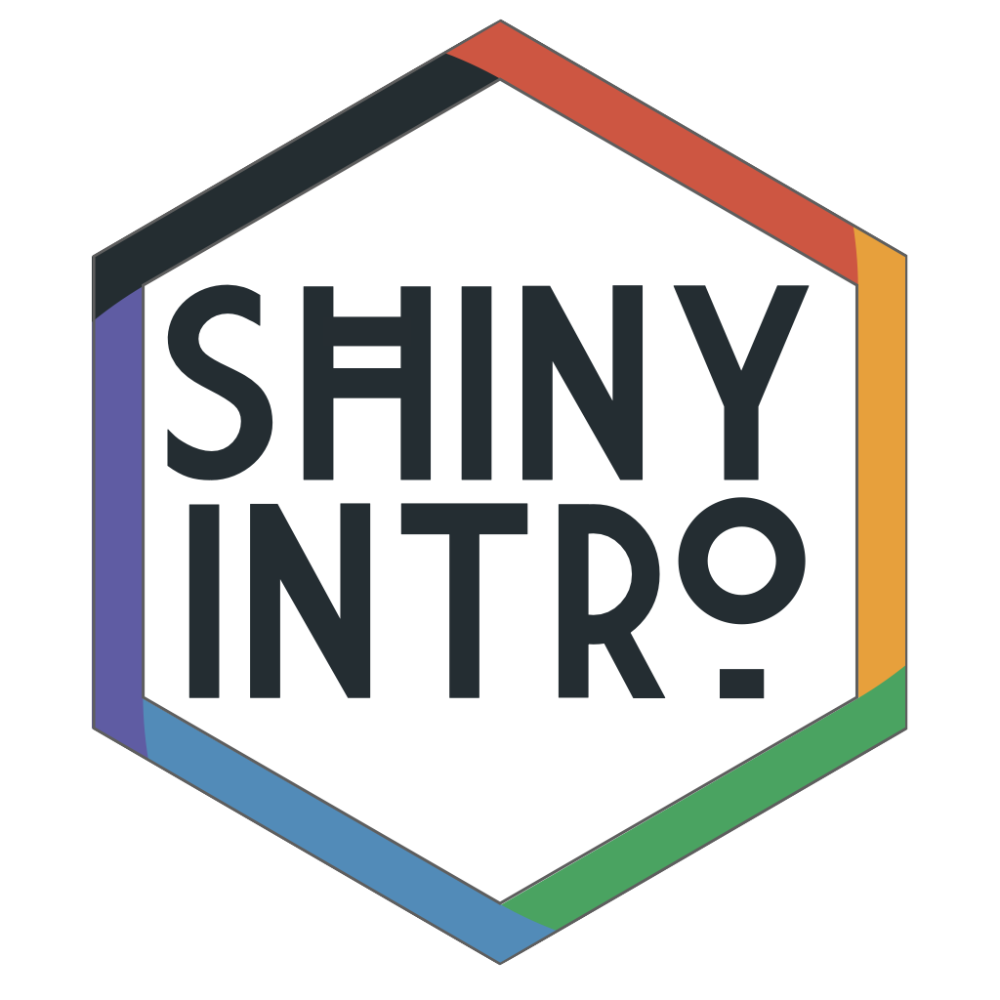

--- 
title: "Building Web Apps with R Shiny"
subtitle: "[<a href='/shinyintro.pdf'>PDF</a> | <a href='/shinyintro.epub'>EPUB</a> | <a href='/shinyintro.mobi'>MOBI</a>]"
author: "Lisa DeBruine"
date: "`r Sys.Date()`"
site: bookdown::bookdown_site
documentclass: book
bibliography: [book.bib, packages.bib]
csl: include/apa.csl
classoption: oneside
geometry: margin=1in
link-citations: yes
description: "This class will teach you the basics of Shiny app programming, giving you skills that will form the basis of almost any app you want to build. By the end of the class, you will have created a custom app that collects and saves data, allows users to dynamically visualize the data, and produces downloadable reports."
url: https://debruine.github.io/shinyintro/
github-repo: debruine/shinyintro
cover-image: images/logos/shinyintro.png
apple-touch-icon: images/logos/touch-icon.png
apple-touch-icon-size: 152
favicon: images/logos/favicon.ico
always_allow_html: true
---

```{r cite-packages, include = FALSE}
# automatically create a bib database for R packages
# add any packages you want to cite here
knitr::write_bib(c(
  .packages(), 'bookdown', 'tidyverse'
), 'packages.bib')
```

# Overview {-}

```{r, echo = FALSE, eval = TRUE, results='asis'}
if (is_html) {
  cat('<div class="small_right"></div>')
}
```

`r glossary("Shiny")` lets you make web applications that do anything you can code in R. For example, you can share your data analysis in a dynamic way with people who don't use R, collect and visualize data, or even make [data aRt](https://towardsdatascience.com/getting-started-with-generative-art-in-r-3bc50067d34b){target="_blank"}.

While there is a wealth of material available on the internet to help you get started with Shiny, it can be difficult to see how everything fits together. This class will take a predominantly live coding approach, rather than a lecture-only approach, so you can code along with the instructor and deal with the inevitable bugs and roadblocks together.

This class will teach you the basics of Shiny app programming, giving you skills that will form the basis of almost any app you want to build. By the end of the class, you will have created a custom app that collects and saves data, allows users to dynamically visualize the data, and produces downloadable reports.

## Installing shinyintro

To install the class package, which will provide you with a copy of all of the shiny apps we'll use for demos and the basic template, paste the following code into the console in RStudio. See [Appendix A](#installing-r) for help installing R and RStudio.

```{r}
# you may have to install devtools first with 
# install.packages("devtools")

devtools::install_github("debruine/shinyintro")
```

The class package lets you access the book or run the demo apps offline.

```{r}
shinyintro::book()
shinyintro::app("first_demo")
```

You can also clone the demo apps.

```{r}
shinyintro::clone("basic_template", "myapps/newapp")
```


## Example Apps

The following are some diverse examples of Shiny apps that the instructor has made.

* [Word Cloud](https://shiny.psy.gla.ac.uk/debruine/wordcloud/){target="_blank"} Create a word cloud from text and customize its appearance. Created during the live-coding event at [Hack Your Data Beautiful](https://psyteachr.github.io/hack-your-data/){target="_blank"}.
* [Faux](https://shiny.psy.gla.ac.uk/debruine/fauxapp/){target="_blank"} Simulate data with a specified factorial design.
* [Plot Demo](https://shiny.psy.gla.ac.uk/debruine/plotdemo/){target="_blank"} Simulate data from a 2×2 factorial design and visualize it with 6 different plot styles.
* [Simulating for LMEM](https://shiny.psy.gla.ac.uk/lmem_sim/){target="_blank"} companion to Understanding mixed effects models through data simulation (DeBruine & Barr, AMPPS 2021)
* [Scienceverse](http://shiny.ieis.tue.nl/scienceverse/){target="_blank"} is an ambitious (but in-progress) app for creating machine-readable descriptions of studies and human-readable summaries.

```{r word-cloud-app, echo=FALSE, fig.cap="Word Cloud App"}
if (is_html)
  knitr::include_app("https://shiny.psy.gla.ac.uk/debruine/wordcloud/",
  height = "600px")
```

<!--

## Code Horizons Course (27-30 July 2021)

Starting July 27, we are offering this seminar as a 4-day synchronous ^[We understand that scheduling is difficult during this unpredictable time. If you prefer, you may take all or part of the course asynchronously. The video recordings will be made available within 24 hours of each session and will be accessible for two weeks after the seminar, meaning that you will get all of the class content and discussions even if you cannot participate synchronously.], remote workshop for the first time. Each day will consist of a 3-hour live lecture held via the free video-conferencing software Zoom. You are encouraged to join the lecture live, but will have the opportunity to view the recorded session later if you are unable to attend at the scheduled time. Closed captioning is available for all live and recorded sessions.

Each lecture session will conclude with a hands-on exercise reviewing the content covered, to be completed on your own. An additional lab session will be held Tuesday and Thursday afternoons, where you can review the exercise results with the instructor and ask any questions.

### Schedule

#### Day 1 {-}

* [Your First Shiny App](#first-app)
* [ShinyDashboard](#shinydashboard)

#### Day 2 {-}

* [Different input types](#inputs)
* [Different output types](#outputs)
* [Reactive functions](#reactives)
* [Reading and saving data](#data)

#### Day 3 {-}

* [CSS, HTML, and Javascript](#web)
* [Structuring a complex app](#structure)
* [Debugging and error handling](#debugging)
* [Contingent Display](#contingency)

#### Day 4 {-}

* [Sharing Your Apps](#sharing)
* [Creating and downloading a customized report](#reports)
* [Shiny modules for repeated structures](#modules)

-->

### Computing

To participate in the hands-on exercises, you are strongly encouraged to use a computer with the most recent version of [R installed](https://www.r-project.org/){target="_blank"}. Participants are also encouraged to download and install [RStudio](https://www.rstudio.com/products/rstudio/download/){target="_blank"}, a front-end for R that makes it easier to work with. This software is free and available for Windows, Mac, and Linux platforms.

### What experience do I need?

You need to have basic familiarity with R, including data import, `r glossary("data wrangling", "data processing")`, visualization, and `r glossary("function", "functions")` and control structures (e.g., if/else). Instruction will be done using `r glossary("RStudio")`. Some familiarity with `r pkg("ggplot2")` and `r pkg("dplyr")` would be useful. You definitely do not need to be an expert coder, but the following code should not be challenging to understand.

```{r, eval = FALSE}

library(ggplot2)

pets <- read.csv("pets.csv")

dv <- sample(c("score", "weight"), 1)

if (dv == "score") {
  g <- ggplot(pets, aes(pet, score, fill = country))
} else if (dv == "weight") {
  g <- ggplot(pets, aes(pet, weight, fill = country))
}

g + geom_violin(alpha = 0.5)

```


If you want to brush up on your R (especially `r glossary("tidyverse")`), and also gain familiarity with the instructor's teaching style, the book [Applied Data Skills](https://psyteachr.github.io/ads/){target="_blank"} provides a good overview.


## Further Resources

There are a lot of great resources online to reinforce or continue your learning about Shiny. I advise going back to learning materials periodically because things that don't make sense the first (or second or third...) time around often click after you've had some experience.

* [Mastering Shiny](https://mastering-shiny.org/){target="_blank"}
* [RStudio Shiny Tutorials](https://shiny.rstudio.com/tutorial/){target="_blank"}
* [Awesome Shiny Extensions](https://github.com/nanxstats/awesome-shiny-extensions){target="_blank"}


