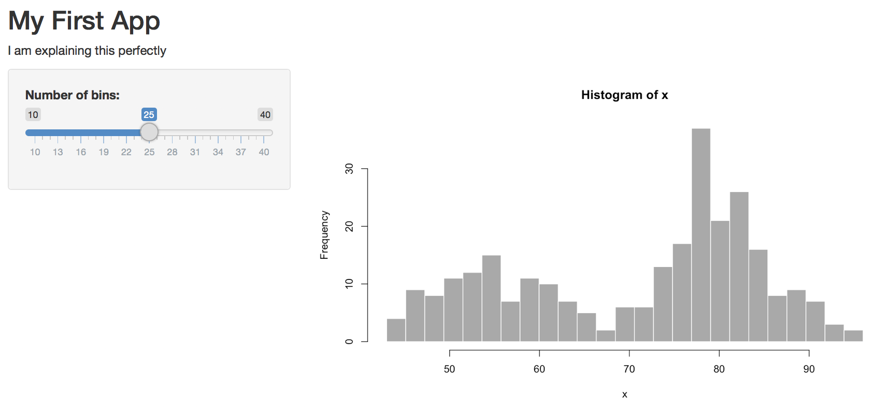
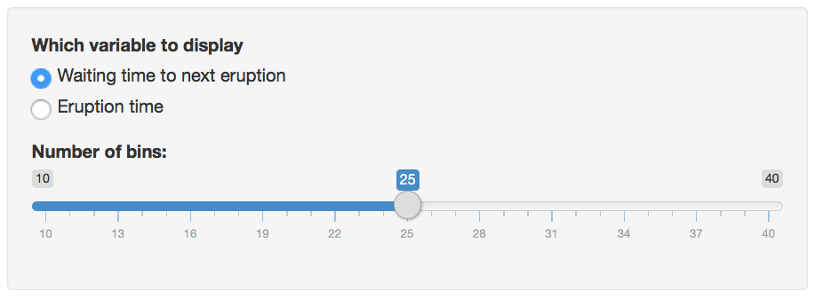

# Getting Started

## Your First Shiny App

### The Demo App

To start, let's walk through the basics of setting up a <a class='glossary' target='_blank' title='An R package that builds interactive web apps' href='https://psyteachr.github.io/glossary/s#shiny'>shiny</a> app, starting with the example built into <a class='glossary' target='_blank' title='An integrated development environment (IDE) that helps you process R code.' href='https://psyteachr.github.io/glossary/r#rstudio'>RStudio</a> I won't explain yet how shiny apps are structured; the goal is to just get something up and running, and give you some familiarity with the layout of a fairly simple app.

#### Set Up the Demo App

<div class="figure" style="text-align: center">

<p class="caption">(\#fig:first-demo)Creating a demo app.</p>
</div>

1. Under the `File` menu, choose `New Project...`. You will see a popup window like the one above. Choose `New Directory`.

2. Choose `Shiny Web Application` as the project type.

3.  I like to put all of my apps in the same directory`, but it doesn't matter where you save it.

4. Your RStudio interface should look like this now. You don't have to do anything else at this step.


<div class="warning">
If RStudio has changed their demo app and your source code doesn't look like this, replace it with the code below: 


<div class='webex-solution'><button>View Code</button>


```r
#
# This is a Shiny web application. You can run the application by clicking
# the 'Run App' button above.
#
# Find out more about building applications with Shiny here:
#
#    http://shiny.rstudio.com/
#

library(shiny)

# Define UI for application that draws a histogram
ui <- fluidPage(
   
   # Application title
   titlePanel("Old Faithful Geyser Data"),
   
   # Sidebar with a slider input for number of bins 
   sidebarLayout(
      sidebarPanel(
         sliderInput("bins",
                     "Number of bins:",
                     min = 1,
                     max = 50,
                     value = 30)
      ),
      
      # Show a plot of the generated distribution
      mainPanel(
         plotOutput("distPlot")
      )
   )
)

# Define server logic required to draw a histogram
server <- function(input, output) {
   
   output$distPlot <- renderPlot({
      # generate bins based on input$bins from ui.R
      x    <- faithful[, 2] 
      bins <- seq(min(x), max(x), length.out = input$bins + 1)
      
      # draw the histogram with the specified number of bins
      hist(x, breaks = bins, col = 'darkgray', border = 'white')
   })
}

# Run the application 
shinyApp(ui = ui, server = server)
```


</div>

</div>


Click on `Run App` in the top right corner of the <a class='glossary' target='_blank' title='RStudio is arranged with four window “panes.”' href='https://psyteachr.github.io/glossary/p#panes'>source pane</a>. The app will open up in a new window. Play with the slider and watch the histogram change.


<div class="info">
<p>You can also open up the app in a web browser by clicking on <code>Open in Browser</code>.</p>
</div>

#### Modify the Demo App

Now we're going to make a series of changes to the demo app until it's all your own.

<div class="info">
<p>You can close the app by closing the window or browser tab it’s running in, or leave it running while you edit the code. If you have multiple screens, it’s useful to have the app open on one screen and the code on another.</p>
</div>


Find the application title. It is the first [argument](defs.html#argument) to the [function](defs.html#function) `titlePanel`. Change the title to `"My First App"`. Make sure the title is inside quotes and the whole quoted <a class='glossary' target='_blank' title='A piece of text inside of quotes.' href='https://psyteachr.github.io/glossary/s#string'>string</a> is inside the parentheses. Save the file (`cmd-S` or `File > Save`).


Click `Run App` (or `Reload App` if you haven't closed the app window) in the [source pane](defs.html#panes). If you haven't saved your changes, it will prompt you to do so. Check that the app title has changed.

Now let's change the input. Find the function `sliderInput` (line 21). The first <a class='glossary' target='_blank' title='A variable that provides input to a function.' href='https://psyteachr.github.io/glossary/a#argument'>argument</a> is the name you can use in the code to find the value of this input, so don't change it just yet. The second argument is the text that displays before the slider. Change this to something else and re-run the app.


```r
         sliderInput("bins",
                     "Number of bins:",
                     min = 0,
                     max = 50,
                     value = 30)
```

<div class="try">
See if you can figure out what the next three arguments to `sliderInput` do. Change them to different <a class='glossary' target='_blank' title='A data type representing whole numbers.' href='https://psyteachr.github.io/glossary/i#integer'>integers</a>, then re-run the app to see what's changed.
</div>

The arguments to the function `sidebarPanel` are just a list of things you want to display in the sidebar. To add some explanatory text in a paragraph before the `sliderInput`, just use the paragraph function `p("My text")`


```r
      sidebarPanel(
         p("I am explaining this perfectly"),
         sliderInput("bins",
                     "Choose the best bin number:",
                     min = 10,
                     max = 40,
                     value = 25)
      )
```



<div class="info">
<p>The sidebar shows up on the left if your window is wide enough, but moves to the top of the screen if it’s too narrow.</p>
</div>

I don't like it there, so we can move this text out of the sidebar and to the top of the page, just under the title. Try this and re-run the app.


```r
   # Application title
   titlePanel("My First App"),

   p("I am explaining this perfectly"),

   # Sidebar with a slider input for number of bins
   sidebarLayout(...)
```

<div class="try">
<p>See where you can move the text in the layout of the page and where causes errors.</p>
</div>


I'm also not keen on the grey plot. We can change the plot colour inside the `hist` function.


```r
      # draw the histogram with the specified number of bins
      hist(x, breaks = bins, col = 'steelblue3', border = 'grey30')
```

There are a lot of ways to represent colour in R. The easiest three are:

1. hexadecimal colours like `#0066CC`, 
2. the `rgb` or `hsl` functions, 
3. colour names (type `colours()` in the console)

I like `steelblue3`, as it's pretty close to the shiny interface default colour, but feel free to choose whatever you like. 


I prefer `ggplot` graphs, so let's make the plot with `geom_histogram` instead of `hist` (which is a great function for really quick plots). Since we need several functions from the `ggplot2` <a class='glossary' target='_blank' title='A group of R functions.' href='https://psyteachr.github.io/glossary/p#package'>package</a>, we'll need to load that package at the top of the script, just under where the `shiny` package is loaded:


```r
library(shiny)
library(ggplot2)
```

You can replace all of the code in the `renderPlot` function with the code below. 


```r
  output$distPlot <- renderPlot({
    # create plot
    ggplot(faithful, aes(waiting)) +
      geom_histogram(bins = input$bins,
                     fill = "steelblue3",
                     colour = "grey30") +
      xlab("What are we even plotting here?") +
      theme_minimal()
  })
```

<div class="info">
<p>You can set the <code>fill</code> and <code>colour</code> to whatever colours you like, and change <code>theme_minimal()</code> to one of the other <a href="https://ggplot2.tidyverse.org/reference/ggtheme.html#examples" target="_blank">built-in ggplot themes</a>.</p>
</div>

<div class="try">
<p>What <em>are</em> we even plotting here? Type <code>?faithful</code> into the console pane to see what the <code>waiting</code> column represents (<code>faithful</code> is a built-in demo dataset). Change the label on the x-axis to something more sensible.</p>
</div>

#### Add New Things

The `faithful` dataset includes two columns:`eruptions` and `waiting`. We've been plotting the `waiting` variable, but what if you wanted to plot the `eruptions` variable instead? 

<div class="try">
<p>Try plotting the eruption time (<code>eruptions</code>) instead of the waiting time. You just have to change one word in the <code>ggplot</code> function and update the x-axis label.</p>
</div>

We can add another input <a class='glossary' target='_blank' title='A interactive web element, like a dropdown menu or a slider.' href='https://psyteachr.github.io/glossary/w#widget'>widget</a> to let the user switch between plotting eruption time and wait time. The [RStudio Shiny tutorial](https://shiny.rstudio.com/tutorial/written-tutorial/lesson3/) has a great overview of the different input options. We need to toggle between two options, so we can use either radio buttons or a select box. Radio buttons are probably best if you have only a few options and the user will want to see them all at the same time to decide.

Add the following code as the first argument to `sidebarPanel()`, which just takes a list of different widgets. `radioButtons` is the widget we're using. The first argument is `display_var`, which we will use later in the code to find the value of this widget. The second argument is the label to display to the user. The next argument is `choices`, which is a list of choices in the format `c("label1" = "value1", "label2 = "value2", ...)`. The label is what gets shown to the user and the value is what gets used by the code (these can be the same, but you often want the user label to be more descriptive). The last argument is `selected`, which is the value of the default choice. Save this and re-run the app.


```r
         radioButtons("display_var",
                      "Which variable to display",
                      choices = c("Waiting time to next eruption" = "waiting",
                                  "Eruption time" = "eruptions"),
                      selected = "waiting"
         ),
```




You should have a radio button interface now. You can click on the options to switch the button, but it won't do anything to your plot yet. We need to edit the plot-generating code to make that happen. 

First, we need to change the x-axis label depending on what we're graphing. We use an if/else statement to set the variable `xlabel` to one thing if `input$display_var` is equivalent to `"eruptions"`, and to something else if it's equivalent to `"waiting"`. Put this code at the very beginning of the code block for the `renderPlot` function (after the line `output$distPlot <- renderPlot({`).


```r
      # set x-axis label depending on the value of display_var
      if (input$display_var == "eruptions") {
        xlabel <- "Eruption Time (in minutes)"
      } else if (input$display_var == "waiting") {
        xlabel <- "Waiting Time to Next Eruption (in minutes)"
      }
```

<div class="warning">
<p>The double-equal-signs <code>==</code> means "equivalent to and is how you check if two things are the same; if you only use one equal sign, you set the variable on the left to the value on the right.</p>
</div>

Then we have to edit the `ggplot` function to use the new label and to plot the correct column. The variable `input$display_var` gives you the user-input value of the widget called `display_var`.


```r
      # create plot
      ggplot(faithful, aes(.data[[input$display_var]])) +
        geom_histogram(bins = input$bins,
                       fill = "steelblue3",
                       colour = "grey30") +
        xlab(xlabel) +
        theme_minimal()
```

<div class="warning">
<p>Notice that the function <code>aes(waiting)</code> from before has changed to <code>aes(.data[[input$display_var]])</code>. Because <code>input$display_var</code> is a <code>r glossary("string")</code>, we have to select it from the <code>.data</code> placeholder (which refers to the <code>faithful</code> data table) using double brackets.</p>
</div>

Re-run your app and see if you can change the data and x-axis label with your new widget. If not, check that your code against the code in `shinyintro::newapp("first_demo")`.

<div class="figure" style="text-align: center">
<iframe src="https://shiny.psy.gla.ac.uk/debruine/first_demo/?showcase=0" width="100%" height="800px"></iframe>
<p class="caption">(\#fig:first-demo-app)First Demo App</p>
</div>


### Overview of the UI/server structure

### Inputs, outputs, and action buttons

### Reactive functions

## ShinyDashboard

### Basic template for shinydashboard projects

### Sidebar, menu navigation, and tabs

### Row- and column-based layouts

## Glossary {#glossary-01}


|term                                                                                                    |definition                                                                 |
|:-------------------------------------------------------------------------------------------------------|:--------------------------------------------------------------------------|
|<a class='glossary' target='_blank' href='https://psyteachr.github.io/glossary/a#argument'>argument</a> |A variable that provides input to a function.                              |
|<a class='glossary' target='_blank' href='https://psyteachr.github.io/glossary/i#integer'>integer</a>   |A data type representing whole numbers.                                    |
|<a class='glossary' target='_blank' href='https://psyteachr.github.io/glossary/p#package'>package</a>   |A group of R functions.                                                    |
|<a class='glossary' target='_blank' href='https://psyteachr.github.io/glossary/p#panes'>panes</a>       |RStudio is arranged with four window “panes.”                              |
|<a class='glossary' target='_blank' href='https://psyteachr.github.io/glossary/r#rstudio'>rstudio</a>   |An integrated development environment (IDE) that helps you process R code. |
|<a class='glossary' target='_blank' href='https://psyteachr.github.io/glossary/s#shiny'>shiny</a>       |An R package that builds interactive web apps                              |
|<a class='glossary' target='_blank' href='https://psyteachr.github.io/glossary/s#string'>string</a>     |A piece of text inside of quotes.                                          |
|<a class='glossary' target='_blank' href='https://psyteachr.github.io/glossary/w#widget'>widget</a>     |A interactive web element, like a dropdown menu or a slider.               |


