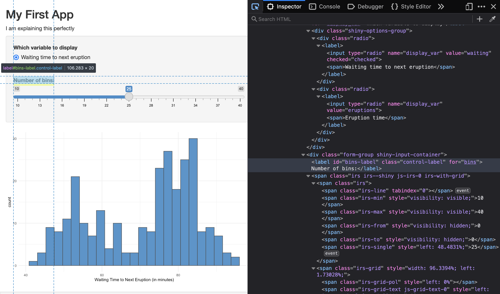

# HTML, CSS, and JavaScript {#web}

You don't need to know anything about HTML, CSS and JavaScript to make basic Shiny apps, but a little knowledge can really help you customise your apps. This chapter will cover some of the basics so you have enough vocabulary to get started.

## HTML

<a class='glossary' target='_blank' title='Hyper-Text Markup Language: A system for semantically tagging structure and information on web pages.' href='https://psyteachr.github.io/glossary/h#html'>HTML</a> stands for Hyper-Text Markup Language, a system for semantically tagging structure and information on web pages. The term "semantically" is important here; HTML should tell you **what** something is, not **how** to display it (that's handled by CSS). This separation helps your apps be accessible to people who use screen readers.

### HTML Tags

We learned about the `tags()` function in [Chapter 1](#tags) and how it is linked to <a class='glossary' target='_blank' title='A way to mark the start and end of HTML elements.' href='https://psyteachr.github.io/glossary/t#tag'>HTML tags</a>. For example, the R code `tags$h2("Methods")` creates the HTML `<h2>Methods</h2>`. It surrounds the text content with a starting tag `<h2>` and an ending tag `</h2>`. 

Tags create <a class='glossary' target='_blank' title='A unit of HTML, such as a header, paragraph, or image.' href='https://psyteachr.github.io/glossary/e#element-html'>elements</a>, which can be thought of kind of like boxes. An element can contain one or more elements. Elements can have <a class='glossary' target='_blank' title='Extra information about an HTML element' href='https://psyteachr.github.io/glossary/a#attribute-html'>attributes</a> that provide more information such as the element's ID or class, which can be used by CSS or JavaScript to refer to the element or a group of elements.

For example, the following code creates an unordered list (`<ul>`) with the class "animals". It contains three list item elements (`<li>`), each with its own id. 

``` html
<ul class="animals">
    <li id="aardvark">Aardvarks</li>
    <li id="bee">Bees</li>
    <li id="capybara">Capybaras</li>
</ul>
```

You seldom *have to* write HTML directly in Shiny, but if you have experience with HTML, it can sometimes be easier to create something in HTML than with the relevant Shiny functions. For example, the code above in Shiny would be:


```r
tags$ul(class = "animals",
        tags$li("aardvark", "Aardvark"),
        tags$li("bee", "Bee"),
        tags$li("capybara", "Capybara")
)
```

Alternatively, you can use `HTML()` to include raw HTML in a ui function.


```r
HTML('<ul class="animals">
    <li id="aardvark">Aardvarks</li>
    <li id="bee">Bees</li>
    <li id="capybara">Capybaras</li>
</ul>')
```

### Viewing HTML

But the main reason for you to learn a little about HTML is that it can help you to customise the appearance of your Shiny apps using CSS and their behaviour using JavaScript.

Often, you'll need to find out how to refer to a specific element or group of elements that were created by a shiny ui function. For example, it isn't obvious how you'd refer to the sidebar tab for `x_tab` in the following code:


```r
sidebarMenu(
    id = "tabs",
    menuItem("Tab Title", tabName = "x_tab", icon = icon("dragon"))
)
```

If you right click on the resulting app and choose "View Page Source", you'll (eventually) find that the code above created the HTML below.

```
<ul class="sidebar-menu">
  <li>
    <a href="#shiny-tab-x_tab" data-toggle="tab" data-value="x_tab">
      <i class="fa fa-dragon" role="presentation" aria-label="dragon icon"></i>
      <span>Tab Title</span>
    </a>
  </li>
  <div id="tabs" class="sidebarMenuSelectedTabItem" data-value="null"></div>
</ul>
```

Now you know that the dragon icon is made by an italics tag (`<i>`) that's inside an anchor (`<a>`) with the id "#shiny-tab-x_tab". Therefore, you can change the colour of this icon using the following CSS:

``` css
#shiny-tab-x_tab i { color: red; }
```

It can be tricky to find what code you're looking for, but developer tools can help. I use [FireFox Developer Edition](https://www.mozilla.org/en-US/firefox/developer/){target="_blank"} when I'm developing web apps, but Chrome also has developer tools. In FireFox, go to **`Tools > Browser Tools > Web Developer Tools`** (opt-cmd-I). In Chrome, go to **`View > Developer > Developer Tools`** (opt-cmd-I). You can dock the tools to the bottom, right , or left of the window, or as a separate window. 

Open the Inspector (FireFox) or Elements (Chrome) tab of the tools and click on the icon that looks like an arrow pointing into a box. When you hover over parts of the web page, not you will see boxes outlining each element. You can click on an element to highlight its HTML in the tools.

<div class="figure" style="text-align: center">

<p class="caption">(\#fig:inspector)Viewing the HTML with the inspector.</p>
</div>


## CSS

<a class='glossary' target='_blank' title='Cascading Style Sheet: A system for controlling the visual presentation of HTML in web pages.' href='https://psyteachr.github.io/glossary/c#css'>CSS</a> stands for Cascading Style Sheets and is a way to control the visual presentation of HTML on web pages. You can use CSS to change the default appearance of anything on a web page. 

### CSS Basics

CSS is structured as follows:

``` css
selector { property: value; }
```

Selectors are how you refer to the parts of the HTML you want to style. There are dozens of [selectors](https://www.w3schools.com/cssref/css_selectors.asp){target="_blank"} and they can get very complex. We'll focus on some basic examples below.

Properties are aspects of the visual style that you want to change, such as "color" (text color), "background-color", or "border". Values have specific formats for each property, such as "1px" or "0.5em" to describe lengths, or "red" or "#FF0000" to describe colours. 

::: {.info}
There are hundreds of [properties](https://www.w3schools.com/cssref/default.asp){target="_blank"} and you can't memorise them all. I usually Google something like "css font type" or "css underline text" and choose the first link from [ww3schools](https://www.w3schools.com){target="_blank"}.
:::

For example, if you have HTML that looks like this:

``` html
<ul class="animals">
    <li id="aardvark">Aardvarks</li>
    <li id="bee">Bees</li>
    <li id="capybara">Capybaras</li>
</ul>
```

You can refer to different parts of the list in many ways:

| CSS | Meaning |
|:----|:--------|
| `.animals { border: 1px solid green; }` | any element with the class "animals" will get a 1-pixel green border |
| `ul.animals { border: 1px solid green; }` | any unordered list with the class "animals" will get a 1-pixel green border |
| `.animals li { color: blue; }` | any list item element inside an element with the class "animals" will have blue text |
| `#bee { font-style: italic; }` | the element with the id "bee" will be in italics |
| `.animals li + li { background-color: grey; }` | inside an element with the class "animals", any list item that follows another list item will have a grey background |

### Styling a single element

You can add styles to most elements that you make with shiny ui functions by adding an <a class='glossary' target='_blank' title='A variable that provides input to a function.' href='https://psyteachr.github.io/glossary/a#argument'>argument</a> called `style`.


```r
tags$ul(class = "animals", style="width: 10em;",
        tags$li("Aardvark"),
        tags$li("Bee", style="background-color: yellow;"),
        tags$li("Capybara")
)
```


### Inline CSS

You can add a small amount of CSS to an app inside the header using the style tag. The code below makes the element with the class "animal" 10em wide (*em* is a unit of size that is proportional to text size). It also makes the element with the id "bee" italic and gives it a black background with yellow text. If the element is a list item, it makes the marker a bee emoji.


```r
mystyle <- '
  .animal { width: 10em; }
  #bee {
    font-style: italic; 
    color: yellow;
    background-color: black;
  }
  li#bee::marker { content: "🐝 "; }
'

ui <- fluidPage(
  tags$head(
    tags$style(mystyle)
  ),
  tags$ul(class = "animals",
        tags$li("Aardvark", class = "aardvark"),
        tags$li("Bee", class = "bee"),
        tags$li("Capybara", class = "capybara")
  )
)
```

<style>
  .animal { width: 10em; }
  #bee {
    font-style: italic; 
    color: yellow;
    background-color: black;
  }
  li#bee::marker { content: "🐝 "; }
</style>

<ul class="animals">
    <li id="aardvark">Aardvarks</li>
    <li id="bee">Bees</li>
    <li id="capybara">Capybaras</li>
</ul>

### External CSS

For anything longer than a few lines, you can see how this can get tedious. You can put all of your CSS in an external file and reference that in the header instead using `tags$link()`. The CSS file needs to be inside the `www` directory to let Shiny know that it's meant to be included like this. The template we're using in this class comes with a CSS file called `custom.css`.


```r
tags$head(
  tags$link(rel = "stylesheet", type = "text/css", href = "custom.css")
)
```

::: {.warning}
Sometimes when you change external files, they don't seem to update when you test the app. This can be because of <a class='glossary' target='_blank' title='In a web browser, external files like CSS, JavaScript, and images are usually cached so that they don’t have to be repeatedly downloaded.' href='https://psyteachr.github.io/glossary/c#cache-web'>caching</a>. You can usually solve this by reloading the app in your web browser, reloading in the web browser with the shift key pressed, stopping the app from running in RStudio with the stop sign icon and starting it up again, and, finally, restarting R.
:::

## JavaScript

<a class='glossary' target='_blank' title='An object-oriented computer programming language commonly used to create interactive effects in web browsers.' href='https://psyteachr.github.io/glossary/j#javascript'>JavaScript</a> is a coding language that is very useful for adding dynamic behaviour to web pages. For simple apps, you don't need to understand any JavaScript, but a little bit can be really helpful for adding advanced behaviour.

### shinyjs

The R package shinyjs provides several ways to work with JavaScript in a Shiny app. In orde to set it up so that your server function can use shinyjs function, you need to add `shinyjs::useShinyjs()` somewhere in your ui function.

Here is a list of the shinyjs functions that I find most useful (`id` refers to an element with the specified ID):

* `hide(id)`: hide the element
* `show(id)`: show the element
* `toggle(id)`: change the visibility of the element (hide it if it's visible, and show it if it's not)
* `alert(text)`: create an alert popup; this is useful for debugging
* `addClass(id, class)`: adds a CSS class to the element
* `removeClass(id, class)`: removes a CSS class from the element
* `click(id)`: simulates a click on the action button
* `disable(id)`: disable an input
* `enable(id)`: enables an input
* `reset(id)`: resets an input (much easier than the update* functions)

### External JS

To do anything more complicated, it's best to put your JavaScript in an external file in the `www` directory. You can include a link to this script in the header. The template we're using in this class comes with a JavaScript file called "custom.js".


```r
tags$head(
  tags$script(src = "custom.js")
)
```

Shiny apps use [jQuery](https://jquery.com/){target="_blank"}, a framework for making JavaScript easier to write. It lets you refer to elements using their CSS selectors.

Here is some example code from the custom.js file in the template.

``` js
$(document).on("shiny:connected", function() {
  // send window width to shiny
  shiny_size = function() {
    Shiny.setInputValue("window_width", window.innerWidth);
    Shiny.setInputValue("window_height", window.innerHeight);
  }
  
  window.onresize = shiny_size;
  shiny_size(); // trigger once at start
})
```

JavaScript is similar to R in some ways, and maddeningly different in others. One big difference is that lines of code have to end with a semi-colon.

In the code above, the function `$(document).on("shiny:connected", function() { ... })` is jQuery shorthand for making sure that the code inside doesn't run until the whole webpage has been downloaded and the extra javascript for shiny is available. Otherwise, you might try to run some code that references an element that hasn't been created yet (HTML pages don't always download all in one go) or uses a Shiny function that isn't available yet.

The we create a new function called `shiny_size`, which creates two new Shiny input variables, "window_width" and "window_height", and sets then to the values of the window dimensions (in pixels). The line `window.onresize = shiny_size;` sets this function to run every time the window is resized and the function is run once at the start to initialise those values.

The javaScript function `Shiny.setInputValue(input_id, value)` is a way for you to communicate things that happen on the web page to the Shiny app by changing or creating inputs. You can use this inside `server()` to, for example, change a plot style if `input$window_width < 600`.

## Further Resources {#resources-web}

* [W3 Schools HTML Tutorial](https://www.w3schools.com/html/){target="_blank"}
* [Using Custom CSS in your App](https://shiny.rstudio.com/articles/css.html){target="_blank"}
* [CSS Selectors Reference](https://www.w3schools.com/cssref/css_selectors.asp){target="_blank"}
* [Packaging JavaScript Code for Shiny](https://shiny.rstudio.com/articles/packaging-javascript.html){target="_blank"}
* [W3 Schools jQuery Tutorial](https://www.w3schools.com/jquERy/default.asp){target="_blank"}
* [Codeacademy interactive tutorials](https://www.codecademy.com/en/tracks/htmlcss){target="_blank"}

## Glossary {#glossary-web}


|term                                                                                                                |definition                                                                                                                                |
|:-------------------------------------------------------------------------------------------------------------------|:-----------------------------------------------------------------------------------------------------------------------------------------|
|<a class='glossary' target='_blank' href='https://psyteachr.github.io/glossary/a#argument'>argument</a>             |A variable that provides input to a function.                                                                                             |
|<a class='glossary' target='_blank' href='https://psyteachr.github.io/glossary/a#attribute-html'>attribute-html</a> |Extra information about an HTML element                                                                                                   |
|<a class='glossary' target='_blank' href='https://psyteachr.github.io/glossary/c#cache-web'>cache-web</a>           |In a web browser, external files like CSS, JavaScript, and images are usually cached so that they don’t have to be repeatedly downloaded. |
|<a class='glossary' target='_blank' href='https://psyteachr.github.io/glossary/c#css'>css</a>                       |Cascading Style Sheet: A system for controlling the visual presentation of HTML in web pages.                                             |
|<a class='glossary' target='_blank' href='https://psyteachr.github.io/glossary/e#element-html'>element-html</a>     |A unit of HTML, such as a header, paragraph, or image.                                                                                    |
|<a class='glossary' target='_blank' href='https://psyteachr.github.io/glossary/h#html'>html</a>                     |Hyper-Text Markup Language: A system for semantically tagging structure and information on web pages.                                     |
|<a class='glossary' target='_blank' href='https://psyteachr.github.io/glossary/j#javascript'>javascript</a>         |An object-oriented computer programming language commonly used to create interactive effects in web browsers.                             |
|<a class='glossary' target='_blank' href='https://psyteachr.github.io/glossary/t#tag'>tag</a>                       |A way to mark the start and end of HTML elements.                                                                                         |


## Exercises {#exercises-web}

Clone the basic template for these exercises.

### Add HTML

Add the following HTML before the image in `x_tab` using `HTML()`:

``` html
<p class="help">For more help, you can go to <a href="https://shiny.rstudio.com/articles/html-tags.html">Customize your UI with HTML</a>.</p>
```


<div class='webex-solution'><button>Hint</button>

Since the HTML has double quotes in it, you either need to escape them or surround the string in single quotes instead.

</div>


<div class='webex-solution'><button>Solution</button>


```r
x_tab <- tabItem(
    tabName = "x_tab",
    HTML('<p class="help">For more help, you can go to <a href="https://shiny.rstudio.com/articles/html-tags.html">Customize your UI with HTML</a>.</p>'),
    imageOutput("logo")
)
```

</div>


### Class HTML

Add an unordered list under the paragraph that contains the following text and links:

* [Tags Glossary](https://shiny.rstudio.com/articles/tag-glossary.html)
* [HTML Tutorial](https://www.w3schools.com/html/)


<div class='webex-solution'><button>Solution</button>


```r
x_tab <- tabItem(
    tabName = "x_tab",
    HTML('<p class="help">For more help, you can go to <a href="https://shiny.rstudio.com/articles/html-tags.html">Customize your UI with HTML</a>.</p>'),
    tags$ul(
        tags$li(tags$a(href = "https://shiny.rstudio.com/articles/tag-glossary.html", "Tags Glossary")),
        tags$li(tags$a(href = "https://www.w3schools.com/html/", "HTML Tutorial"))
    ),
    imageOutput("logo")
)
```

</div>


### Style links

Change the style of all the links to make them hotpink. Use the inline CSS method. As a bonus, change the colour of links when you hover over them, too.


<div class='webex-solution'><button>Solution</button>


```r
tags$head(
    tags$style("a { color: hotpink; }
                a:hover { color: red; }")
)
```

</div>


### Style a single link directly

Change the style of just the first link in the list to make it green. 

<div class='webex-solution'><button>Solution</button>


```r
tags$ul(
        tags$li(tags$a(href = "https://shiny.rstudio.com/articles/tag-glossary.html", "Tags Glossary"), style="color: green;"),
        tags$li(tags$a(href = "https://www.w3schools.com/html/", "HTML Tutorial"))
    )
```

</div>


### External CSS

Change the style of just the links inside paragraphs with the class "help" to have an underline. Use external CSS.


<div class='webex-solution'><button>Solution</button>

Add the following to `www/custom.css`:

``` css
.help a { text-decoration: underline; }
```

</div>


