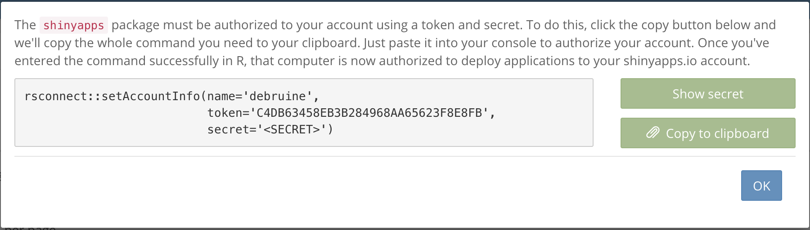
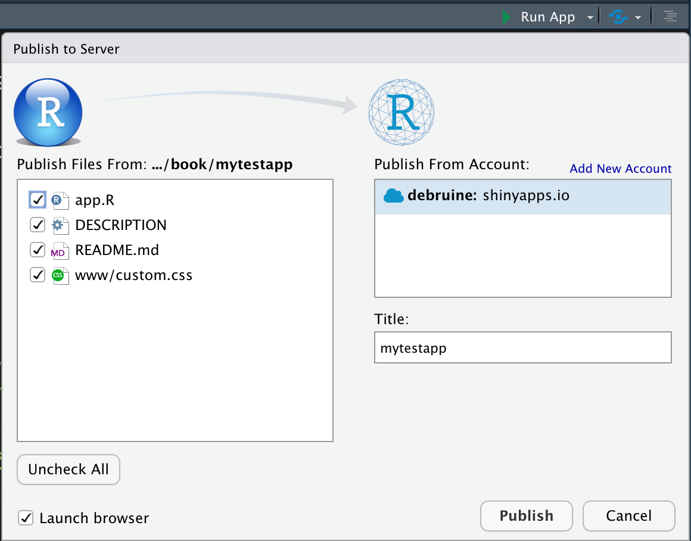

# Sharing your Apps {#sharing}

## shinyapps.io

{style="max-width:300px; float: right;"}

1. Open **`Tools > Global Options ...`**
2. Go to the **Publishing** tab 
3. Click the **Connect** button and choose ShinyApps.io
4. Click on the link to [go to your account](https://www.shinyapps.io/){target="_blank"}
5. Click the **Sign Up** button and **Sign up with GitHub** 
6. You should now be in your shinyapps.io dashboard; click on your name in the upper right and choose **Tokens**
7. Add a token
8. Click **Show** next to the token and copy the text to the clipboard
    
9. Go back to RStudio and paste the text in the box and click **Connect Account**
10. Make sure the box next to "Enable publishing..." is ticked, click **Apply**, and close the options window
˙
You can test this by creating a simple app. If you have the shinyintro package, use the code below.


```r
shinyintro::clone("input_demo", "mytestapp")
```

{style="max-width:300px; float: right;"}

Open the app.R file and go to **`File > Publish...`** in the menu (or click on the blue icon in the upper right corner of the source pane). Make sure these are the right files for your app, edit the title if you want, and click **Publish**. A web browser window will open after a few seconds showing your app online! You can now share it with your friends and colleagues.

::: {.info}
If publishing fails, check the Console pane. If you already have too many apps on shinyapps.io, you'll see the message, "You have reached the maximum number of applications allowed for your account." You can archive some of your apps from the shinyapps.io dashboard if this is the problem.
:::

## Self-hosting a shiny server

Setting up a shiny server is beyond the scope of this class, but if you have access to one, you can ask the administrator how to access the correct directories and upload your app directories there.

This solution is good if you want to save data locally and do not want to use Google Sheets. You can't save data locally on shinyapps.io.

::: {.info}
If you save data locally on a shiny server, you may need to change the owner or permissions of the directory you save data in so that the web user can write to it. Ask the administrator of the server for help if this doesn't make any sense to you.
:::

## GitHub

<a class='glossary' target='_blank' title='A cloud-based service for storing and sharing your version controlled files.' href='https://psyteachr.github.io/glossary/g#github'>GitHub</a> is a great place to organise and share your code using <a class='glossary' target='_blank' title='A way to save a record of changes to your files.' href='https://psyteachr.github.io/glossary/v#version-control'>version control</a>. You can also use it to host Shiny app code for others to download and run on their own computer.

See [Appendix B](#setup-git) for instructions on how to set up git and a GitHub account. Set up a github access token with `usethis::create_github_token()`. Your web browser will open and you'll be asked to log into your GitHub account and then asked to authorise a new token. Accept the defaults and click OK at the bottom of the page. In RStudio, run `gitcreds::gitcreds_set()` and follow the instructions to save the token.

Then, to share an app with people who use R, make a project that contains your `app.R` file and any related files. If you aren't already using version control for this project, make sure all of your files are saved and type `usethis::use_git()` into the console. Choose Yes to commit and Yes to restart R.

Make a new GitHub repository with `usethis::use_github(protocol="https")`; check that the suggested title and description are OK. If you choose the affirmative response (not always the same number), you'll see some messages and your web browser will open the github repository page.

Now you can share your app with others by sending them the repository link. They can access your repository in RStudio by starting a New Project from version control, using the URL that is shown when you click on the green "Code" button on the repository page (something like "https://github.com/account/repository.git"). They can run your app the same way you do when developing it, by opening the `app.R` file and clicking the Run button.

To update your files on GitHub, you need to <a class='glossary' target='_blank' title='' href='https://psyteachr.github.io/glossary/c#commit'>commit</a> any changes you make using the Git tab in the upper right pane. Click on the checkbox of any files you want to update, click "Commit", and write a message to yourself explaining the changes (this will be publicly viewable on GitHub, so try to be professional ;). 

Committing just creates a snapshot of the files on your computer so you can look at previous versions. To update the files on GitHub, you need to <a class='glossary' target='_blank' title='' href='https://psyteachr.github.io/glossary/p#push'>push</a> the updates using the green up arrow button.

::: {.info}
Git and GitHub can be tricky. [Happy Git with R](https://happygitwithr.com/){target="_blank"} by Jenny Bryan is a fantastic in-depth book anbout how to work with git in R and RStudio.
:::

## In an R package

You can put your app in a custom R package to make it even easier for people to run the app. The usethis package is incredibly helpful for setting up packages.


```r
usethis::create_package("mypackagename")
usethis::use_ccby_license()

# add packages your app uses
usethis::use_package("shiny")
usethis::use_package("shinydashboard")

# add the directory for your apps
dir.create("inst")
dir.create("inst/apps")
```


Copy any apps you want to include in this package into the inst/apps directory. 

Now, create the app function by running `usethis::edit_file("R/app.R")` and copy the following text into the `app.R` file that just opened. Replace "default_app" with the directory name of the app that you want to open if a user doesn't type any name in at all.


```r
#' Launch Shiny App
#'
#' @param name The name of the app to run
#' @param ... arguments to pass to shiny::runApp
#'
#' @export
#'
app <- function(name = "default_app", ...) {
  appDir <- system.file(paste0("apps/", name), package = "mypackagename")
  if (appDir == "") stop("The shiny app ", name, " does not exist")
  shiny::runApp(appDir, ...)
}
```


Next, open the `DESCRIPTION` file and edit the title, author and description. 


```r
devtools::document()
devtools::install()
```

You should now be able to run your app with `mypackagename::app()`.

Set up git and save your package to GitHub to share it with others:


```r
usethis::use_git()
usethis::use_github(protocol="https")
```

Once it's uploaded to GitHub, other people can install it with the following code:


```r
devtools::install_github("myaccountname/mypackagename")
```


## Glossary {#glossary-sharing}


|term                                                                                                                  |definition                                                                   |
|:---------------------------------------------------------------------------------------------------------------------|:----------------------------------------------------------------------------|
|<a class='glossary' target='_blank' href='https://psyteachr.github.io/glossary/c#commit'>commit</a>                   |                                                                             |
|<a class='glossary' target='_blank' href='https://psyteachr.github.io/glossary/g#github'>github</a>                   |A cloud-based service for storing and sharing your version controlled files. |
|<a class='glossary' target='_blank' href='https://psyteachr.github.io/glossary/p#push'>push</a>                       |                                                                             |
|<a class='glossary' target='_blank' href='https://psyteachr.github.io/glossary/v#version-control'>version-control</a> |A way to save a record of changes to your files.                             |


## Exercises {#exercises-sharing}

### Shinyapps.io

* Upload another demo app to shinyapps.io
* Check that you can access it online
* Archive the app in the shinyapps.io dashboard

### GitHub

* Set up a GitHub account
* Create a New Project in RStudio from version control using <https://github.com/debruine/demoapp>
* Create your own project that contains an app you're working on and upload it to GitHub. 
* Send a friend (or your instructor) directions to access and run it.

### R Package

* Create an R package for your app and upload it to GitHub.
* Send a friend (or your instructor) directions to access and run it.


