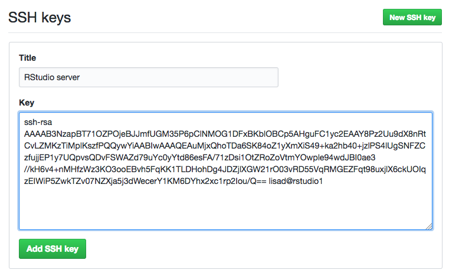

# Git and GitHub {#setup-git}

There are many reasons to use version control. Git is one option and it is well-integrated into RStudio. GitHub is a free service to store your version controlled projects in the cloud and (optionally) share them with others.

## Get a GitHub account

Go to [GitHub](https://github.com/) and create a new account.

+ Make sure your username is professional
+ Use an email address that you won't lose access to (e.g., gmail)

## Set up RStudio

If you are a UofG INP staff/student, you can access the [Glasgow Psychology RStudio](http://rstudio1.psy.gla.ac.uk) site and skip to [Set your GitHub info](#github-info).

If you are working from your own computer, follow the next 2 sub-steps:

### Install git

You can check if git is already installed on your computer by going to `Shell...` under the `Tools` menu (or just open a terminal window) and typing `which git`. If you get an answer like `/usr/local/bin/git` then git is already installed. If not, [install git](https://gist.github.com/derhuerst/1b15ff4652a867391f03) and then use `which git` to check where it is installed.

### Enable version control in RStudio

Go to `Global Options...` from the `Tools` menu and set the location of your git executable to the location from the previous step.

<div class="figure" style="text-align: center">

<p class="caption">(\#fig:git-path)Set the location of git</p>
</div>

## Set your GitHub info {#github-info}

Run `usethis::edit_git_config()` in the console pane; it will open a file called `.gitconfig`. Replace `GITHUB_EMAIL` with the email address you used for github and `GITHUB_USERNAME` with your github username.

```
[user]
	email = GITHUB_EMAIL
	name = GITHUB_USERNAME
```

<div class="warning">
<p>You can skip the rest of the steps if you are using your own computer because you can use <strong><code>https</code></strong> to access github. If you are using an RStudio server or just want to use <strong><code>SSH</code></strong>, follow the steps below.</p>
</div>

## Create an SSH Key on RStudio

1.  Go to `Global Options...` from the `Tools` menu
2. Click **`Create RSA Key...`** and enter a passphrase
    <div class="figure" style="text-align: center">
    
    <p class="caption">(\#fig:git-options)Global options</p>
    </div>
3. Click on `View public key` and copy the contents of the box

## Create an SSH Key on GitHub

1. Go to [GitHub > Settings > SSH and GPG keys](https://github.com/settings/keys) 
2. Click **`New SSH Key`**
3. Put `RStudio server` as the title (or `My Computer Name` if on your own computer)
4. Paste your public key into the `Key` box
5. Click **`Add SSH key`**
    <div class="figure" style="text-align: center">
    
    <p class="caption">(\#fig:github-key)Add SSH key</p>
    </div>
   
